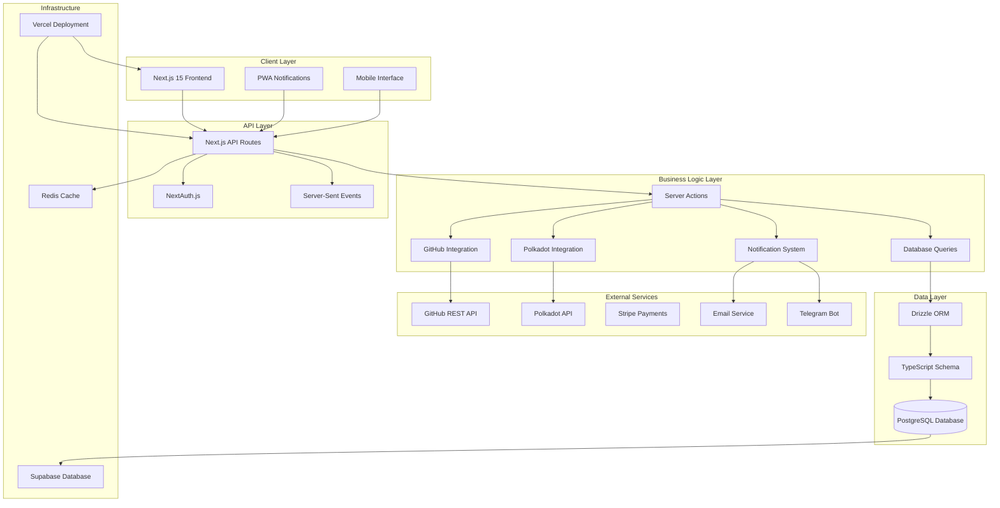

# System Architecture Diagram

## Overview
GrantFlow.dev is a multi-committee grant management platform built on Next.js 15 with a PostgreSQL database, designed to streamline Polkadot bounty grants from submission to payout.

## System Architecture

## Key Architectural Components

### 1. **Frontend Architecture**
- **Next.js 15** with App Router for modern React patterns
- **TypeScript** for type safety across the entire application
- **Tailwind CSS** + **shadcn/ui** for consistent UI components
- **Real-time updates** via Server-Sent Events for live notifications
- **PWA support** for mobile notifications and offline capabilities

### 2. **Authentication & Authorization**
- **NextAuth.js** with GitHub OAuth provider
- **JWT-based sessions** with 24-hour expiration
- **Role-based access control** (curator, grantee, admin)
- **Session management** with secure cookie handling

### 3. **Data Flow Architecture**
- **Server Actions** for type-safe form handling and mutations
- **Drizzle ORM** with TypeScript-first database schema
- **Validated actions** with Zod schema validation
- **Database queries** organized by domain (users, submissions, committees)

### 4. **External Integrations**
- **GitHub REST API** for repository analysis and commit tracking
- **Polkadot API** for multisig wallet operations and blockchain interactions
- **Stripe** for payment processing (currently disabled)
- **Multi-channel notifications** (webapp, PWA, email, optional Telegram)

### 5. **Real-time Communication**
- **Server-Sent Events** for live notification streams
- **Discussion threads** with real-time message updates
- **Voting systems** with live status updates
- **Milestone tracking** with progress notifications

## Request Flow

1. **User Authentication**: GitHub OAuth → NextAuth → JWT Session
2. **Data Requests**: UI → API Routes → Server Actions → Database Queries
3. **Real-time Updates**: SSE Streams → Notification System → Client Updates
4. **External Data**: GitHub API → Code Analysis → Milestone Verification
5. **Blockchain Operations**: Polkadot API → Multisig Operations → Payout Processing

## Security Architecture

- **Authentication**: GitHub OAuth with JWT tokens
- **Authorization**: Role-based permissions with submission-specific access
- **Data Validation**: Zod schemas for all inputs and database operations
- **Session Security**: HTTP-only cookies with secure flags
- **API Protection**: Authenticated routes with user context validation

## Scalability Considerations

- **Database**: PostgreSQL with Drizzle ORM for type-safe queries
- **Caching**: Redis for session storage and notification streams
- **Real-time**: Server-Sent Events for efficient live updates
- **External APIs**: Rate limiting and error handling for GitHub/Polkadot
- **Deployment**: Vercel for serverless scaling and edge optimization
