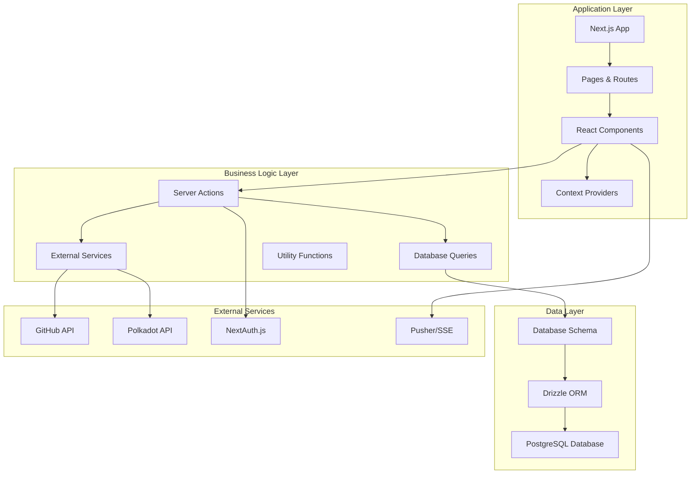
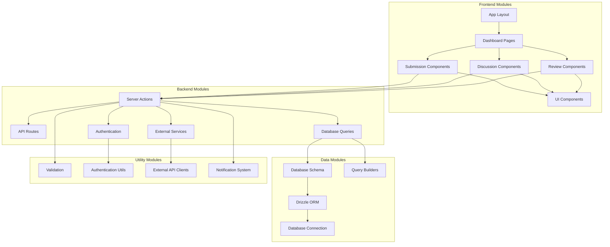
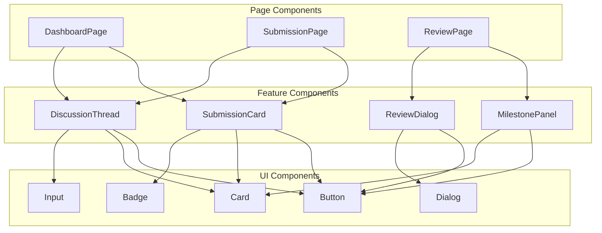
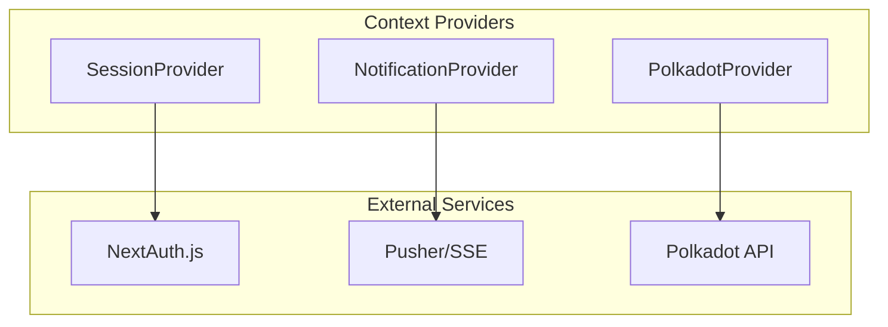
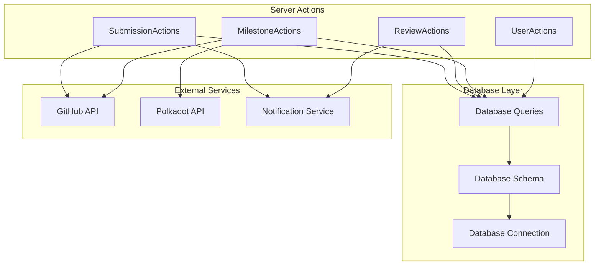
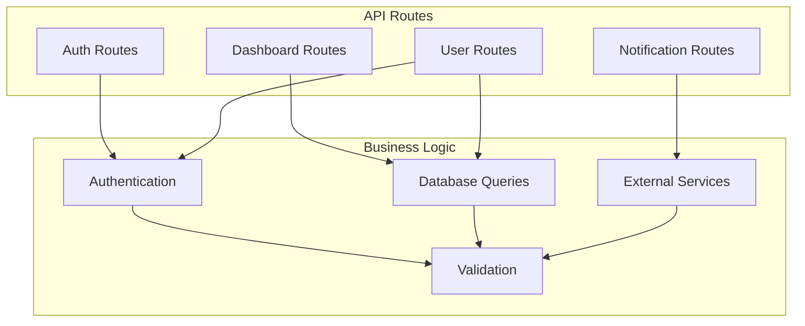
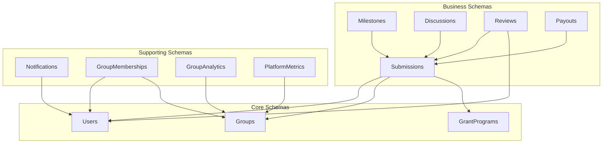
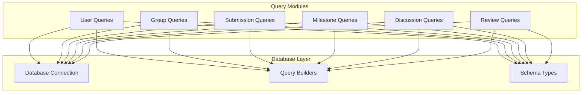

# Module Dependency Graph

## Overview
GrantFlow.dev implements a well-structured modular architecture with clear dependency relationships between different layers and components. The dependency graph shows how modules interact and depend on each other, providing insights into the system's architecture and potential refactoring opportunities.

## Core Dependency Architecture

### **1. High-Level Module Dependencies**

#### **Application Layer Dependencies**


### **2. Detailed Module Dependency Graph**

#### **Core Module Dependencies**


## Module Dependency Analysis

### **1. Frontend Module Dependencies**

#### **Component Dependencies**
```typescript
// Component dependency hierarchy
src/components/
├── ui/                    // Base UI components (no dependencies)
│   ├── button.tsx
│   ├── card.tsx
│   ├── input.tsx
│   └── ...
├── providers/             // Context providers (depends on ui/)
│   ├── notification-provider.tsx
│   ├── session-provider.tsx
│   └── polkadot-provider.tsx
├── submissions/           // Submission components (depends on ui/, providers/)
│   ├── submission-card.tsx
│   ├── reviewer-submission-view.tsx
│   └── grantee-submission-view.tsx
├── discussion/            // Discussion components (depends on ui/, providers/)
│   ├── discussion-thread.tsx
│   └── reviewer-voting.tsx
├── milestone/            // Milestone components (depends on ui/, providers/)
│   ├── milestone-voting-panel.tsx
│   └── signatory-vote-list.tsx
└── committee/            // Committee components (depends on ui/)
    ├── committee-info-card.tsx
    └── grant-program-card.tsx
```

#### **Page Dependencies**
```typescript
// Page dependency hierarchy
src/app/
├── layout.tsx             // Root layout (depends on providers/)
├── (dashboard)/           // Dashboard pages (depends on components/)
│   ├── dashboard/
│   │   ├── page.tsx
│   │   ├── submissions/
│   │   └── review/
│   └── layout.tsx
├── (login)/               // Authentication pages (depends on components/)
│   ├── login.tsx
│   ├── sign-in/
│   └── sign-up/
└── api/                   // API routes (depends on business logic/)
    ├── auth/
    ├── dashboard/
    └── notifications/
```

### **2. Backend Module Dependencies**

#### **Server Action Dependencies**
```typescript
// Server action dependencies
src/app/(dashboard)/dashboard/submissions/actions.ts
├── @/lib/db/drizzle          // Database connection
├── @/lib/db/schema           // Database schema
├── @/lib/db/queries          // Database queries
├── @/lib/auth/middleware     // Authentication middleware
├── @/lib/validation/submission // Validation schemas
└── next/cache               // Next.js cache utilities
```

#### **API Route Dependencies**
```typescript
// API route dependencies
src/app/api/
├── auth/[...nextauth]/route.ts
│   ├── @/lib/auth/next-auth  // NextAuth configuration
│   └── @/lib/db/queries      // User queries
├── dashboard/stats/route.ts
│   ├── @/lib/db/queries        // Dashboard queries
│   └── @/lib/auth/middleware // Authentication
└── notifications/stream/route.ts
    ├── @/lib/notifications/server // Notification system
    └── @/lib/auth/middleware     // Authentication
```

### **3. Data Layer Dependencies**

#### **Database Schema Dependencies**
```typescript
// Database schema dependencies
src/lib/db/schema/
├── users.ts                 // Base user schema
├── groups.ts                // Groups schema (depends on users.ts)
├── submissions.ts           // Submissions schema (depends on groups.ts, users.ts)
├── milestones.ts            // Milestones schema (depends on submissions.ts)
├── discussions.ts           // Discussions schema (depends on submissions.ts)
├── reviews.ts               // Reviews schema (depends on submissions.ts, users.ts)
├── payouts.ts               // Payouts schema (depends on submissions.ts)
└── notifications.ts         // Notifications schema (depends on users.ts)
```

#### **Query Dependencies**
```typescript
// Database query dependencies
src/lib/db/queries/
├── index.ts                 // Query exports
├── users.ts                 // User queries (depends on schema/)
├── groups.ts                // Group queries (depends on schema/)
├── submissions.ts           // Submission queries (depends on schema/)
├── milestones.ts            // Milestone queries (depends on schema/)
├── discussions.ts           // Discussion queries (depends on schema/)
├── reviews.ts               // Review queries (depends on schema/)
├── payouts.ts               // Payout queries (depends on schema/)
└── notifications.ts         // Notification queries (depends on schema/)
```

### **4. External Service Dependencies**

#### **GitHub Integration Dependencies**
```typescript
// GitHub service dependencies
src/lib/github/
├── simple-client.ts         // GitHub API client
│   ├── @octokit/rest       // Octokit REST client
│   ├── @octokit/app        // Octokit app client
│   └── @octokit/auth-app   // Octokit app authentication
└── types.ts                 // GitHub type definitions
```

#### **Polkadot Integration Dependencies**
```typescript
// Polkadot service dependencies
src/lib/polkadot/
├── client.ts               // Polkadot API client
│   ├── polkadot-api        // Polkadot API
│   └── @polkadot/util-crypto // Polkadot crypto utilities
├── multisig.ts             // Multisig functionality
│   └── @/lib/db/schema     // Database schema for multisig config
└── README.md               // Polkadot integration documentation
```

## Dependency Analysis by Layer

### **1. Presentation Layer Dependencies**

#### **Component Dependencies**


#### **Provider Dependencies**


### **2. Business Logic Layer Dependencies**

#### **Server Action Dependencies**


#### **API Route Dependencies**


### **3. Data Layer Dependencies**

#### **Database Schema Dependencies**


#### **Query Dependencies**


## Dependency Metrics and Analysis

### **1. Dependency Complexity Metrics**

#### **Module Coupling Analysis**
```typescript
// Dependency coupling metrics
interface DependencyMetrics {
  totalModules: number
  highCouplingModules: string[]
  lowCouplingModules: string[]
  circularDependencies: string[]
  dependencyDepth: number
  averageDependencies: number
}

// High coupling modules (many dependencies)
const highCouplingModules = [
  'src/app/(dashboard)/dashboard/submissions/actions.ts',
  'src/lib/db/queries/index.ts',
  'src/components/discussion/discussion-thread.tsx',
  'src/lib/auth/next-auth.ts'
]

// Low coupling modules (few dependencies)
const lowCouplingModules = [
  'src/components/ui/button.tsx',
  'src/components/ui/card.tsx',
  'src/lib/utils.ts',
  'src/lib/validation/helpers.ts'
]
```

#### **Dependency Depth Analysis**
```typescript
// Dependency depth analysis
interface DependencyDepth {
  module: string
  depth: number
  dependencies: string[]
  dependents: string[]
}

// Deep dependency chains
const deepDependencies = [
  {
    module: 'src/app/(dashboard)/dashboard/submissions/actions.ts',
    depth: 5,
    dependencies: [
      'src/lib/db/drizzle',
      'src/lib/db/schema',
      'src/lib/db/queries',
      'src/lib/auth/middleware',
      'src/lib/validation/submission'
    ]
  }
]
```

### **2. Circular Dependency Analysis**

#### **Circular Dependencies**
```typescript
// Circular dependency detection
interface CircularDependency {
  modules: string[]
  cycle: string[]
  severity: 'low' | 'medium' | 'high'
}

// Potential circular dependencies
const circularDependencies = [
  {
    modules: ['src/lib/db/schema', 'src/lib/db/queries'],
    cycle: ['schema -> queries -> schema'],
    severity: 'low'
  }
]
```

### **3. Dependency Optimization Opportunities**

#### **Refactoring Opportunities**
```typescript
// Dependency optimization recommendations
interface OptimizationOpportunity {
  module: string
  issue: string
  recommendation: string
  priority: 'low' | 'medium' | 'high'
}

const optimizationOpportunities = [
  {
    module: 'src/app/(dashboard)/dashboard/submissions/actions.ts',
    issue: 'High coupling with multiple layers',
    recommendation: 'Extract business logic to service layer',
    priority: 'high'
  },
  {
    module: 'src/components/discussion/discussion-thread.tsx',
    issue: 'Direct database dependencies',
    recommendation: 'Use dependency injection for data access',
    priority: 'medium'
  }
]
```

## Dependency Management Best Practices

### **1. Dependency Design Principles**

#### **Single Responsibility Principle**
- **Module Focus**: Each module should have a single, well-defined responsibility
- **Clear Boundaries**: Dependencies should respect module boundaries
- **Minimal Coupling**: Minimize dependencies between modules
- **High Cohesion**: Keep related functionality together

#### **Dependency Inversion Principle**
- **Abstraction**: Depend on abstractions, not concretions
- **Interface Segregation**: Use specific interfaces rather than general ones
- **Dependency Injection**: Inject dependencies rather than creating them
- **Loose Coupling**: Minimize direct dependencies between modules

### **2. Dependency Management Strategies**

#### **Module Organization**
- **Layer Separation**: Clear separation between presentation, business logic, and data layers
- **Feature Grouping**: Group related modules by feature
- **Shared Utilities**: Centralize common utilities and helpers
- **External Services**: Isolate external service dependencies

#### **Dependency Injection**
- **Service Locator**: Use service locator pattern for dependencies
- **Constructor Injection**: Inject dependencies through constructors
- **Method Injection**: Inject dependencies through method parameters
- **Property Injection**: Inject dependencies through properties

### **3. Dependency Monitoring**

#### **Dependency Tracking**
- **Static Analysis**: Use tools to analyze static dependencies
- **Runtime Monitoring**: Monitor runtime dependency usage
- **Performance Impact**: Track performance impact of dependencies
- **Change Impact**: Analyze impact of dependency changes

#### **Dependency Health**
- **Coupling Metrics**: Monitor module coupling levels
- **Circular Dependencies**: Detect and resolve circular dependencies
- **Unused Dependencies**: Identify and remove unused dependencies
- **Version Conflicts**: Monitor and resolve version conflicts
