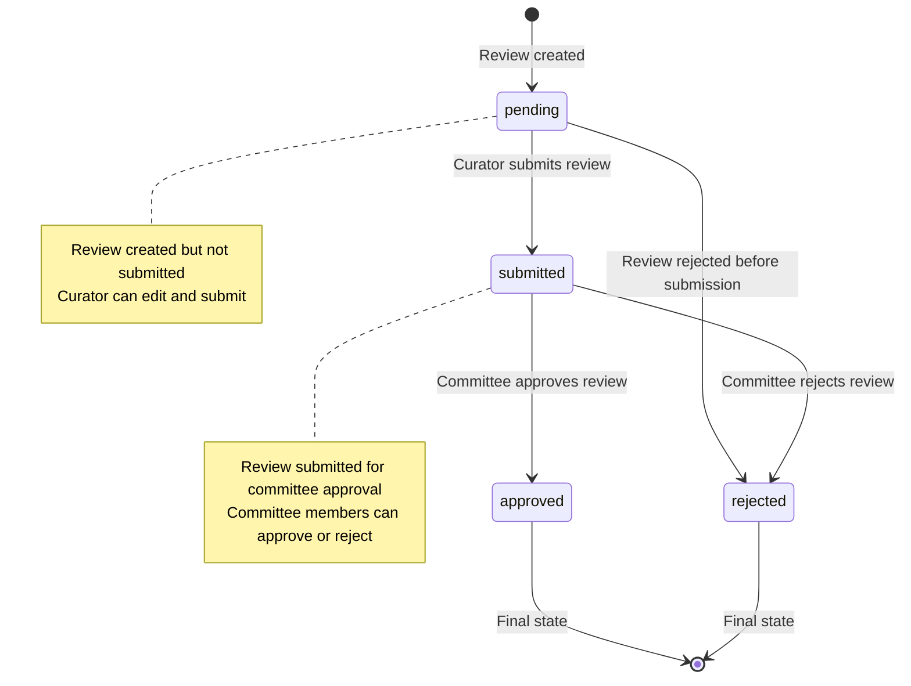
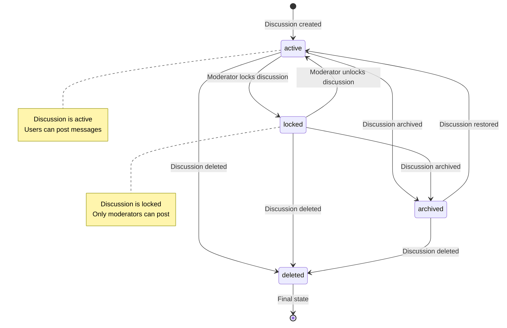

# State Machines and State Transitions

## Overview
GrantFlow.dev implements several complex state machines that manage the lifecycle of submissions, milestones, reviews, and user interactions. These state machines ensure proper workflow management, data integrity, and user experience consistency.

## Core State Machines

### **1. Submission State Machine**

#### **Submission States**
```typescript
const SUBMISSION_STATUS_OPTIONS = [
  'pending',           // Initial state after submission
  'in-review',         // Under committee review
  'changes-requested', // Committee requests changes
  'approved',          // Committee approved
  'rejected',         // Committee rejected
] as const
```

#### **Submission State Transition Diagram**
```mermaid
stateDiagram-v2
    [*] --> pending : User submits application
    
    pending --> in-review : Committee starts review
    pending --> changes-requested : Committee requests changes
    pending --> approved : Committee approves directly
    pending --> rejected : Committee rejects directly
    
    in-review --> changes-requested : Committee requests changes
    in-review --> approved : Committee approves
    in-review --> rejected : Committee rejects
    
    changes-requested --> in-review : Grantee submits changes
    changes-requested --> pending : Grantee resubmits application
    
    approved --> [*] : Final state
    rejected --> [*] : Final state
    
    note right of pending
      Initial state after submission
      Committee can start review or request changes
    end note
    
    note right of in-review
      Active review process
      Committee members voting
    end note
    
    note right of changes-requested
      Grantee needs to make changes
      Can resubmit or make revisions
    end note
```

#### **Submission State Transitions**
```typescript
// State transition logic
export class SubmissionStateMachine {
  private static readonly VALID_TRANSITIONS = {
    'pending': ['in-review', 'changes-requested', 'approved', 'rejected'],
    'in-review': ['changes-requested', 'approved', 'rejected'],
    'changes-requested': ['in-review', 'pending'],
    'approved': [], // Terminal state
    'rejected': [], // Terminal state
  }
  
  static canTransition(from: SubmissionStatus, to: SubmissionStatus): boolean {
    return this.VALID_TRANSITIONS[from]?.includes(to) ?? false
  }
  
  static async transitionSubmission(
    submissionId: number,
    newStatus: SubmissionStatus,
    userId: number,
    reason?: string
  ): Promise<void> {
    const submission = await getSubmission(submissionId)
    if (!submission) {
      throw new Error('Submission not found')
    }
    
    if (!this.canTransition(submission.status, newStatus)) {
      throw new Error(`Invalid transition from ${submission.status} to ${newStatus}`)
    }
    
    // Update submission status
    await updateSubmissionStatus(submissionId, newStatus)
    
    // Log state transition
    await logStateTransition('submission', submissionId, submission.status, newStatus, userId, reason)
    
    // Trigger notifications
    await notifyStatusChange(submissionId, newStatus)
  }
}
```

### **2. Milestone State Machine**

#### **Milestone States**
```typescript
const MILESTONE_STATUS_OPTIONS = [
  'pending',           // Milestone created, not yet submitted
  'in-review',        // Milestone submitted, under review
  'changes-requested', // Committee requests changes
  'completed',        // Milestone approved and completed
  'rejected',         // Milestone rejected
] as const
```

#### **Milestone State Transition Diagram**
```mermaid
stateDiagram-v2
    [*] --> pending : Milestone created
    
    pending --> in-review : Grantee submits milestone
    pending --> changes-requested : Committee requests changes before submission
    
    in-review --> changes-requested : Committee requests changes
    in-review --> completed : Committee approves milestone
    in-review --> rejected : Committee rejects milestone
    
    changes-requested --> in-review : Grantee resubmits milestone
    changes-requested --> pending : Grantee withdraws submission
    
    completed --> [*] : Final state
    rejected --> [*] : Final state
    
    note right of pending
      Milestone created but not submitted
      Grantee can submit or committee can request changes
    end note
    
    note right of in-review
      Milestone submitted for review
      Committee members reviewing deliverables
    end note
    
    note right of changes-requested
      Committee requests specific changes
      Grantee must address feedback
    end note
```

#### **Milestone State Transitions**
```typescript
// Milestone state transition logic
export class MilestoneStateMachine {
  private static readonly VALID_TRANSITIONS = {
    'pending': ['in-review', 'changes-requested'],
    'in-review': ['changes-requested', 'completed', 'rejected'],
    'changes-requested': ['in-review', 'pending'],
    'completed': [], // Terminal state
    'rejected': [], // Terminal state
  }
  
  static async transitionMilestone(
    milestoneId: number,
    newStatus: MilestoneStatus,
    userId: number,
    feedback?: string
  ): Promise<void> {
    const milestone = await getMilestone(milestoneId)
    if (!milestone) {
      throw new Error('Milestone not found')
    }
    
    if (!this.canTransition(milestone.status, newStatus)) {
      throw new Error(`Invalid transition from ${milestone.status} to ${newStatus}`)
    }
    
    // Update milestone status
    await updateMilestoneStatus(milestoneId, newStatus)
    
    // Log state transition
    await logStateTransition('milestone', milestoneId, milestone.status, newStatus, userId, feedback)
    
    // Trigger notifications
    await notifyMilestoneStatusChange(milestoneId, newStatus)
    
    // Handle completion actions
    if (newStatus === 'completed') {
      await handleMilestoneCompletion(milestoneId)
    }
  }
}
```

### **3. Review State Machine**

#### **Review States**
```typescript
const REVIEW_STATUS_OPTIONS = [
  'pending',    // Review created, not yet submitted
  'submitted',  // Review submitted by curator
  'approved',   // Review approved by committee
  'rejected',   // Review rejected by committee
] as const
```

#### **Review State Transition Diagram**


### **4. User Authentication State Machine**

#### **Authentication States**
```typescript
const AUTH_STATES = [
  'unauthenticated', // Not logged in
  'authenticating',  // OAuth in progress
  'authenticated',  // Successfully logged in
  'session-expired', // Session expired
  'error',          // Authentication error
] as const
```

#### **Authentication State Transition Diagram**
```mermaid
stateDiagram-v2
    [*] --> unauthenticated : Initial state
    
    unauthenticated --> authenticating : User clicks login
    authenticating --> authenticated : OAuth success
    authenticating --> error : OAuth failure
    
    authenticated --> session-expired : Session timeout
    authenticated --> unauthenticated : User logs out
    
    session-expired --> authenticating : User re-authenticates
    session-expired --> unauthenticated : User chooses not to re-authenticate
    
    error --> authenticating : User retries
    error --> unauthenticated : User gives up
    
    note right of unauthenticated
      User not logged in
      Can browse public content
    end note
    
    note right of authenticated
      User successfully logged in
      Full access to platform features
    end note
```

### **5. Discussion State Machine**

#### **Discussion States**
```typescript
const DISCUSSION_STATES = [
  'active',     // Discussion is active
  'locked',     // Discussion is locked
  'archived',   // Discussion is archived
  'deleted',    // Discussion is deleted
] as const
```

#### **Discussion State Transition Diagram**


## State Machine Implementation

### **1. State Machine Base Class**

#### **Generic State Machine**
```typescript
// Base state machine implementation
export abstract class StateMachine<T extends string> {
  protected abstract readonly validTransitions: Record<T, T[]>
  protected abstract readonly terminalStates: T[]
  
  canTransition(from: T, to: T): boolean {
    return this.validTransitions[from]?.includes(to) ?? false
  }
  
  isTerminalState(state: T): boolean {
    return this.terminalStates.includes(state)
  }
  
  getNextStates(currentState: T): T[] {
    return this.validTransitions[currentState] ?? []
  }
  
  abstract async transition(
    entityId: number,
    newState: T,
    userId: number,
    context?: any
  ): Promise<void>
}
```

#### **State Transition Logger**
```typescript
// State transition logging
export async function logStateTransition(
  entityType: string,
  entityId: number,
  fromState: string,
  toState: string,
  userId: number,
  reason?: string,
  metadata?: any
): Promise<void> {
  await db.insert(stateTransitions).values({
    entityType,
    entityId,
    fromState,
    toState,
    userId,
    reason,
    metadata: metadata ? JSON.stringify(metadata) : null,
    timestamp: new Date(),
  })
}
```

### **2. State Machine Validation**

#### **Transition Validation**
```typescript
// State transition validation
export class StateTransitionValidator {
  static validateTransition(
    currentState: string,
    newState: string,
    userRole: string,
    entityType: string
  ): ValidationResult {
    // Check if transition is valid
    if (!this.isValidTransition(currentState, newState, entityType)) {
      return {
        valid: false,
        error: `Invalid transition from ${currentState} to ${newState}`
      }
    }
    
    // Check user permissions
    if (!this.hasPermission(userRole, newState, entityType)) {
      return {
        valid: false,
        error: `User role ${userRole} cannot transition to ${newState}`
      }
    }
    
    // Check business rules
    if (!this.satisfiesBusinessRules(currentState, newState, entityType)) {
      return {
        valid: false,
        error: `Business rules not satisfied for transition to ${newState}`
      }
    }
    
    return { valid: true }
  }
}
```

### **3. State Machine Events**

#### **State Change Events**
```typescript
// State change event system
export class StateChangeEventEmitter {
  private static listeners: Map<string, Function[]> = new Map()
  
  static on(event: string, listener: Function): void {
    if (!this.listeners.has(event)) {
      this.listeners.set(event, [])
    }
    this.listeners.get(event)!.push(listener)
  }
  
  static emit(event: string, data: any): void {
    const eventListeners = this.listeners.get(event) || []
    eventListeners.forEach(listener => {
      try {
        listener(data)
      } catch (error) {
        console.error(`Error in state change listener:`, error)
      }
    })
  }
  
  static async emitAsync(event: string, data: any): Promise<void> {
    const eventListeners = this.listeners.get(event) || []
    await Promise.all(
      eventListeners.map(listener => 
        Promise.resolve(listener(data)).catch(error => 
          console.error(`Error in async state change listener:`, error)
        )
      )
    )
  }
}
```

#### **State Change Handlers**
```typescript
// State change handlers
export class StateChangeHandlers {
  static async handleSubmissionStatusChange(
    submissionId: number,
    newStatus: SubmissionStatus,
    userId: number
  ): Promise<void> {
    // Update submission status
    await updateSubmissionStatus(submissionId, newStatus)
    
    // Send notifications
    await notifySubmissionStatusChange(submissionId, newStatus)
    
    // Update analytics
    await updateSubmissionAnalytics(submissionId, newStatus)
    
    // Trigger external integrations
    if (newStatus === 'approved') {
      await triggerApprovalWorkflow(submissionId)
    }
  }
  
  static async handleMilestoneStatusChange(
    milestoneId: number,
    newStatus: MilestoneStatus,
    userId: number
  ): Promise<void> {
    // Update milestone status
    await updateMilestoneStatus(milestoneId, newStatus)
    
    // Send notifications
    await notifyMilestoneStatusChange(milestoneId, newStatus)
    
    // Handle completion
    if (newStatus === 'completed') {
      await handleMilestoneCompletion(milestoneId)
    }
  }
}
```

## State Machine Testing

### **1. Unit Tests**

#### **State Transition Tests**
```typescript
// State transition unit tests
describe('SubmissionStateMachine', () => {
  it('should allow valid transitions', () => {
    expect(SubmissionStateMachine.canTransition('pending', 'in-review')).toBe(true)
    expect(SubmissionStateMachine.canTransition('in-review', 'approved')).toBe(true)
    expect(SubmissionStateMachine.canTransition('changes-requested', 'in-review')).toBe(true)
  })
  
  it('should reject invalid transitions', () => {
    expect(SubmissionStateMachine.canTransition('approved', 'pending')).toBe(false)
    expect(SubmissionStateMachine.canTransition('rejected', 'approved')).toBe(false)
    expect(SubmissionStateMachine.canTransition('pending', 'completed')).toBe(false)
  })
  
  it('should identify terminal states', () => {
    expect(SubmissionStateMachine.isTerminalState('approved')).toBe(true)
    expect(SubmissionStateMachine.isTerminalState('rejected')).toBe(true)
    expect(SubmissionStateMachine.isTerminalState('pending')).toBe(false)
  })
})
```

#### **State Machine Integration Tests**
```typescript
// State machine integration tests
describe('State Machine Integration', () => {
  it('should handle complete submission workflow', async () => {
    // Create submission
    const submission = await createSubmission(testData)
    expect(submission.status).toBe('pending')
    
    // Transition to in-review
    await SubmissionStateMachine.transitionSubmission(
      submission.id,
      'in-review',
      curatorId
    )
    
    // Transition to approved
    await SubmissionStateMachine.transitionSubmission(
      submission.id,
      'approved',
      curatorId
    )
    
    // Verify final state
    const updatedSubmission = await getSubmission(submission.id)
    expect(updatedSubmission.status).toBe('approved')
  })
})
```

### **2. State Machine Monitoring**

#### **State Transition Analytics**
```typescript
// State transition analytics
export class StateTransitionAnalytics {
  static async getTransitionMetrics(
    entityType: string,
    timeRange: { start: Date; end: Date }
  ): Promise<TransitionMetrics> {
    const transitions = await db
      .select()
      .from(stateTransitions)
      .where(
        and(
          eq(stateTransitions.entityType, entityType),
          gte(stateTransitions.timestamp, timeRange.start),
          lte(stateTransitions.timestamp, timeRange.end)
        )
      )
    
    return {
      totalTransitions: transitions.length,
      transitionCounts: this.groupByTransition(transitions),
      averageTransitionTime: this.calculateAverageTransitionTime(transitions),
      commonPaths: this.findCommonTransitionPaths(transitions),
    }
  }
}
```

## State Machine Best Practices

### **1. State Machine Design**

#### **Clear State Definitions**
- **Explicit States**: Each state should be clearly defined and documented
- **Mutually Exclusive**: States should be mutually exclusive and collectively exhaustive
- **Business Meaning**: States should have clear business meaning and purpose
- **Validation Rules**: Each state should have clear validation rules

#### **Transition Rules**
- **Explicit Transitions**: All valid transitions should be explicitly defined
- **Business Logic**: Transitions should follow business logic and rules
- **Permission Checks**: Transitions should include proper permission checks
- **Audit Trail**: All transitions should be logged and auditable

### **2. State Machine Implementation**

#### **Error Handling**
- **Invalid Transitions**: Handle invalid transitions gracefully
- **State Validation**: Validate state before transitions
- **Rollback Support**: Support for rolling back invalid transitions
- **Error Recovery**: Proper error recovery and state restoration

#### **Performance Optimization**
- **State Caching**: Cache state information for performance
- **Batch Operations**: Support batch state transitions
- **Async Processing**: Handle state transitions asynchronously
- **Event Sourcing**: Use event sourcing for state management

### **3. State Machine Monitoring**

#### **Health Checks**
- **State Validation**: Regular validation of state consistency
- **Transition Monitoring**: Monitor transition patterns and anomalies
- **Performance Metrics**: Track state transition performance
- **Error Tracking**: Monitor and alert on state transition errors

#### **Analytics and Reporting**
- **State Distribution**: Monitor distribution of entities across states
- **Transition Patterns**: Analyze common transition patterns
- **Bottleneck Identification**: Identify bottlenecks in state transitions
- **Business Intelligence**: Generate business intelligence from state data
