# Data Flow Diagrams for Key Processes

## Overview
GrantFlow.dev implements several critical data flow processes that handle user interactions, data persistence, real-time communication, and external service integration. These data flows ensure proper data integrity, user experience, and system performance.

## Core Data Flow Processes

### **1. Submission Creation and Review Flow**

#### **Submission Creation Data Flow**
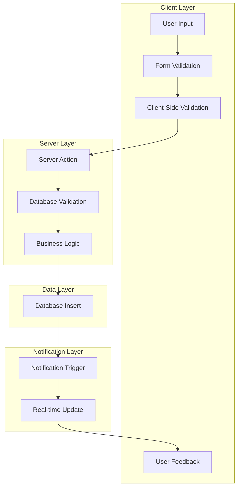

#### **Submission Review Data Flow**
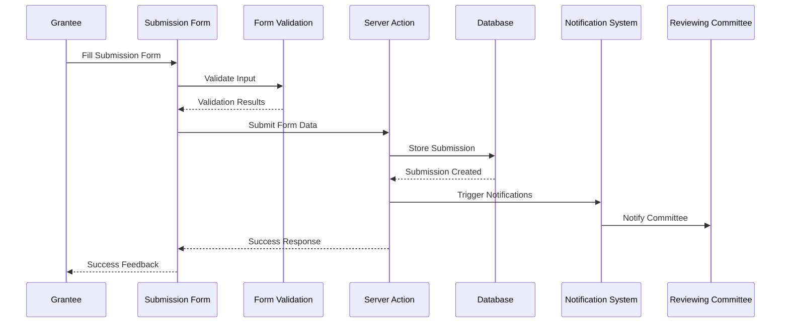

### **2. Real-time Discussion Flow**

#### **Discussion Message Flow**
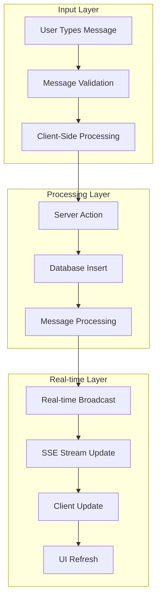

#### **Real-time Communication Flow**
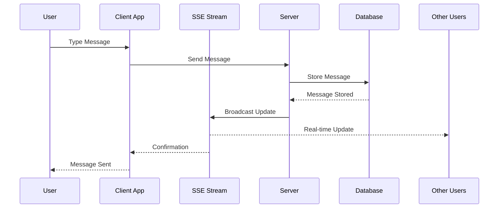

### **3. Milestone Submission and Review Flow**

#### **Milestone Submission Flow**
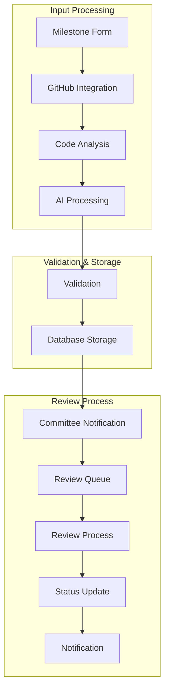

#### **Milestone Review Data Flow**
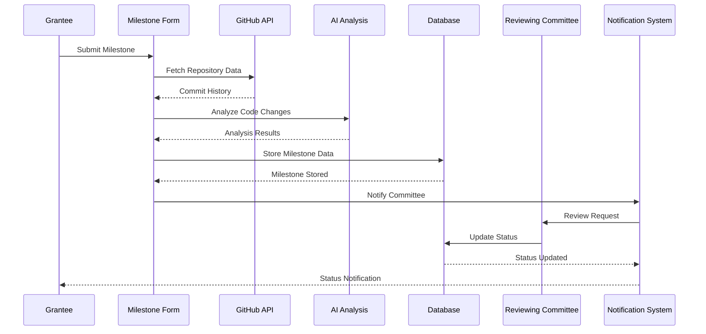

### **4. Authentication and Authorization Flow**

#### **User Authentication Flow**
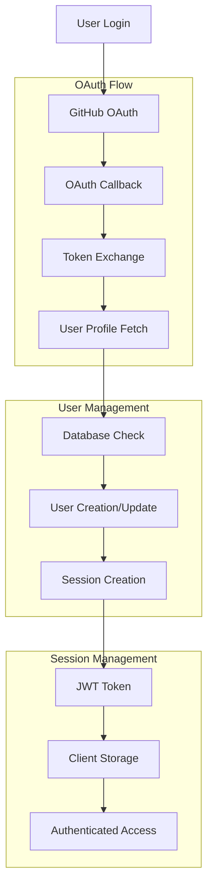

#### **Authorization Check Flow**
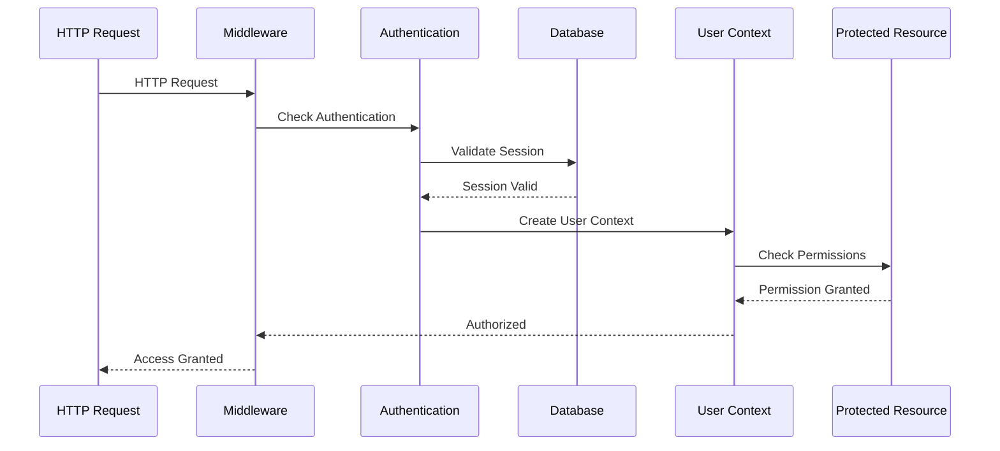

### **5. External Service Integration Flow**

#### **GitHub Integration Flow**
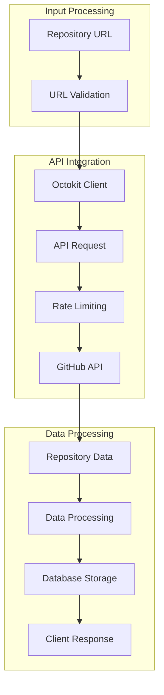

#### **External Service Data Flow**
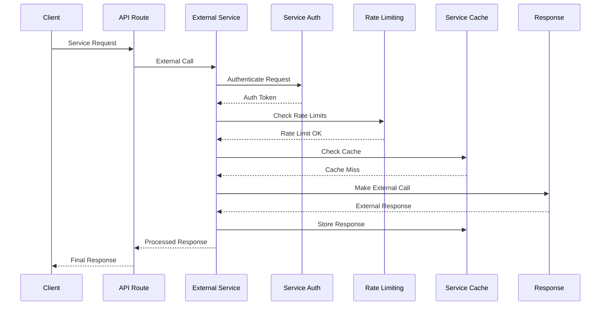

### **6. Notification and Communication Flow**

#### **Notification System Flow**
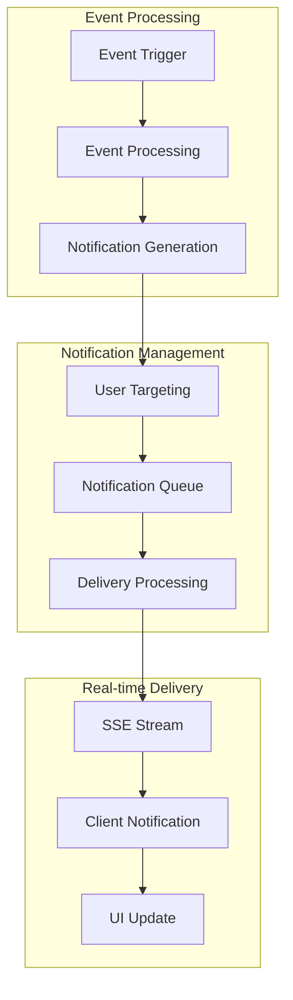

#### **Notification Delivery Flow**
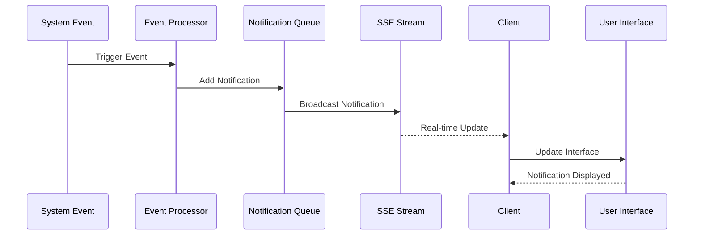

### **7. Data Persistence and Caching Flow**

#### **Database Operation Flow**
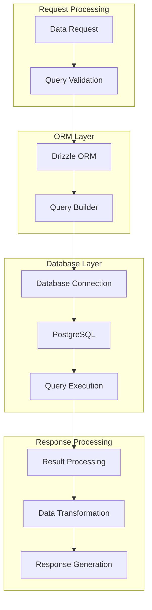

#### **Caching Strategy Flow**
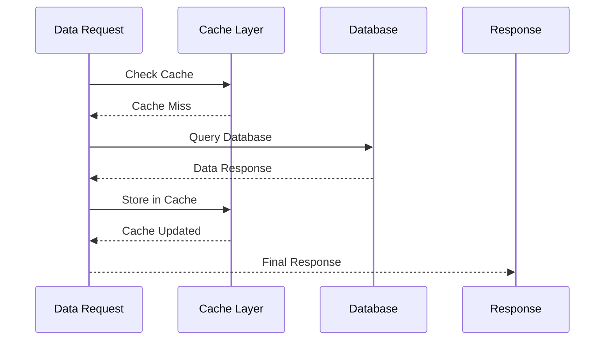

### **8. Error Handling and Recovery Flow**

#### **Error Processing Flow**
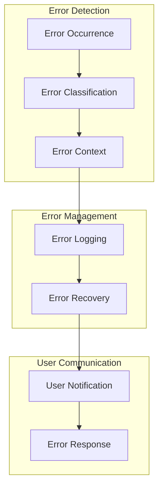

#### **Error Recovery Flow**
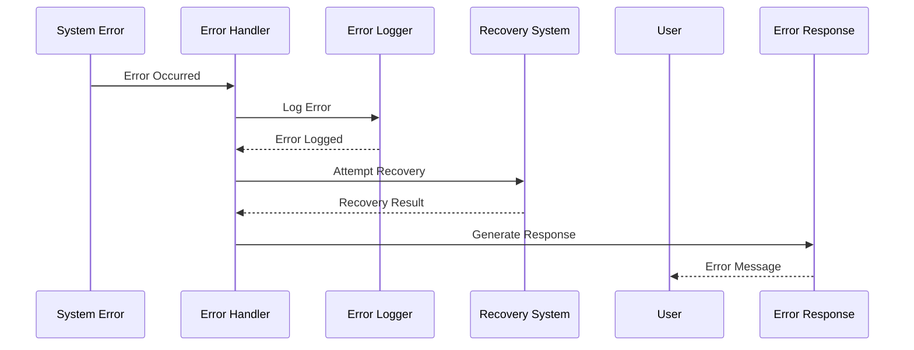

## Data Flow Implementation Details

### **1. Form Data Processing**

#### **Client-Side Form Processing**
```typescript
// Form data processing implementation
export class FormDataProcessor {
  static async processFormData(
    formData: FormData,
    validationSchema: ZodSchema
  ): Promise<ProcessedFormData> {
    try {
      // 1. Extract form data
      const rawData = this.extractFormData(formData)
      
      // 2. Validate data
      const validatedData = await this.validateData(rawData, validationSchema)
      
      // 3. Transform data
      const transformedData = this.transformData(validatedData)
      
      // 4. Sanitize data
      const sanitizedData = this.sanitizeData(transformedData)
      
      return {
        data: sanitizedData,
        isValid: true,
        errors: []
      }
    } catch (error) {
      return {
        data: null,
        isValid: false,
        errors: [error.message]
      }
    }
  }
  
  private static extractFormData(formData: FormData): Record<string, any> {
    const data: Record<string, any> = {}
    for (const [key, value] of formData.entries()) {
      data[key] = value
    }
    return data
  }
  
  private static async validateData(
    data: Record<string, any>,
    schema: ZodSchema
  ): Promise<any> {
    return await schema.parseAsync(data)
  }
  
  private static transformData(data: any): any {
    // Transform data according to business rules
    return {
      ...data,
      createdAt: new Date(),
      updatedAt: new Date()
    }
  }
  
  private static sanitizeData(data: any): any {
    // Sanitize data for security
    return this.sanitizeObject(data)
  }
}
```

### **2. Real-time Data Synchronization**

#### **Server-Sent Events Implementation**
```typescript
// SSE implementation for real-time updates
export class RealTimeDataSync {
  private static streams: Map<string, ReadableStream> = new Map()
  
  static createStream(userId: string): ReadableStream {
    const stream = new ReadableStream({
      start(controller) {
        // Store controller reference
        this.streams.set(userId, controller)
        
        // Send initial connection message
        this.sendMessage(controller, {
          type: 'connection',
          message: 'Connected to real-time stream',
          timestamp: new Date().toISOString()
        })
        
        // Set up heartbeat
        const heartbeat = setInterval(() => {
          this.sendMessage(controller, {
            type: 'heartbeat',
            timestamp: new Date().toISOString()
          })
        }, 30000)
        
        // Cleanup on close
        stream.addEventListener('close', () => {
          clearInterval(heartbeat)
          this.streams.delete(userId)
        })
      }
    })
    
    return stream
  }
  
  static broadcastUpdate(userId: string, data: any): void {
    const controller = this.streams.get(userId)
    if (controller) {
      this.sendMessage(controller, {
        type: 'update',
        data: data,
        timestamp: new Date().toISOString()
      })
    }
  }
  
  private static sendMessage(controller: ReadableStreamDefaultController, message: any): void {
    try {
      controller.enqueue(`data: ${JSON.stringify(message)}\n\n`)
    } catch (error) {
      console.error('Error sending SSE message:', error)
    }
  }
}
```

### **3. Database Transaction Management**

#### **Transaction Flow Implementation**
```typescript
// Database transaction management
export class DatabaseTransactionManager {
  static async executeTransaction<T>(
    operations: (tx: Transaction) => Promise<T>
  ): Promise<T> {
    return await db.transaction(async (tx) => {
      try {
        // Execute operations within transaction
        const result = await operations(tx)
        
        // Commit transaction
        await tx.commit()
        
        return result
      } catch (error) {
        // Rollback transaction on error
        await tx.rollback()
        throw error
      }
    })
  }
  
  static async executeBatchOperations(
    operations: Array<(tx: Transaction) => Promise<any>>
  ): Promise<any[]> {
    return await this.executeTransaction(async (tx) => {
      const results = []
      
      for (const operation of operations) {
        const result = await operation(tx)
        results.push(result)
      }
      
      return results
    })
  }
}
```

### **4. External Service Integration**

#### **Service Integration Flow**
```typescript
// External service integration
export class ExternalServiceIntegration {
  static async integrateWithGitHub(repoUrl: string): Promise<GitHubData> {
    try {
      // 1. Validate repository URL
      const validatedUrl = this.validateRepositoryUrl(repoUrl)
      
      // 2. Extract repository information
      const repoInfo = this.extractRepositoryInfo(validatedUrl)
      
      // 3. Make API request
      const apiData = await this.fetchRepositoryData(repoInfo)
      
      // 4. Process and transform data
      const processedData = this.processRepositoryData(apiData)
      
      // 5. Store in database
      await this.storeRepositoryData(processedData)
      
      return processedData
    } catch (error) {
      console.error('GitHub integration error:', error)
      throw new Error('Failed to integrate with GitHub')
    }
  }
  
  private static validateRepositoryUrl(url: string): string {
    const githubUrlPattern = /^https:\/\/github\.com\/[^\/]+\/[^\/]+$/
    if (!githubUrlPattern.test(url)) {
      throw new Error('Invalid GitHub repository URL')
    }
    return url
  }
  
  private static extractRepositoryInfo(url: string): { owner: string; repo: string } {
    const parts = url.split('/')
    return {
      owner: parts[3],
      repo: parts[4]
    }
  }
}
```

## Data Flow Performance Optimization

### **1. Caching Strategies**

#### **Multi-Level Caching**
```typescript
// Multi-level caching implementation
export class MultiLevelCache {
  private static memoryCache = new Map<string, any>()
  private static redisCache: Redis | null = null
  
  static async get(key: string): Promise<any> {
    // 1. Check memory cache
    if (this.memoryCache.has(key)) {
      return this.memoryCache.get(key)
    }
    
    // 2. Check Redis cache
    if (this.redisCache) {
      const redisValue = await this.redisCache.get(key)
      if (redisValue) {
        const parsedValue = JSON.parse(redisValue)
        this.memoryCache.set(key, parsedValue)
        return parsedValue
      }
    }
    
    // 3. Cache miss
    return null
  }
  
  static async set(key: string, value: any, ttl: number = 300): Promise<void> {
    // 1. Store in memory cache
    this.memoryCache.set(key, value)
    
    // 2. Store in Redis cache
    if (this.redisCache) {
      await this.redisCache.setex(key, ttl, JSON.stringify(value))
    }
  }
}
```

### **2. Data Validation and Sanitization**

#### **Input Validation Pipeline**
```typescript
// Input validation pipeline
export class InputValidationPipeline {
  static async validateInput(
    data: any,
    schema: ZodSchema,
    options: ValidationOptions = {}
  ): Promise<ValidationResult> {
    try {
      // 1. Schema validation
      const validatedData = await schema.parseAsync(data)
      
      // 2. Business rule validation
      const businessValidated = await this.validateBusinessRules(validatedData)
      
      // 3. Security validation
      const securityValidated = await this.validateSecurity(businessValidated)
      
      // 4. Data sanitization
      const sanitizedData = await this.sanitizeData(securityValidated)
      
      return {
        isValid: true,
        data: sanitizedData,
        errors: []
      }
    } catch (error) {
      return {
        isValid: false,
        data: null,
        errors: [error.message]
      }
    }
  }
  
  private static async validateBusinessRules(data: any): Promise<any> {
    // Implement business rule validation
    return data
  }
  
  private static async validateSecurity(data: any): Promise<any> {
    // Implement security validation
    return data
  }
  
  private static async sanitizeData(data: any): Promise<any> {
    // Implement data sanitization
    return data
  }
}
```

## Data Flow Monitoring and Analytics

### **1. Data Flow Metrics**

#### **Performance Monitoring**
```typescript
// Data flow performance monitoring
export class DataFlowMonitor {
  static async trackDataFlow(
    flowName: string,
    startTime: number,
    endTime: number,
    success: boolean,
    error?: Error
  ): Promise<void> {
    const duration = endTime - startTime
    
    // Log performance metrics
    console.log(`[DataFlow] ${flowName}: ${duration}ms, Success: ${success}`)
    
    // Store metrics in database
    await this.storeMetrics({
      flowName,
      duration,
      success,
      error: error?.message,
      timestamp: new Date()
    })
    
    // Alert on performance issues
    if (duration > 5000) { // 5 seconds
      await this.alertPerformanceIssue(flowName, duration)
    }
  }
  
  private static async storeMetrics(metrics: DataFlowMetrics): Promise<void> {
    // Store metrics in database
    await db.insert(dataFlowMetrics).values(metrics)
  }
  
  private static async alertPerformanceIssue(
    flowName: string,
    duration: number
  ): Promise<void> {
    // Send alert for performance issues
    console.warn(`[Performance Alert] ${flowName} took ${duration}ms`)
  }
}
```

### **2. Data Flow Analytics**

#### **Flow Analysis**
```typescript
// Data flow analytics
export class DataFlowAnalytics {
  static async analyzeDataFlow(
    flowName: string,
    timeRange: { start: Date; end: Date }
  ): Promise<DataFlowAnalysis> {
    const metrics = await this.getFlowMetrics(flowName, timeRange)
    
    return {
      totalExecutions: metrics.length,
      averageDuration: this.calculateAverageDuration(metrics),
      successRate: this.calculateSuccessRate(metrics),
      errorRate: this.calculateErrorRate(metrics),
      performanceTrends: this.analyzePerformanceTrends(metrics),
      bottlenecks: this.identifyBottlenecks(metrics)
    }
  }
  
  private static async getFlowMetrics(
    flowName: string,
    timeRange: { start: Date; end: Date }
  ): Promise<DataFlowMetrics[]> {
    return await db
      .select()
      .from(dataFlowMetrics)
      .where(
        and(
          eq(dataFlowMetrics.flowName, flowName),
          gte(dataFlowMetrics.timestamp, timeRange.start),
          lte(dataFlowMetrics.timestamp, timeRange.end)
        )
      )
  }
}
```

## Data Flow Best Practices

### **1. Data Flow Design**

#### **Clear Data Flow Patterns**
- **Unidirectional Flow**: Data flows in one direction through the system
- **Clear Boundaries**: Well-defined boundaries between different layers
- **Error Handling**: Comprehensive error handling at each stage
- **Performance Optimization**: Efficient data processing and caching

#### **Data Flow Validation**
- **Input Validation**: Validate all inputs at the entry point
- **Business Rule Validation**: Enforce business rules throughout the flow
- **Security Validation**: Implement security checks at each stage
- **Output Validation**: Validate outputs before sending to clients

### **2. Data Flow Implementation**

#### **Error Handling**
- **Graceful Degradation**: Handle errors gracefully without system failure
- **Error Recovery**: Implement error recovery mechanisms
- **Error Logging**: Comprehensive error logging and monitoring
- **User Communication**: Clear error messages for users

#### **Performance Optimization**
- **Caching**: Implement appropriate caching strategies
- **Batch Processing**: Use batch processing for bulk operations
- **Async Processing**: Handle long-running operations asynchronously
- **Resource Management**: Efficient resource usage and cleanup

### **3. Data Flow Monitoring**

#### **Health Checks**
- **Flow Monitoring**: Monitor data flow performance and health
- **Bottleneck Identification**: Identify and resolve bottlenecks
- **Performance Metrics**: Track performance metrics and trends
- **Alert System**: Implement alerting for critical issues

#### **Analytics and Reporting**
- **Flow Analytics**: Analyze data flow patterns and performance
- **Usage Metrics**: Track usage patterns and trends
- **Performance Reports**: Generate performance reports and insights
- **Business Intelligence**: Extract business intelligence from data flows
