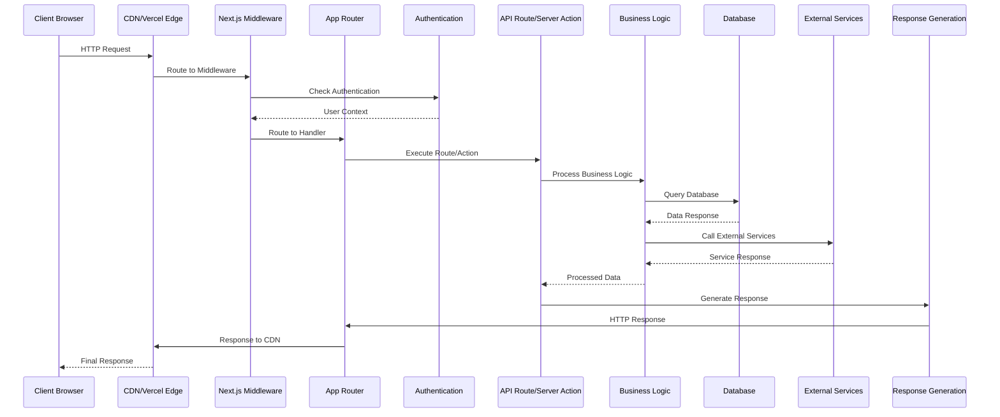
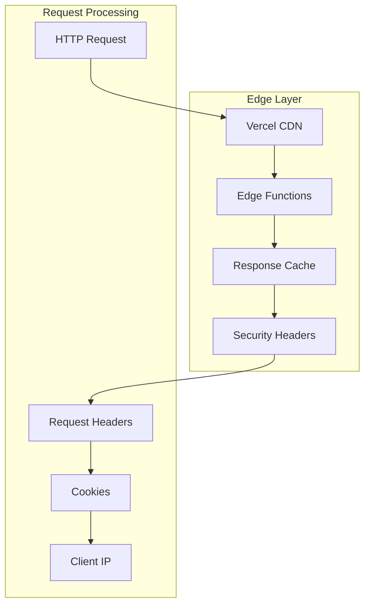
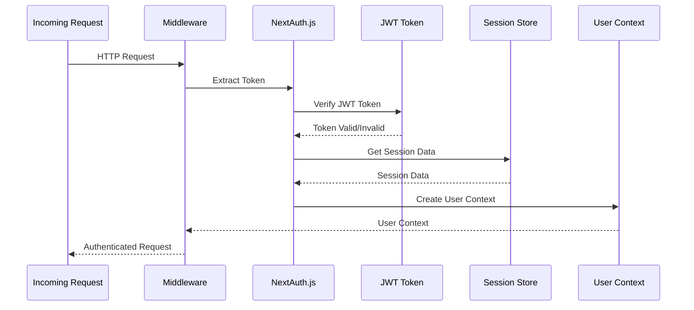
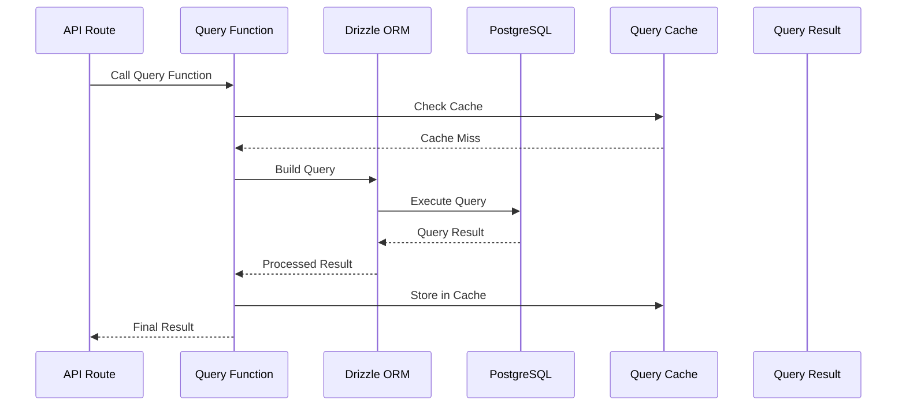
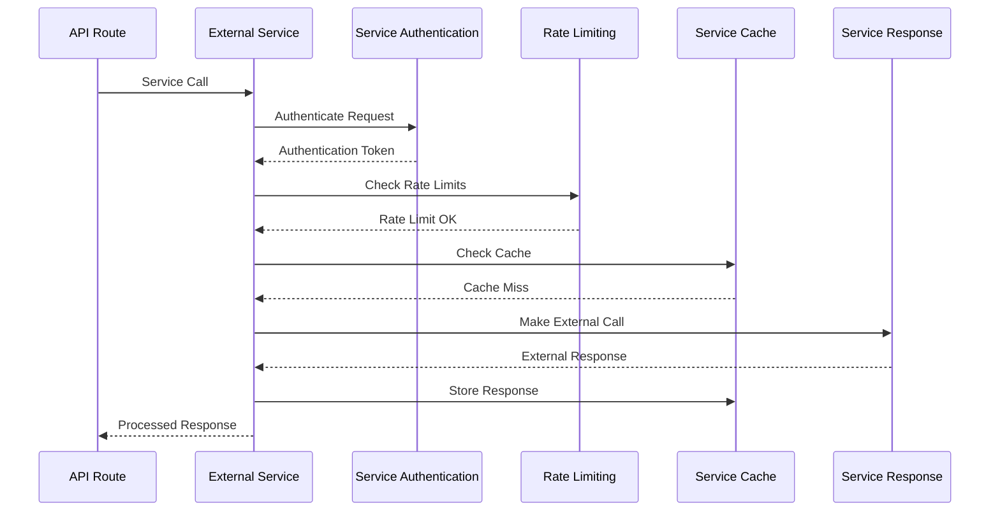
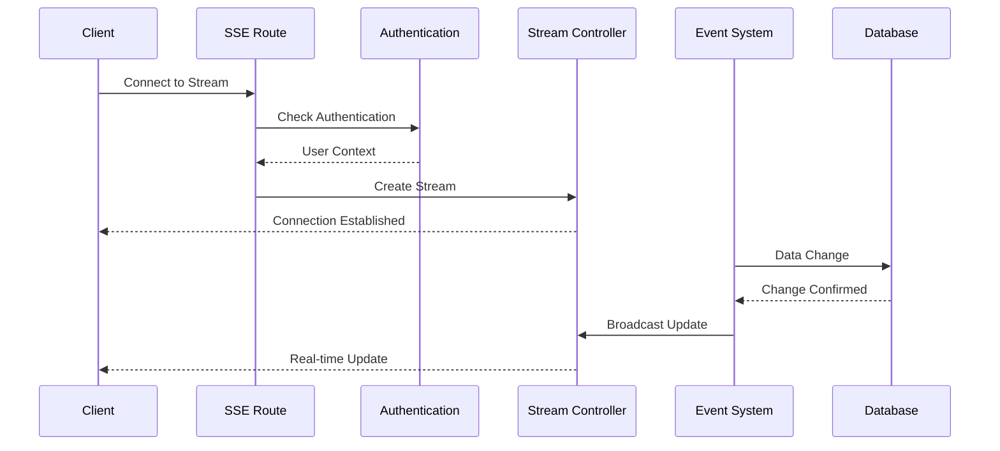
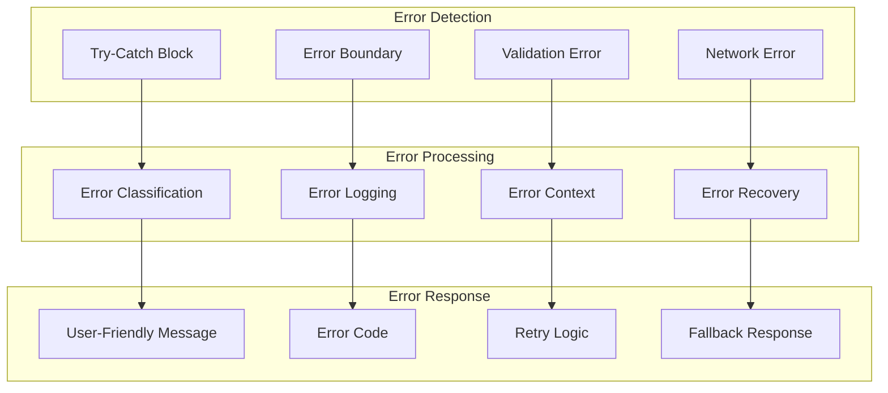
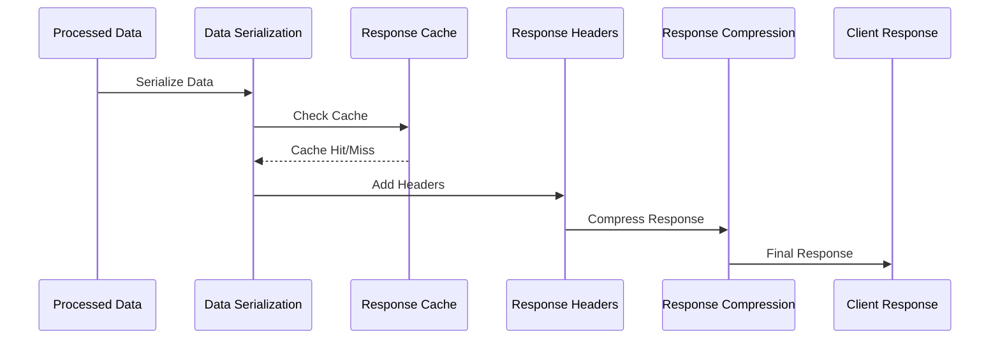

# Request Lifecycle Diagram

## Overview
GrantFlow.dev implements a comprehensive request lifecycle that handles authentication, authorization, business logic, and response generation. The system uses Next.js App Router with middleware, API routes, and server actions to process requests efficiently.

## HTTP Request Lifecycle Diagram



## Detailed Request Lifecycle

### **1. Request Entry and Routing**

#### **CDN and Edge Processing**


#### **Middleware Processing**
```typescript
// middleware.ts - Request Processing
export async function middleware(request: NextRequest) {
  const { pathname } = request.nextUrl
  const token = await getToken({ req: request })
  
  // Security headers
  const response = NextResponse.next()
  response.headers.set('X-Content-Type-Options', 'nosniff')
  response.headers.set('X-Frame-Options', 'DENY')
  response.headers.set('X-XSS-Protection', '1; mode=block')
  
  // Authentication check
  if (pathname.startsWith('/dashboard')) {
    if (!token) {
      return NextResponse.redirect(new URL('/login', request.url))
    }
  }
  
  // API protection
  if (pathname.startsWith('/api/')) {
    if (!token) {
      return NextResponse.json({ error: 'Unauthorized' }, { status: 401 })
    }
  }
  
  return response
}
```

### **2. Authentication and Authorization**

#### **Authentication Flow**


#### **Authorization Check**
```typescript
// src/lib/auth/middleware.ts - Authorization
export async function checkAuthorization(
  user: User,
  resource: string,
  action: string
): Promise<boolean> {
  // Role-based access control
  const userRole = user.primaryRole
  const permissions = rolePermissions[userRole] || []
  
  // Check specific permissions
  if (action === 'read' && permissions.includes('view_submissions')) {
    return true
  }
  
  if (action === 'write' && permissions.includes('create_submissions')) {
    return true
  }
  
  if (action === 'admin' && permissions.includes('manage_committees')) {
    return true
  }
  
  return false
}
```

### **3. API Route Processing**

#### **API Route Handler**
```typescript
// src/app/api/dashboard/stats/route.ts - API Route
export async function GET() {
  try {
    // 1. Authentication
    const user = await getUser()
    if (!user) {
      return NextResponse.json({ error: 'Unauthorized' }, { status: 401 })
    }
    
    // 2. Authorization
    if (!await checkAuthorization(user, 'dashboard', 'read')) {
      return NextResponse.json({ error: 'Forbidden' }, { status: 403 })
    }
    
    // 3. Business Logic
    const [stats, deadlines] = await Promise.all([
      getDashboardStats(),
      getUpcomingDeadlines(user.id),
    ])
    
    // 4. Response Generation
    return NextResponse.json({ 
      ...stats, 
      upcomingDeadlines: deadlines 
    })
  } catch (error) {
    // 5. Error Handling
    console.error('Error fetching dashboard stats:', error)
    return NextResponse.json(
      { error: 'Failed to fetch dashboard stats' },
      { status: 500 }
    )
  }
}
```

#### **Server Action Processing**
```typescript
// src/lib/actions/submission-actions.ts - Server Action
export const createSubmissionAction = validatedActionWithUser(
  submissionSchema,
  async (data: SubmissionFormData, user: User) => {
    try {
      // 1. Input Validation (handled by validatedActionWithUser)
      
      // 2. Business Logic
      const grantProgram = await getGrantProgram(data.grantProgramId)
      if (!grantProgram) {
        return { error: 'Grant program not found' }
      }
      
      // 3. Data Processing
      const submission = await createSubmission({
        ...data,
        submitterId: user.id,
        submitterGroupId: user.primaryGroupId,
        reviewerGroupId: grantProgram.groupId,
      })
      
      // 4. Side Effects
      await notifyCommittee(grantProgram.groupId, submission.id)
      await logActivity('CREATE_SUBMISSION', user.id, { submissionId: submission.id })
      
      // 5. Response
      return { success: true, submission }
    } catch (error) {
      console.error('Error creating submission:', error)
      return { error: 'Failed to create submission' }
    }
  }
)
```

### **4. Database Query Processing**

#### **Database Query Flow**


#### **Database Query Implementation**
```typescript
// src/lib/db/queries/dashboard.ts - Database Query
export async function getDashboardStats() {
  try {
    // 1. Query Building
    const stats = await db
      .select({
        totalSubmissions: count(submissions.id),
        pendingReviews: count(submissions.id).where(eq(submissions.status, 'pending')),
        completedMilestones: count(milestones.id).where(eq(milestones.status, 'completed')),
        totalFunding: sum(submissions.totalAmount),
      })
      .from(submissions)
      .leftJoin(milestones, eq(submissions.id, milestones.submissionId))
    
    // 2. Data Processing
    const processedStats = {
      totalSubmissions: stats[0]?.totalSubmissions || 0,
      pendingReviews: stats[0]?.pendingReviews || 0,
      completedMilestones: stats[0]?.completedMilestones || 0,
      totalFunding: stats[0]?.totalFunding || 0,
    }
    
    // 3. Cache Result
    await cache.set('dashboard_stats', processedStats, 300) // 5 minutes
    
    return processedStats
  } catch (error) {
    console.error('Error fetching dashboard stats:', error)
    throw new Error('Failed to fetch dashboard stats')
  }
}
```

### **5. External Service Integration**

#### **External Service Call Flow**


#### **GitHub API Integration**
```typescript
// src/lib/github/simple-client.ts - External Service
export class GitHubClient {
  private octokit: Octokit
  
  constructor() {
    this.octokit = new Octokit({
      auth: process.env.GITHUB_TOKEN,
      request: {
        timeout: 10000,
        retries: 3,
      },
    })
  }
  
  async getRepositoryData(repoUrl: string) {
    try {
      // 1. Rate limiting check
      await this.checkRateLimit()
      
      // 2. Parse repository URL
      const { owner, repo } = this.parseRepositoryUrl(repoUrl)
      
      // 3. Make API call
      const response = await this.octokit.rest.repos.get({
        owner,
        repo,
      })
      
      // 4. Process response
      return {
        name: response.data.name,
        description: response.data.description,
        language: response.data.language,
        stars: response.data.stargazers_count,
        forks: response.data.forks_count,
        updatedAt: response.data.updated_at,
      }
    } catch (error) {
      console.error('GitHub API error:', error)
      throw new Error('Failed to fetch repository data')
    }
  }
  
  private async checkRateLimit() {
    const rateLimit = await this.octokit.rest.rateLimit.get()
    if (rateLimit.data.remaining < 10) {
      throw new Error('GitHub API rate limit exceeded')
    }
  }
}
```

### **6. Real-time Communication**

#### **Server-Sent Events Flow**


#### **SSE Implementation**
```typescript
// src/app/api/notifications/stream/route.ts - SSE Route
export async function GET(request: NextRequest) {
  try {
    // 1. Authentication
    const user = await getUser()
    if (!user) {
      return new Response('Unauthorized', { status: 401 })
    }
    
    // 2. Create SSE stream
    const stream = new ReadableStream({
      start(controller) {
        // 3. Send initial connection
        const welcomeMessage = {
          type: 'connection',
          message: 'Connected to notification stream',
          timestamp: new Date().toISOString(),
          userId: user.id,
        }
        controller.enqueue(`data: ${JSON.stringify(welcomeMessage)}\n\n`)
        
        // 4. Store controller reference
        global.notificationStreams ??= new Map()
        global.notificationStreams.set(user.id, controller)
        
        // 5. Set up heartbeat
        const heartbeat = setInterval(() => {
          try {
            const heartbeatMessage = {
              type: 'heartbeat',
              timestamp: new Date().toISOString(),
            }
            controller.enqueue(`data: ${JSON.stringify(heartbeatMessage)}\n\n`)
          } catch (error) {
            clearInterval(heartbeat)
          }
        }, 30000)
        
        // 6. Cleanup on close
        request.signal.addEventListener('abort', () => {
          clearInterval(heartbeat)
          global.notificationStreams?.delete(user.id)
        })
      }
    })
    
    // 7. Return stream with proper headers
    return new Response(stream, {
      headers: {
        'Content-Type': 'text/event-stream',
        'Cache-Control': 'no-cache',
        'Connection': 'keep-alive',
      }
    })
  } catch (error) {
    console.error('SSE connection error:', error)
    return new Response('Internal Server Error', { status: 500 })
  }
}
```

### **7. Error Handling and Recovery**

#### **Error Handling Flow**


#### **Error Handling Implementation**
```typescript
// src/lib/errors/error-handler.ts - Error Handling
export class ErrorHandler {
  static handle(error: unknown, context: string): ErrorResponse {
    console.error(`[${context}]:`, error)
    
    // 1. Error Classification
    if (error instanceof ValidationError) {
      return {
        type: 'validation',
        message: 'Invalid input data',
        code: 'VALIDATION_ERROR',
        details: error.details,
      }
    }
    
    if (error instanceof DatabaseError) {
      return {
        type: 'database',
        message: 'Database operation failed',
        code: 'DATABASE_ERROR',
        details: error.message,
      }
    }
    
    if (error instanceof ExternalServiceError) {
      return {
        type: 'external',
        message: 'External service unavailable',
        code: 'EXTERNAL_SERVICE_ERROR',
        details: error.service,
      }
    }
    
    // 2. Generic Error
    return {
      type: 'internal',
      message: 'Internal server error',
      code: 'INTERNAL_ERROR',
      details: 'An unexpected error occurred',
    }
  }
  
  static async withRetry<T>(
    operation: () => Promise<T>,
    maxRetries: number = 3,
    delay: number = 1000
  ): Promise<T> {
    for (let attempt = 1; attempt <= maxRetries; attempt++) {
      try {
        return await operation()
      } catch (error) {
        if (attempt === maxRetries) {
          throw error
        }
        
        // Exponential backoff
        await new Promise(resolve => setTimeout(resolve, delay * attempt))
      }
    }
    
    throw new Error('Max retries exceeded')
  }
}
```

### **8. Response Generation and Caching**

#### **Response Generation Flow**


#### **Response Caching Implementation**
```typescript
// src/lib/cache/response-cache.ts - Response Caching
export class ResponseCache {
  private static cache = new Map<string, { data: any; timestamp: number }>()
  private static TTL = 5 * 60 * 1000 // 5 minutes
  
  static set(key: string, data: any, ttl: number = this.TTL): void {
    this.cache.set(key, {
      data,
      timestamp: Date.now() + ttl,
    })
  }
  
  static get(key: string): any | null {
    const cached = this.cache.get(key)
    if (!cached) return null
    
    if (Date.now() > cached.timestamp) {
      this.cache.delete(key)
      return null
    }
    
    return cached.data
  }
  
  static generateCacheKey(
    endpoint: string,
    params: Record<string, any>,
    user?: User
  ): string {
    const sortedParams = Object.keys(params)
      .sort()
      .map(key => `${key}:${params[key]}`)
      .join('|')
    
    const userKey = user ? `user:${user.id}` : 'anonymous'
    return `${endpoint}|${sortedParams}|${userKey}`
  }
}
```

## Performance Optimization

### **1. Request Optimization**
- **Connection Pooling**: Database connection management
- **Query Optimization**: Efficient database queries
- **Caching**: Response and data caching
- **Compression**: Response compression and optimization

### **2. Error Recovery**
- **Retry Logic**: Automatic retry for transient errors
- **Circuit Breaker**: Protection against cascading failures
- **Fallback Responses**: Graceful degradation
- **Monitoring**: Error tracking and alerting

### **3. Security Considerations**
- **Input Validation**: Comprehensive input validation
- **Rate Limiting**: API rate limiting and throttling
- **Authentication**: Secure authentication and authorization
- **Data Protection**: Data encryption and protection
