# File Structure Tree

## Overview
GrantFlow.dev follows a Next.js 15 App Router structure with clear separation of concerns between frontend components, API routes, database schemas, and business logic.

## File Structure Diagram

```mermaid
graph TD
    Root[grantflow-dev/]
    
    Root --> App[src/app/]
    Root --> Components[src/components/]
    Root --> Lib[src/lib/]
    Root --> Types[src/types/]
    Root --> Docs[docs/]
    Root --> Scripts[scripts/]
    Root --> Public[public/]
    Root --> Config[Config Files]
    
    App --> Dashboard[app/dashboard/]
    App --> Login[app/login/]
    App --> API[app/api/]
    App --> Layout[layout.tsx]
    App --> Global[globals.css]
    
    Dashboard --> Activity[activity/]
    Dashboard --> Committees[committees/]
    Dashboard --> General[general/]
    Dashboard --> Programs[programs/]
    Dashboard --> Review[review/]
    Dashboard --> Security[security/]
    Dashboard --> Submissions[submissions/]
    
    API --> Auth[api/auth/]
    API --> DashboardAPI[api/dashboard/]
    API --> Notifications[api/notifications/]
    API --> Stripe[api/stripe/]
    API --> Team[api/team/]
    API --> User[api/user/]
    
    Components --> Committee[committee/]
    Components --> Dashboard[components/dashboard/]
    Components --> Discussion[discussion/]
    Components --> Milestone[milestone/]
    Components --> Providers[providers/]
    Components --> Review[review/]
    Components --> Submissions[submissions/]
    Components --> UI[ui/]
    Components --> Wallet[wallet/]
    
    Lib --> Auth[lib/auth/]
    Lib --> DB[lib/db/]
    Lib --> GitHub[lib/github/]
    Lib --> Hooks[lib/hooks/]
    Lib --> LLM[lib/llm/]
    Lib --> Notifications[lib/notifications/]
    Lib --> Polkadot[lib/polkadot/]
    Lib --> Utils[lib/utils.ts]
    Lib --> Validation[lib/validation/]
    
    DB --> Schema[db/schema/]
    DB --> Queries[db/queries/]
    DB --> Writes[db/writes/]
    DB --> Drizzle[db/drizzle.ts]
    
    Schema --> Users[schema/users.ts]
    Schema --> Groups[schema/groups.ts]
    Schema --> Submissions[schema/submissions.ts]
    Schema --> Milestones[schema/milestones.ts]
    Schema --> Discussions[schema/discussions.ts]
    Schema --> Messages[schema/messages.ts]
    Schema --> Reviews[schema/reviews.ts]
    Schema --> Payouts[schema/payouts.ts]
    Schema --> Notifications[schema/notifications.ts]
    
    Config --> Package[package.json]
    Config --> Next[next.config.ts]
    Config --> Tailwind[tailwind.config.js]
    Config --> Drizzle[drizzle.config.ts]
    Config --> TypeScript[tsconfig.json]
```

## Directory Structure with Context

### **Root Level**
- `package.json` - Project dependencies and scripts
- `next.config.ts` - Next.js configuration
- `tailwind.config.js` - Tailwind CSS configuration
- `drizzle.config.ts` - Database ORM configuration
- `tsconfig.json` - TypeScript configuration
- `middleware.ts` - Next.js middleware for authentication
- `plan.md` - Project roadmap and implementation guide

### **Source Code (`src/`)**

#### **App Directory (`src/app/`)**
- **Dashboard Routes** (`(dashboard)/`) - Protected dashboard pages
  - `dashboard/` - Main dashboard with stats and overview
  - `committees/[id]/` - Committee management and details
  - `programs/[id]/` - Grant program configuration
  - `submissions/` - Submission management and review
  - `review/` - Review workflow interfaces
  - `activity/` - Activity feed and notifications
- **Authentication Routes** (`(login)/`) - Public authentication pages
  - `login.tsx` - Login page component
  - `sign-in/` - Sign-in form
  - `sign-up/` - Registration form
- **API Routes** (`api/`) - Backend API endpoints
  - `auth/[...nextauth]/` - NextAuth.js authentication
  - `dashboard/stats/` - Dashboard statistics
  - `notifications/stream/` - Server-sent events for notifications
  - `stripe/` - Payment processing (currently disabled)
  - `team/` - Team management endpoints
  - `user/` - User profile and committee membership

#### **Components Directory (`src/components/`)**
- **Committee Components** (`committee/`) - Committee management UI
- **Dashboard Components** (`dashboard/`) - Dashboard-specific components
- **Discussion Components** (`discussion/`) - Real-time chat and messaging
- **Milestone Components** (`milestone/`) - Milestone tracking and voting
- **Provider Components** (`providers/`) - React context providers
- **Review Components** (`review/`) - Review workflow interfaces
- **Submission Components** (`submissions/`) - Submission management
- **UI Components** (`ui/`) - Reusable shadcn/ui components
- **Wallet Components** (`wallet/`) - Polkadot wallet integration

#### **Library Directory (`src/lib/`)**
- **Authentication** (`auth/`) - NextAuth.js configuration and session management
- **Database** (`db/`) - Drizzle ORM schemas, queries, and database operations
- **GitHub Integration** (`github/`) - GitHub API client and repository analysis
- **Hooks** (`hooks/`) - Custom React hooks for state management
- **LLM Integration** (`llm/`) - AI/LLM model configurations
- **Notifications** (`notifications/`) - Multi-channel notification system
- **Polkadot Integration** (`polkadot/`) - Blockchain and multisig operations
- **Validation** (`validation/`) - Zod schemas for form validation

#### **Database Schema (`src/lib/db/schema/`)**
- **Core Entities** - Users, groups, submissions, milestones
- **Relationships** - Group memberships, discussions, reviews
- **Analytics** - Group analytics and platform metrics
- **Notifications** - Notification system data models
- **JSON Types** - TypeScript interfaces for complex data structures

### **Supporting Directories**

#### **Scripts (`scripts/`)**
- `db/setup.ts` - Database initialization
- `db/seed.ts` - Database seeding with sample data
- `db/clean.ts` - Database cleanup utilities

#### **Documentation (`docs/`)**
- `github-setup.md` - GitHub integration setup guide

#### **Public Assets (`public/`)**
- `animations/` - Lottie animation files
- `favicon.ico` - Site favicon

#### **Configuration Files**
- `components.json` - shadcn/ui component configuration
- `eslint.config.mjs` - ESLint configuration
- `postcss.config.mjs` - PostCSS configuration
- `vitest.config.ts` - Testing configuration

## Key Architectural Patterns

### **1. Next.js App Router Structure**
- Route-based file organization with `(dashboard)` and `(login)` route groups
- API routes co-located with frontend routes
- Server components for data fetching and rendering

### **2. Component Organization**
- Domain-specific component directories (committee, milestone, submission)
- Shared UI components in `ui/` directory
- Provider components for global state management

### **3. Database Architecture**
- TypeScript-first schema with Drizzle ORM
- Separated queries, writes, and schema definitions
- JSON types for complex data structures

### **4. External Integrations**
- GitHub integration for repository analysis
- Polkadot integration for blockchain operations
- Multi-channel notification system
- AI/LLM integration for code analysis

### **5. Authentication & Security**
- NextAuth.js with GitHub OAuth
- Role-based access control
- Server actions with validation
- Secure session management

## File Naming Conventions

- **Components**: PascalCase (e.g., `CommitteeInfoCard.tsx`)
- **Pages**: `page.tsx` for route pages
- **API Routes**: `route.ts` for API endpoints
- **Schemas**: camelCase with `.ts` extension
- **Utilities**: camelCase with descriptive names
- **Types**: PascalCase interfaces and types
