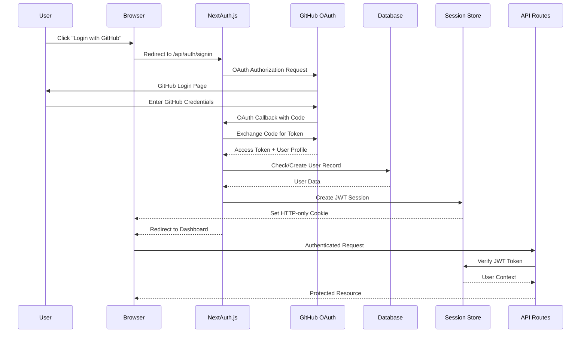

# Security & Authentication Flow

## Overview
GrantFlow.dev implements a comprehensive security and authentication system using NextAuth.js with GitHub OAuth, JWT sessions, role-based access control, and secure API endpoints. The system ensures secure user authentication, data protection, and proper authorization throughout the application.

## Authentication Flow Diagram



## Security Architecture

### **1. Authentication System**

#### **NextAuth.js Configuration**
```typescript
// src/lib/auth/next-auth.ts
export const authOptions: NextAuthOptions = {
  providers: [
    GithubProvider({
      clientId: process.env.GITHUB_CLIENT_ID!,
      clientSecret: process.env.GITHUB_CLIENT_SECRET!,
    }),
  ],
  secret: process.env.NEXTAUTH_SECRET,
  session: {
    strategy: 'jwt',
    maxAge: 60 * 60 * 24, // 24 hours
  },
  callbacks: {
    async signIn({ user, account, profile }) {
      // GitHub profile validation and user creation
      if (account?.provider === 'github' && profile) {
        const githubProfile = profile as {
          id: number
          login: string
          name: string
          email: string
          avatar_url: string
        }
        
        // Check if user exists by GitHub ID
        const existingUser = await db
          .select()
          .from(users)
          .where(eq(users.githubId, String(githubProfile.id)))
          .limit(1)
        
        if (existingUser.length > 0) {
          // Update existing user
          await db
            .update(users)
            .set({
              name: githubProfile.name,
              email: githubProfile.email,
              avatarUrl: githubProfile.avatar_url,
              updatedAt: new Date(),
            })
            .where(eq(users.githubId, String(githubProfile.id)))
        } else {
          // Create new user
          await db.insert(users).values({
            name: githubProfile.name,
            email: githubProfile.email,
            githubId: String(githubProfile.id),
            avatarUrl: githubProfile.avatar_url,
            primaryRole: 'team',
          })
        }
        return true
      }
      return false
    },
    async jwt({ token, user }) {
      if (user) {
        token.userId = user.id
        token.role = user.role
      }
      return token
    },
    async session({ session, token }) {
      if (token) {
        session.user.id = token.userId
        session.user.role = token.role
      }
      return session
    },
  },
}
```

#### **Session Management**
```typescript
// src/lib/auth/session.ts
export async function getSession() {
  const session = await cookies().get('session')?.value
  if (!session) return null
  return await verifyToken(session)
}

export async function setSession(user: NewUser) {
  if (!user.id) {
    throw new Error('Cannot create session: user ID is required')
  }

  const expiresInOneDay = new Date(Date.now() + 24 * 60 * 60 * 1000)
  const session: SessionData = {
    user: { id: user.id },
    expires: expiresInOneDay.toISOString(),
  }

  try {
    const encryptedSession = await signToken(session)
    const cookieStore = await cookies()

    cookieStore.set('session', encryptedSession, {
      expires: expiresInOneDay,
      httpOnly: true,
      secure: process.env.NODE_ENV === 'production',
      sameSite: 'lax',
      path: '/',
    })
  } catch (error) {
    console.error('[Session]: Failed to create session:', error)
    throw new Error('Failed to create session')
  }
}
```

### **2. Authorization System**

#### **Role-Based Access Control**
```typescript
// User roles and permissions
export enum UserRole {
  ADMIN = 'admin',
  CURATOR = 'curator',
  GRANTEE = 'grantee',
  TEAM = 'team'
}

export enum Permission {
  CREATE_SUBMISSION = 'create_submission',
  REVIEW_SUBMISSION = 'review_submission',
  MANAGE_COMMITTEE = 'manage_committee',
  MANAGE_USERS = 'manage_users',
  VIEW_ANALYTICS = 'view_analytics'
}

// Role-based permission mapping
export const rolePermissions: Record<UserRole, Permission[]> = {
  [UserRole.ADMIN]: [
    Permission.CREATE_SUBMISSION,
    Permission.REVIEW_SUBMISSION,
    Permission.MANAGE_COMMITTEE,
    Permission.MANAGE_USERS,
    Permission.VIEW_ANALYTICS
  ],
  [UserRole.CURATOR]: [
    Permission.CREATE_SUBMISSION,
    Permission.REVIEW_SUBMISSION,
    Permission.VIEW_ANALYTICS
  ],
  [UserRole.GRANTEE]: [
    Permission.CREATE_SUBMISSION
  ],
  [UserRole.TEAM]: [
    Permission.CREATE_SUBMISSION
  ]
}
```

#### **Middleware Protection**
```typescript
// middleware.ts
import { NextResponse } from 'next/server'
import type { NextRequest } from 'next/server'
import { getToken } from 'next-auth/jwt'

export async function middleware(request: NextRequest) {
  const token = await getToken({ req: request })
  const { pathname } = request.nextUrl

  // Public routes that don't require authentication
  const publicRoutes = ['/', '/login', '/sign-in', '/sign-up']
  if (publicRoutes.includes(pathname)) {
    return NextResponse.next()
  }

  // Protected routes
  if (pathname.startsWith('/dashboard')) {
    if (!token) {
      return NextResponse.redirect(new URL('/login', request.url))
    }
    
    // Role-based access control
    if (pathname.startsWith('/dashboard/admin') && token.role !== 'admin') {
      return NextResponse.redirect(new URL('/dashboard', request.url))
    }
  }

  // API routes protection
  if (pathname.startsWith('/api/')) {
    if (!token) {
      return NextResponse.json({ error: 'Unauthorized' }, { status: 401 })
    }
  }

  return NextResponse.next()
}

export const config = {
  matcher: [
    '/dashboard/:path*',
    '/api/:path*'
  ]
}
```

### **3. API Security**

#### **Authenticated API Routes**
```typescript
// src/lib/auth/middleware.ts
export function validatedActionWithUser<
  TSchema extends ZodLike,
  TOutput extends ActionState,
>(
  schema: TSchema,
  action: ValidatedActionWithUserFunction<
    TSchema extends {
      safeParse: (
        data: unknown
      ) => { success: true; data: infer TData } | { success: false }
    }
      ? TData
      : never,
    TOutput
  >
) {
  return async (
    data: TSchema extends {
      safeParse: (
        data: unknown
      ) => { success: true; data: infer TData } | { success: false }
    }
      ? TData
      : never
  ): Promise<TOutput | { error: string }> => {
    // Authentication check
    const user = await getUser()
    if (!user) {
      throw new Error('User is not authenticated')
    }

    // Validation
    const result = schema.safeParse(data)
    if (!result.success) {
      console.error(
        '[validatedActionWithUser]: Validation failed',
        result.error
      )
      return { error: result.error?.issues[0]?.message ?? 'Validation failed' }
    }

    // Execute action with validated data and user
    return action(
      result.data as TSchema extends {
        safeParse: (
          data: unknown
        ) => { success: true; data: infer TData } | { success: false }
      }
        ? TData
        : never,
      user
    )
  }
}
```

#### **API Route Protection**
```typescript
// Example protected API route
export async function GET() {
  try {
    const user = await getUser()
    if (!user) {
      return NextResponse.json({ error: 'Unauthorized' }, { status: 401 })
    }

    // Role-based access control
    if (user.role !== 'admin' && user.role !== 'curator') {
      return NextResponse.json({ error: 'Forbidden' }, { status: 403 })
    }

    const data = await fetchProtectedData(user.id)
    return NextResponse.json(data)
  } catch (error) {
    console.error('API Error:', error)
    return NextResponse.json(
      { error: 'Internal Server Error' },
      { status: 500 }
    )
  }
}
```

### **4. Data Security**

#### **Input Validation and Sanitization**
```typescript
// Zod validation schemas
export const submissionSchema = z.object({
  title: z.string().min(1).max(255).trim(),
  description: z.string().min(1).max(10000).trim(),
  executiveSummary: z.string().min(1).max(5000).trim(),
  githubRepoUrl: z.string().url().optional(),
  walletAddress: z.string().regex(/^[1-9A-HJ-NP-Za-km-z]{47,48}$/).optional(),
  totalAmount: z.number().positive().optional(),
  labels: z.array(z.string()).optional()
})

export const messageSchema = z.object({
  content: z.string().min(1).max(10000).trim(),
  messageType: z.enum(['comment', 'status_change', 'vote', 'group_decision']),
  metadata: z.string().optional()
})

export const reviewSchema = z.object({
  vote: z.enum(['approve', 'reject', 'abstain']),
  feedback: z.string().max(5000).trim().optional(),
  reviewType: z.enum(['standard', 'final', 'milestone']),
  weight: z.number().int().min(1).max(10).default(1),
  isBinding: z.boolean().default(false)
})
```

#### **SQL Injection Prevention**
```typescript
// Drizzle ORM provides type-safe queries
export async function getUserSubmissions(userId: number) {
  return await db
    .select()
    .from(submissions)
    .where(eq(submissions.submitterId, userId))
    .orderBy(desc(submissions.createdAt))
}

export async function getCommitteeMembers(committeeId: number) {
  return await db
    .select({
      user: users,
      membership: groupMemberships
    })
    .from(groupMemberships)
    .innerJoin(users, eq(groupMemberships.userId, users.id))
    .where(
      and(
        eq(groupMemberships.groupId, committeeId),
        eq(groupMemberships.isActive, true)
      )
    )
}
```

### **5. Session Security**

#### **JWT Token Security**
```typescript
// JWT token creation and verification
const key = new TextEncoder().encode(process.env.AUTH_SECRET)

export async function signToken(payload: SessionData) {
  return await new SignJWT(payload)
    .setProtectedHeader({ alg: 'HS256' })
    .setIssuedAt()
    .setExpirationTime('24h')
    .sign(key)
}

export async function verifyToken(token: string) {
  try {
    const { payload } = await jwtVerify(token, key)
    return payload as SessionData
  } catch (error) {
    console.error('[verifyToken]: Token verification failed', error)
    return null
  }
}
```

#### **Cookie Security**
```typescript
// Secure cookie configuration
cookieStore.set('session', encryptedSession, {
  expires: expiresInOneDay,
  httpOnly: true,                    // Prevent XSS
  secure: process.env.NODE_ENV === 'production', // HTTPS only in production
  sameSite: 'lax',               // CSRF protection
  path: '/',                     // Cookie scope
})
```

### **6. External Service Security**

#### **GitHub OAuth Security**
```typescript
// GitHub OAuth configuration
const githubProvider = GithubProvider({
  clientId: process.env.GITHUB_CLIENT_ID!,
  clientSecret: process.env.GITHUB_CLIENT_SECRET!,
  authorization: {
    params: {
      scope: 'read:user user:email', // Minimal required scopes
    },
  },
})
```

#### **API Rate Limiting**
```typescript
// Rate limiting implementation
const rateLimit = new Map<string, { count: number; resetTime: number }>()

export function rateLimitMiddleware(limit: number, windowMs: number) {
  return (req: NextRequest) => {
    const ip = req.ip ?? 'unknown'
    const now = Date.now()
    const windowStart = now - windowMs
    
    const userLimit = rateLimit.get(ip)
    
    if (!userLimit || userLimit.resetTime < windowStart) {
      rateLimit.set(ip, { count: 1, resetTime: now })
      return true
    }
    
    if (userLimit.count >= limit) {
      return false
    }
    
    userLimit.count++
    return true
  }
}
```

## Security Best Practices

### **1. Authentication Security**

#### **Password Security**
- **No Password Storage**: GitHub OAuth eliminates password storage
- **Token Security**: JWT tokens with secure signing
- **Session Management**: Secure session handling with expiration
- **Multi-Factor**: GitHub's built-in 2FA support

#### **OAuth Security**
- **Minimal Scopes**: Only request necessary GitHub permissions
- **State Parameter**: CSRF protection in OAuth flow
- **Token Validation**: Secure token exchange and validation
- **Profile Verification**: GitHub profile data validation

### **2. Authorization Security**

#### **Role-Based Access Control**
- **Principle of Least Privilege**: Users get minimum required permissions
- **Role Separation**: Clear separation between user roles
- **Permission Inheritance**: Hierarchical permission system
- **Dynamic Permissions**: Context-aware permission checking

#### **API Security**
- **Authentication Required**: All API endpoints protected
- **Input Validation**: Comprehensive input validation and sanitization
- **Output Sanitization**: Safe data output and serialization
- **Error Handling**: Secure error messages without information leakage

### **3. Data Security**

#### **Database Security**
- **Type Safety**: Drizzle ORM prevents SQL injection
- **Parameterized Queries**: All database queries use parameters
- **Data Encryption**: Sensitive data encrypted at rest
- **Access Control**: Database access restricted to application

#### **Data Protection**
- **Input Sanitization**: All user input sanitized and validated
- **Output Encoding**: Safe data output and encoding
- **Data Masking**: Sensitive data masked in logs and responses
- **Audit Logging**: Comprehensive security event logging

### **4. Network Security**

#### **HTTPS Enforcement**
- **TLS Encryption**: All communication encrypted in transit
- **Certificate Management**: Valid SSL certificates
- **HSTS Headers**: HTTP Strict Transport Security
- **Secure Cookies**: HTTP-only and secure cookie flags

#### **CORS Configuration**
```typescript
// CORS configuration
const corsOptions = {
  origin: process.env.NODE_ENV === 'production' 
    ? ['https://grantflow.dev'] 
    : ['http://localhost:3000'],
  credentials: true,
  optionsSuccessStatus: 200
}
```

### **5. Security Headers**

#### **Security Headers Implementation**
```typescript
// Security headers middleware
export function securityHeaders(req: NextRequest) {
  const response = NextResponse.next()
  
  response.headers.set('X-Content-Type-Options', 'nosniff')
  response.headers.set('X-Frame-Options', 'DENY')
  response.headers.set('X-XSS-Protection', '1; mode=block')
  response.headers.set('Strict-Transport-Security', 'max-age=31536000; includeSubDomains')
  response.headers.set('Content-Security-Policy', "default-src 'self'")
  response.headers.set('Referrer-Policy', 'strict-origin-when-cross-origin')
  
  return response
}
```

## Security Monitoring and Logging

### **1. Security Event Logging**

#### **Authentication Events**
```typescript
// Authentication event logging
export async function logAuthEvent(event: string, userId: number, details: any) {
  console.log(`[AUTH_EVENT]: ${event}`, {
    event,
    userId,
    timestamp: new Date().toISOString(),
    details
  })
  
  // Store in database for audit trail
  await db.insert(auditLogs).values({
    event,
    userId,
    details: JSON.stringify(details),
    timestamp: new Date()
  })
}
```

#### **Security Incident Response**
- **Failed Login Attempts**: Track and alert on suspicious activity
- **Unauthorized Access**: Monitor and log unauthorized access attempts
- **Data Access**: Log all data access and modifications
- **System Changes**: Track all system configuration changes

### **2. Security Monitoring**

#### **Real-time Monitoring**
- **Authentication Failures**: Monitor failed login attempts
- **API Abuse**: Track API usage patterns and abuse
- **Data Breaches**: Monitor for potential data breaches
- **System Intrusions**: Detect and respond to system intrusions

#### **Security Alerts**
- **Critical Alerts**: Immediate response required
- **Warning Alerts**: Investigation required
- **Info Alerts**: Monitoring and logging
- **Escalation**: Automatic escalation for critical issues

## Compliance and Privacy

### **1. Data Privacy**

#### **User Data Protection**
- **Data Minimization**: Collect only necessary user data
- **Purpose Limitation**: Use data only for stated purposes
- **Data Retention**: Implement data retention policies
- **User Rights**: Support user data access and deletion

#### **Privacy by Design**
- **Default Privacy**: Privacy-friendly default settings
- **Data Transparency**: Clear data usage policies
- **User Control**: User control over their data
- **Regular Audits**: Regular privacy and security audits

### **2. Compliance Requirements**

#### **GDPR Compliance**
- **Data Processing Lawfulness**: Legal basis for data processing
- **User Consent**: Clear consent for data processing
- **Data Portability**: User data export functionality
- **Right to Erasure**: User data deletion capabilities

#### **Security Standards**
- **OWASP Top 10**: Protection against common vulnerabilities
- **Security Best Practices**: Industry-standard security practices
- **Regular Updates**: Regular security updates and patches
- **Vulnerability Management**: Proactive vulnerability management

## Security Incident Response

### **1. Incident Detection**

#### **Automated Detection**
- **Anomaly Detection**: Automated detection of unusual patterns
- **Threat Intelligence**: Integration with threat intelligence feeds
- **Behavioral Analysis**: User behavior analysis for anomalies
- **System Monitoring**: Continuous system security monitoring

#### **Manual Detection**
- **User Reports**: User-reported security issues
- **Security Audits**: Regular security audits and assessments
- **Penetration Testing**: Regular penetration testing
- **Code Reviews**: Security-focused code reviews

### **2. Incident Response**

#### **Response Procedures**
- **Immediate Response**: Immediate containment and mitigation
- **Investigation**: Thorough investigation of security incidents
- **Recovery**: System recovery and restoration
- **Post-Incident**: Post-incident analysis and improvement

#### **Communication**
- **Internal Communication**: Internal team communication
- **User Notification**: User notification of security incidents
- **Regulatory Reporting**: Regulatory reporting requirements
- **Public Disclosure**: Public disclosure of security incidents

## Security Training and Awareness

### **1. Developer Security**

#### **Security Training**
- **Secure Coding**: Secure coding practices and training
- **Security Tools**: Security tool usage and configuration
- **Threat Awareness**: Awareness of current security threats
- **Best Practices**: Security best practices and guidelines

#### **Code Security**
- **Security Reviews**: Security-focused code reviews
- **Vulnerability Scanning**: Automated vulnerability scanning
- **Dependency Management**: Secure dependency management
- **Update Management**: Regular security updates and patches

### **2. User Security**

#### **User Education**
- **Security Awareness**: User security awareness training
- **Best Practices**: User security best practices
- **Threat Awareness**: Awareness of security threats
- **Reporting**: Security incident reporting procedures

#### **Security Features**
- **Account Security**: Account security features and settings
- **Privacy Controls**: User privacy controls and settings
- **Security Notifications**: Security-related notifications
- **Help and Support**: Security help and support resources
