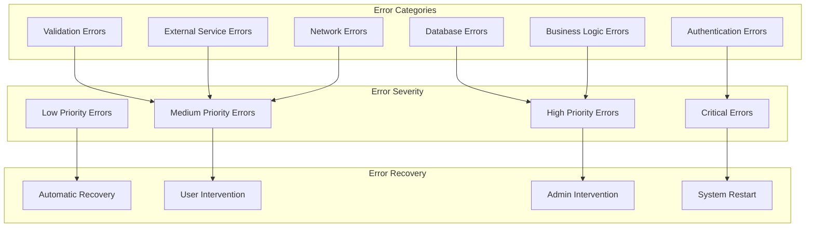
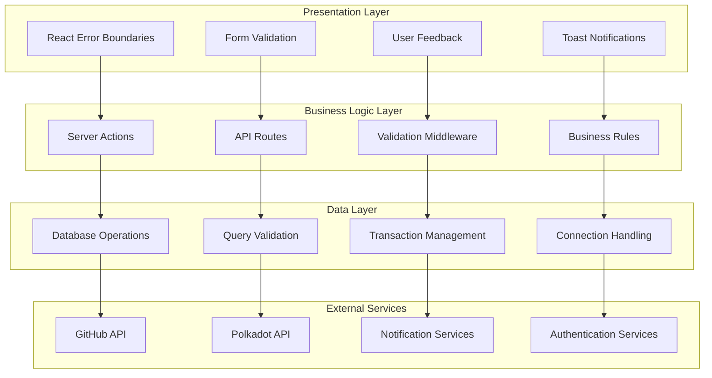
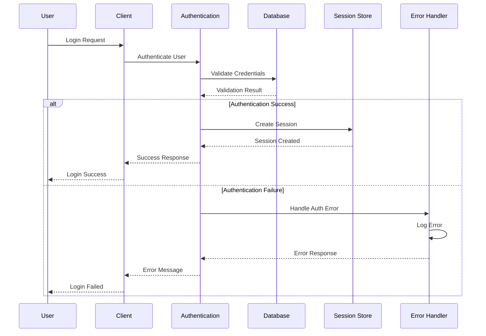
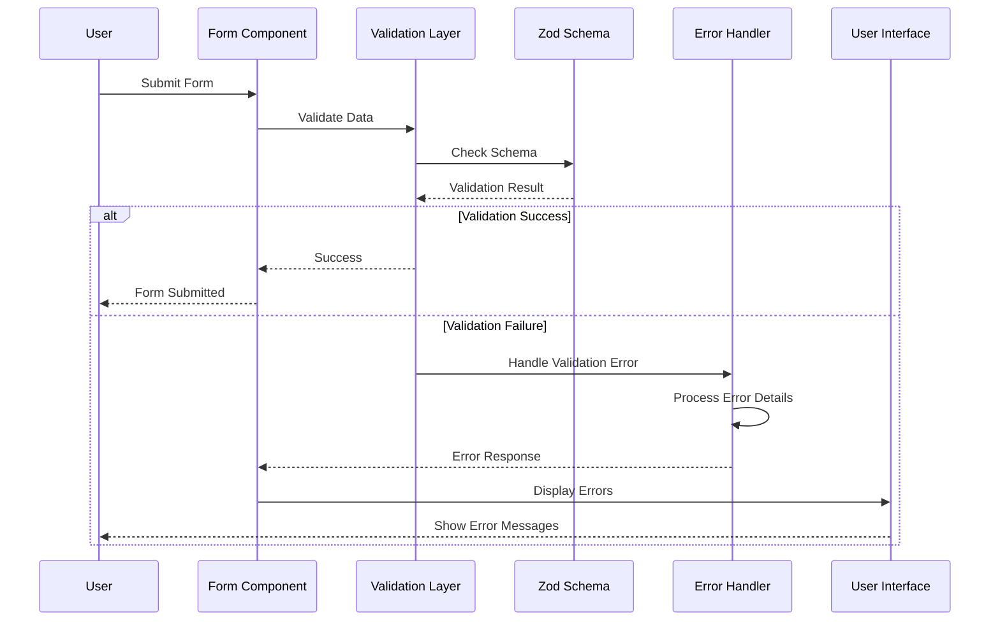
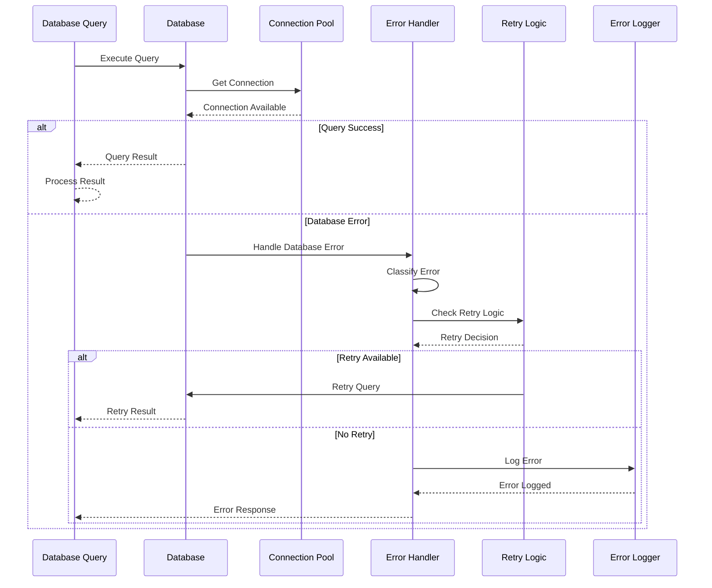
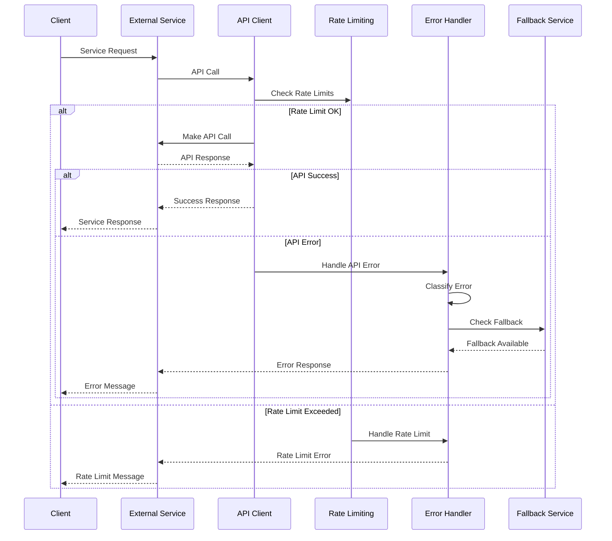

# Error Handling and Exception Pathways

## Overview
GrantFlow.dev implements a comprehensive error handling system that covers authentication, validation, database operations, external service integration, and user experience. The error handling strategy ensures graceful degradation, proper user feedback, and system stability.

## Error Handling Architecture

### **1. Error Classification System**

#### **Error Types and Categories**


#### **Error Classification Implementation**
```typescript
// Error classification system
export enum ErrorType {
  AUTHENTICATION = 'authentication',
  VALIDATION = 'validation',
  DATABASE = 'database',
  EXTERNAL_SERVICE = 'external_service',
  NETWORK = 'network',
  BUSINESS_LOGIC = 'business_logic',
  SYSTEM = 'system'
}

export enum ErrorSeverity {
  CRITICAL = 'critical',
  HIGH = 'high',
  MEDIUM = 'medium',
  LOW = 'low'
}

export interface ErrorContext {
  type: ErrorType
  severity: ErrorSeverity
  message: string
  code?: string
  details?: any
  timestamp: Date
  userId?: number
  requestId?: string
  stack?: string
}
```

### **2. Error Handling Layers**

#### **Multi-Layer Error Handling**


## Error Handling Implementation

### **1. Authentication Error Handling**

#### **Authentication Error Flow**


#### **Authentication Error Implementation**
```typescript
// Authentication error handling
export class AuthenticationErrorHandler {
  static async handleAuthenticationError(
    error: Error,
    context: AuthenticationContext
  ): Promise<AuthenticationErrorResponse> {
    console.error('[AuthenticationError]:', error.message, context)
    
    // Classify authentication error
    const errorType = this.classifyAuthenticationError(error)
    
    // Log error for monitoring
    await this.logAuthenticationError(error, context)
    
    // Generate user-friendly response
    return this.generateErrorResponse(errorType, context)
  }
  
  private static classifyAuthenticationError(error: Error): AuthenticationErrorType {
    if (error.message.includes('Invalid credentials')) {
      return AuthenticationErrorType.INVALID_CREDENTIALS
    }
    if (error.message.includes('Account locked')) {
      return AuthenticationErrorType.ACCOUNT_LOCKED
    }
    if (error.message.includes('Session expired')) {
      return AuthenticationErrorType.SESSION_EXPIRED
    }
    return AuthenticationErrorType.UNKNOWN
  }
  
  private static async logAuthenticationError(
    error: Error,
    context: AuthenticationContext
  ): Promise<void> {
    await db.insert(authenticationErrors).values({
      errorType: this.classifyAuthenticationError(error),
      message: error.message,
      userId: context.userId,
      ipAddress: context.ipAddress,
      userAgent: context.userAgent,
      timestamp: new Date()
    })
  }
}
```

### **2. Validation Error Handling**

#### **Form Validation Error Flow**


#### **Validation Error Implementation**
```typescript
// Validation error handling
export class ValidationErrorHandler {
  static handleValidationError(
    error: z.ZodError,
    context: ValidationContext
  ): ValidationErrorResponse {
    console.error('[ValidationError]:', error.issues, context)
    
    // Process Zod validation errors
    const processedErrors = this.processZodErrors(error.issues)
    
    // Generate user-friendly error messages
    const userMessages = this.generateUserMessages(processedErrors)
    
    // Log validation errors
    this.logValidationErrors(processedErrors, context)
    
    return {
      isValid: false,
      errors: userMessages,
      fieldErrors: this.mapFieldErrors(processedErrors)
    }
  }
  
  private static processZodErrors(issues: z.ZodIssue[]): ProcessedValidationError[] {
    return issues.map(issue => ({
      field: issue.path.join('.'),
      message: issue.message,
      code: issue.code,
      path: issue.path
    }))
  }
  
  private static generateUserMessages(
    errors: ProcessedValidationError[]
  ): string[] {
    return errors.map(error => {
      switch (error.code) {
        case 'too_small':
          return `${error.field} is too short`
        case 'too_big':
          return `${error.field} is too long`
        case 'invalid_type':
          return `${error.field} has an invalid type`
        case 'required':
          return `${error.field} is required`
        default:
          return error.message
      }
    })
  }
}
```

### **3. Database Error Handling**

#### **Database Error Flow**


#### **Database Error Implementation**
```typescript
// Database error handling
export class DatabaseErrorHandler {
  static async handleDatabaseError(
    error: Error,
    context: DatabaseContext
  ): Promise<DatabaseErrorResponse> {
    console.error('[DatabaseError]:', error.message, context)
    
    // Classify database error
    const errorType = this.classifyDatabaseError(error)
    
    // Determine if retry is possible
    const canRetry = this.canRetryOperation(errorType, context)
    
    if (canRetry) {
      return this.attemptRetry(context)
    }
    
    // Log error for monitoring
    await this.logDatabaseError(error, context)
    
    // Generate appropriate response
    return this.generateDatabaseErrorResponse(errorType, context)
  }
  
  private static classifyDatabaseError(error: Error): DatabaseErrorType {
    if (error.message.includes('connection')) {
      return DatabaseErrorType.CONNECTION_ERROR
    }
    if (error.message.includes('timeout')) {
      return DatabaseErrorType.TIMEOUT_ERROR
    }
    if (error.message.includes('constraint')) {
      return DatabaseErrorType.CONSTRAINT_ERROR
    }
    if (error.message.includes('permission')) {
      return DatabaseErrorType.PERMISSION_ERROR
    }
    return DatabaseErrorType.UNKNOWN
  }
  
  private static canRetryOperation(
    errorType: DatabaseErrorType,
    context: DatabaseContext
  ): boolean {
    const retryableErrors = [
      DatabaseErrorType.CONNECTION_ERROR,
      DatabaseErrorType.TIMEOUT_ERROR
    ]
    
    return retryableErrors.includes(errorType) && 
           context.retryCount < context.maxRetries
  }
}
```

### **4. External Service Error Handling**

#### **External Service Error Flow**


#### **External Service Error Implementation**
```typescript
// External service error handling
export class ExternalServiceErrorHandler {
  static async handleExternalServiceError(
    error: Error,
    service: string,
    context: ExternalServiceContext
  ): Promise<ExternalServiceErrorResponse> {
    console.error(`[${service}Error]:`, error.message, context)
    
    // Classify external service error
    const errorType = this.classifyExternalServiceError(error, service)
    
    // Check for fallback options
    const fallbackAvailable = await this.checkFallbackOptions(service, context)
    
    if (fallbackAvailable) {
      return this.attemptFallback(service, context)
    }
    
    // Log error for monitoring
    await this.logExternalServiceError(error, service, context)
    
    // Generate appropriate response
    return this.generateExternalServiceErrorResponse(errorType, service, context)
  }
  
  private static classifyExternalServiceError(
    error: Error,
    service: string
  ): ExternalServiceErrorType {
    if (error.message.includes('rate limit')) {
      return ExternalServiceErrorType.RATE_LIMIT_EXCEEDED
    }
    if (error.message.includes('timeout')) {
      return ExternalServiceErrorType.TIMEOUT
    }
    if (error.message.includes('network')) {
      return ExternalServiceErrorType.NETWORK_ERROR
    }
    if (error.message.includes('authentication')) {
      return ExternalServiceErrorType.AUTHENTICATION_ERROR
    }
    return ExternalServiceErrorType.UNKNOWN
  }
  
  private static async checkFallbackOptions(
    service: string,
    context: ExternalServiceContext
  ): Promise<boolean> {
    // Check if fallback service is available
    switch (service) {
      case 'github':
        return await this.checkGitHubFallback(context)
      case 'polkadot':
        return await this.checkPolkadotFallback(context)
      default:
        return false
    }
  }
}
```

## Error Recovery Strategies

### **1. Automatic Error Recovery**

#### **Retry Logic Implementation**
```typescript
// Retry logic for transient errors
export class RetryManager {
  static async executeWithRetry<T>(
    operation: () => Promise<T>,
    options: RetryOptions = {}
  ): Promise<T> {
    const {
      maxRetries = 3,
      baseDelay = 1000,
      maxDelay = 10000,
      backoffMultiplier = 2
    } = options
    
    let lastError: Error
    
    for (let attempt = 0; attempt <= maxRetries; attempt++) {
      try {
        return await operation()
      } catch (error) {
        lastError = error as Error
        
        // Check if error is retryable
        if (!this.isRetryableError(lastError) || attempt === maxRetries) {
          throw lastError
        }
        
        // Calculate delay with exponential backoff
        const delay = Math.min(
          baseDelay * Math.pow(backoffMultiplier, attempt),
          maxDelay
        )
        
        console.log(`[RetryManager]: Retrying in ${delay}ms (attempt ${attempt + 1}/${maxRetries + 1})`)
        await this.delay(delay)
      }
    }
    
    throw lastError!
  }
  
  private static isRetryableError(error: Error): boolean {
    const retryableErrors = [
      'ECONNRESET',
      'ETIMEDOUT',
      'ENOTFOUND',
      'ECONNREFUSED',
      'rate limit',
      'timeout'
    ]
    
    return retryableErrors.some(retryableError => 
      error.message.toLowerCase().includes(retryableError)
    )
  }
  
  private static delay(ms: number): Promise<void> {
    return new Promise(resolve => setTimeout(resolve, ms))
  }
}
```

#### **Circuit Breaker Pattern**
```typescript
// Circuit breaker for external services
export class CircuitBreaker {
  private state: 'CLOSED' | 'OPEN' | 'HALF_OPEN' = 'CLOSED'
  private failureCount = 0
  private lastFailureTime = 0
  private readonly failureThreshold: number
  private readonly timeout: number
  
  constructor(failureThreshold = 5, timeout = 60000) {
    this.failureThreshold = failureThreshold
    this.timeout = timeout
  }
  
  async execute<T>(operation: () => Promise<T>): Promise<T> {
    if (this.state === 'OPEN') {
      if (Date.now() - this.lastFailureTime > this.timeout) {
        this.state = 'HALF_OPEN'
      } else {
        throw new Error('Circuit breaker is OPEN')
      }
    }
    
    try {
      const result = await operation()
      this.onSuccess()
      return result
    } catch (error) {
      this.onFailure()
      throw error
    }
  }
  
  private onSuccess(): void {
    this.failureCount = 0
    this.state = 'CLOSED'
  }
  
  private onFailure(): void {
    this.failureCount++
    this.lastFailureTime = Date.now()
    
    if (this.failureCount >= this.failureThreshold) {
      this.state = 'OPEN'
    }
  }
}
```

### **2. User-Initiated Error Recovery**

#### **Error Recovery UI**
```typescript
// Error recovery UI components
export function ErrorRecoveryComponent({ error, onRetry, onFallback }: ErrorRecoveryProps) {
  const [isRetrying, setIsRetrying] = useState(false)
  const [retryCount, setRetryCount] = useState(0)
  
  const handleRetry = async () => {
    setIsRetrying(true)
    try {
      await onRetry()
      setRetryCount(0)
    } catch (error) {
      setRetryCount(prev => prev + 1)
    } finally {
      setIsRetrying(false)
    }
  }
  
  const handleFallback = async () => {
    try {
      await onFallback()
    } catch (error) {
      console.error('Fallback failed:', error)
    }
  }
  
  return (
    <div className="error-recovery">
      <div className="error-message">
        <h3>Something went wrong</h3>
        <p>{error.message}</p>
      </div>
      
      <div className="recovery-actions">
        <Button 
          onClick={handleRetry} 
          disabled={isRetrying || retryCount >= 3}
          variant="outline"
        >
          {isRetrying ? 'Retrying...' : 'Try Again'}
        </Button>
        
        {error.fallbackAvailable && (
          <Button onClick={handleFallback} variant="secondary">
            Use Alternative
          </Button>
        )}
      </div>
      
      {retryCount > 0 && (
        <p className="retry-info">
          Retry attempt {retryCount} of 3
        </p>
      )}
    </div>
  )
}
```

### **3. Error Monitoring and Alerting**

#### **Error Monitoring System**
```typescript
// Error monitoring and alerting
export class ErrorMonitor {
  private static errorCounts = new Map<string, number>()
  private static alertThresholds = new Map<string, number>()
  
  static async trackError(error: Error, context: ErrorContext): Promise<void> {
    // Increment error count
    const errorKey = this.getErrorKey(error, context)
    const currentCount = this.errorCounts.get(errorKey) || 0
    this.errorCounts.set(errorKey, currentCount + 1)
    
    // Log error
    await this.logError(error, context)
    
    // Check for alerting
    await this.checkAlerting(errorKey, currentCount + 1)
    
    // Update metrics
    await this.updateErrorMetrics(error, context)
  }
  
  private static getErrorKey(error: Error, context: ErrorContext): string {
    return `${context.type}:${error.name}:${context.severity}`
  }
  
  private static async logError(error: Error, context: ErrorContext): Promise<void> {
    await db.insert(errorLogs).values({
      errorType: context.type,
      severity: context.severity,
      message: error.message,
      stack: error.stack,
      userId: context.userId,
      requestId: context.requestId,
      timestamp: new Date(),
      details: context.details
    })
  }
  
  private static async checkAlerting(errorKey: string, count: number): Promise<void> {
    const threshold = this.alertThresholds.get(errorKey) || 10
    
    if (count >= threshold) {
      await this.sendAlert(errorKey, count)
    }
  }
  
  private static async sendAlert(errorKey: string, count: number): Promise<void> {
    console.warn(`[ErrorAlert]: ${errorKey} has occurred ${count} times`)
    
    // Send alert to monitoring system
    await this.sendToMonitoringSystem({
      type: 'error_alert',
      errorKey,
      count,
      timestamp: new Date()
    })
  }
}
```

## Error Handling Best Practices

### **1. Error Handling Design Principles**

#### **Fail Fast and Fail Safe**
- **Early Validation**: Validate inputs early in the process
- **Graceful Degradation**: Provide fallback functionality when possible
- **User Communication**: Always communicate errors clearly to users
- **System Stability**: Ensure errors don't crash the entire system

#### **Error Categorization**
- **Critical Errors**: System-level errors that require immediate attention
- **High Priority Errors**: Business logic errors that affect user experience
- **Medium Priority Errors**: Validation errors that can be corrected by users
- **Low Priority Errors**: Minor issues that don't affect core functionality

### **2. Error Handling Implementation**

#### **Consistent Error Responses**
```typescript
// Consistent error response format
export interface ErrorResponse {
  success: false
  error: {
    type: string
    message: string
    code?: string
    details?: any
    timestamp: string
    requestId?: string
  }
}

// Error response factory
export class ErrorResponseFactory {
  static createErrorResponse(
    error: Error,
    context: ErrorContext
  ): ErrorResponse {
    return {
      success: false,
      error: {
        type: context.type,
        message: this.getUserFriendlyMessage(error, context),
        code: this.getErrorCode(error, context),
        details: context.details,
        timestamp: new Date().toISOString(),
        requestId: context.requestId
      }
    }
  }
  
  private static getUserFriendlyMessage(error: Error, context: ErrorContext): string {
    // Map technical errors to user-friendly messages
    switch (context.type) {
      case ErrorType.AUTHENTICATION:
        return 'Please log in to continue'
      case ErrorType.VALIDATION:
        return 'Please check your input and try again'
      case ErrorType.DATABASE:
        return 'We are experiencing technical difficulties. Please try again later'
      case ErrorType.EXTERNAL_SERVICE:
        return 'External service is temporarily unavailable'
      default:
        return 'An unexpected error occurred. Please try again'
    }
  }
}
```

#### **Error Boundary Implementation**
```typescript
// React error boundary for component errors
export class ErrorBoundary extends React.Component<
  ErrorBoundaryProps,
  ErrorBoundaryState
> {
  constructor(props: ErrorBoundaryProps) {
    super(props)
    this.state = { hasError: false, error: null }
  }
  
  static getDerivedStateFromError(error: Error): ErrorBoundaryState {
    return { hasError: true, error }
  }
  
  componentDidCatch(error: Error, errorInfo: React.ErrorInfo): void {
    console.error('[ErrorBoundary]:', error, errorInfo)
    
    // Log error to monitoring system
    this.logError(error, errorInfo)
  }
  
  private async logError(error: Error, errorInfo: React.ErrorInfo): Promise<void> {
    await ErrorMonitor.trackError(error, {
      type: ErrorType.SYSTEM,
      severity: ErrorSeverity.HIGH,
      message: error.message,
      details: errorInfo,
      timestamp: new Date()
    })
  }
  
  render(): React.ReactNode {
    if (this.state.hasError) {
      return (
        <ErrorRecoveryComponent
          error={this.state.error}
          onRetry={() => this.setState({ hasError: false, error: null })}
          onFallback={() => window.location.reload()}
        />
      )
    }
    
    return this.props.children
  }
}
```

### **3. Error Handling Monitoring**

#### **Error Metrics and Analytics**
```typescript
// Error metrics and analytics
export class ErrorAnalytics {
  static async getErrorMetrics(
    timeRange: { start: Date; end: Date }
  ): Promise<ErrorMetrics> {
    const errors = await db
      .select()
      .from(errorLogs)
      .where(
        and(
          gte(errorLogs.timestamp, timeRange.start),
          lte(errorLogs.timestamp, timeRange.end)
        )
      )
    
    return {
      totalErrors: errors.length,
      errorTypes: this.groupByErrorType(errors),
      errorSeverity: this.groupBySeverity(errors),
      errorTrends: this.calculateErrorTrends(errors),
      topErrors: this.getTopErrors(errors),
      errorRate: this.calculateErrorRate(errors, timeRange)
    }
  }
  
  private static groupByErrorType(errors: ErrorLog[]): Record<string, number> {
    return errors.reduce((acc, error) => {
      acc[error.errorType] = (acc[error.errorType] || 0) + 1
      return acc
    }, {} as Record<string, number>)
  }
  
  private static groupBySeverity(errors: ErrorLog[]): Record<string, number> {
    return errors.reduce((acc, error) => {
      acc[error.severity] = (acc[error.severity] || 0) + 1
      return acc
    }, {} as Record<string, number>)
  }
}
```

## Error Handling Testing

### **1. Error Handling Test Strategy**

#### **Unit Tests for Error Handling**
```typescript
// Error handling unit tests
describe('Error Handling', () => {
  describe('AuthenticationErrorHandler', () => {
    it('should handle invalid credentials error', async () => {
      const error = new Error('Invalid credentials')
      const context = { userId: 1, ipAddress: '127.0.0.1' }
      
      const result = await AuthenticationErrorHandler.handleAuthenticationError(error, context)
      
      expect(result.type).toBe(AuthenticationErrorType.INVALID_CREDENTIALS)
      expect(result.message).toBe('Please check your credentials and try again')
    })
  })
  
  describe('ValidationErrorHandler', () => {
    it('should handle Zod validation errors', () => {
      const zodError = new z.ZodError([
        {
          code: 'too_small',
          minimum: 1,
          type: 'string',
          inclusive: true,
          exact: false,
          message: 'String must contain at least 1 character(s)',
          path: ['title']
        }
      ])
      
      const result = ValidationErrorHandler.handleValidationError(zodError, {})
      
      expect(result.isValid).toBe(false)
      expect(result.errors).toContain('title is too short')
    })
  })
})
```

#### **Integration Tests for Error Recovery**
```typescript
// Error recovery integration tests
describe('Error Recovery', () => {
  describe('RetryManager', () => {
    it('should retry on transient errors', async () => {
      let attemptCount = 0
      const operation = async () => {
        attemptCount++
        if (attemptCount < 3) {
          throw new Error('ECONNRESET')
        }
        return 'success'
      }
      
      const result = await RetryManager.executeWithRetry(operation, { maxRetries: 3 })
      
      expect(result).toBe('success')
      expect(attemptCount).toBe(3)
    })
    
    it('should not retry on non-retryable errors', async () => {
      const operation = async () => {
        throw new Error('Invalid input')
      }
      
      await expect(RetryManager.executeWithRetry(operation)).rejects.toThrow('Invalid input')
    })
})
```

## Error Handling Best Practices

### **1. Error Handling Guidelines**

#### **Error Message Guidelines**
- **User-Friendly**: Use clear, non-technical language
- **Actionable**: Provide guidance on how to resolve the error
- **Consistent**: Use consistent error message format across the application
- **Contextual**: Include relevant context for debugging

#### **Error Logging Guidelines**
- **Comprehensive**: Log all relevant error information
- **Structured**: Use structured logging for better analysis
- **Secure**: Avoid logging sensitive information
- **Performance**: Ensure logging doesn't impact performance

### **2. Error Handling Monitoring**

#### **Error Monitoring Strategy**
- **Real-time Monitoring**: Monitor errors in real-time
- **Alerting**: Set up alerts for critical errors
- **Trend Analysis**: Analyze error trends over time
- **Performance Impact**: Monitor the impact of errors on performance

#### **Error Recovery Planning**
- **Recovery Procedures**: Document recovery procedures for different error types
- **Fallback Strategies**: Implement fallback strategies for critical services
- **User Communication**: Plan how to communicate errors to users
- **System Health**: Monitor overall system health and stability
