# File Structure Tree with Contextual Comments

## Overview
This document provides a detailed file structure tree with contextual comments explaining the role of each file within the GrantFlow.dev application.

## Detailed File Structure

```mermaid
graph TD
    Root[grantflow-dev/]
    
    Root --> App[src/app/ - Next.js App Router]
    Root --> Components[src/components/ - React Components]
    Root --> Lib[src/lib/ - Business Logic]
    Root --> Types[src/types/ - TypeScript Types]
    Root --> Docs[docs/ - Documentation]
    Root --> Scripts[scripts/ - Database Scripts]
    Root --> Public[public/ - Static Assets]
    Root --> Config[Config Files - Project Configuration]
    
    App --> Dashboard[app/dashboard/ - Protected Dashboard Routes]
    App --> Login[app/login/ - Authentication Routes]
    App --> API[app/api/ - Backend API Endpoints]
    App --> Layout[layout.tsx - Root Layout Component]
    App --> Global[globals.css - Global Styles]
    
    Dashboard --> Activity[activity/ - Activity Feed & Notifications]
    Dashboard --> Committees[committees/ - Committee Management]
    Dashboard --> General[general/ - General Dashboard]
    Dashboard --> Programs[programs/ - Grant Program Management]
    Dashboard --> Review[review/ - Review Workflow]
    Dashboard --> Security[security/ - Security Settings]
    Dashboard --> Submissions[submissions/ - Submission Management]
    
    API --> Auth[api/auth/ - NextAuth.js Authentication]
    API --> DashboardAPI[api/dashboard/ - Dashboard Statistics]
    API --> Notifications[api/notifications/ - Real-time Notifications]
    API --> Stripe[api/stripe/ - Payment Processing]
    API --> Team[api/team/ - Team Management]
    API --> User[api/user/ - User Profile Management]
    
    Components --> Committee[committee/ - Committee UI Components]
    Components --> Dashboard[components/dashboard/ - Dashboard Components]
    Components --> Discussion[discussion/ - Real-time Chat Components]
    Components --> Milestone[milestone/ - Milestone Tracking Components]
    Components --> Providers[providers/ - React Context Providers]
    Components --> Review[review/ - Review Interface Components]
    Components --> Submissions[submissions/ - Submission Components]
    Components --> UI[ui/ - Reusable UI Components]
    Components --> Wallet[wallet/ - Polkadot Wallet Components]
    
    Lib --> Auth[lib/auth/ - Authentication Logic]
    Lib --> DB[lib/db/ - Database Layer]
    Lib --> GitHub[lib/github/ - GitHub Integration]
    Lib --> Hooks[lib/hooks/ - Custom React Hooks]
    Lib --> LLM[lib/llm/ - AI/LLM Integration]
    Lib --> Notifications[lib/notifications/ - Notification System]
    Lib --> Polkadot[lib/polkadot/ - Blockchain Integration]
    Lib --> Utils[lib/utils.ts - Utility Functions]
    Lib --> Validation[lib/validation/ - Form Validation]
    
    DB --> Schema[db/schema/ - Database Schema Definitions]
    DB --> Queries[db/queries/ - Database Query Functions]
    DB --> Writes[db/writes/ - Database Write Operations]
    DB --> Drizzle[db/drizzle.ts - Database Connection]
    
    Schema --> Users[schema/users.ts - User Entity Schema]
    Schema --> Groups[schema/groups.ts - Committee/Team Schema]
    Schema --> Submissions[schema/submissions.ts - Grant Submission Schema]
    Schema --> Milestones[schema/milestones.ts - Milestone Tracking Schema]
    Schema --> Discussions[schema/discussions.ts - Discussion Thread Schema]
    Schema --> Messages[schema/messages.ts - Message Entity Schema]
    Schema --> Reviews[schema/reviews.ts - Review Entity Schema]
    Schema --> Payouts[schema/payouts.ts - Payout Schema]
    Schema --> Notifications[schema/notifications.ts - Notification Schema]
```

## File-by-File Contextual Comments

### **Root Level Files**
- `package.json` - **Project Dependencies**: Defines all npm packages, scripts, and project metadata for the Next.js application
- `next.config.ts` - **Next.js Configuration**: Configures Next.js build settings, redirects, and environment variables
- `tailwind.config.js` - **Tailwind CSS Configuration**: Defines custom colors, fonts, and component styles for the design system
- `drizzle.config.ts` - **Database ORM Configuration**: Configures Drizzle ORM connection settings and migration paths
- `tsconfig.json` - **TypeScript Configuration**: Defines TypeScript compiler options and path mappings
- `middleware.ts` - **Authentication Middleware**: Handles route protection and user authentication for protected routes
- `plan.md` - **Project Roadmap**: Comprehensive implementation guide and feature roadmap for the platform
- `goal.md` - **Project Goals**: High-level project objectives and technical requirements
- `granted_application.md` - **Grant Application**: Official grant application documentation for the project

### **Source Code Structure**

#### **App Directory (`src/app/`)**
- `layout.tsx` - **Root Layout**: Main application layout with providers and global styles
- `page.tsx` - **Home Page**: Landing page and public interface
- `globals.css` - **Global Styles**: Tailwind CSS imports and global style definitions
- `not-found.tsx` - **404 Page**: Custom 404 error page component

**Dashboard Routes (`(dashboard)/`)**
- `dashboard/page.tsx` - **Main Dashboard**: User dashboard with statistics and overview
- `dashboard/layout.tsx` - **Dashboard Layout**: Protected layout with navigation and user context
- `dashboard/activity/page.tsx` - **Activity Feed**: Real-time activity and notification feed
- `dashboard/committees/[id]/page.tsx` - **Committee Management**: Committee details and member management
- `dashboard/general/page.tsx` - **General Settings**: User profile and general settings
- `dashboard/programs/[id]/page.tsx` - **Grant Programs**: Grant program configuration and management
- `dashboard/review/page.tsx` - **Review Interface**: Submission review and voting interface
- `dashboard/security/page.tsx` - **Security Settings**: User security and privacy settings
- `dashboard/submissions/` - **Submission Management**: Submission creation, editing, and tracking

**Authentication Routes (`(login)/`)**
- `login.tsx` - **Login Component**: Main login interface with GitHub OAuth
- `actions.ts` - **Auth Actions**: Server actions for authentication operations
- `sign-in/page.tsx` - **Sign In Page**: User sign-in form and OAuth flow
- `sign-up/page.tsx` - **Registration Page**: User registration and onboarding

**API Routes (`api/`)**
- `auth/[...nextauth]/route.ts` - **NextAuth Handler**: NextAuth.js authentication endpoints
- `dashboard/stats/route.ts` - **Dashboard Statistics**: API endpoint for dashboard metrics
- `notifications/stream/route.ts` - **Notification Stream**: Server-sent events for real-time notifications
- `stripe/checkout/route.ts` - **Stripe Checkout**: Payment processing endpoint (currently disabled)
- `stripe/webhook/route.ts` - **Stripe Webhook**: Payment webhook handler (currently disabled)
- `team/route.ts` - **Team Management**: Team and committee management API
- `user/route.ts` - **User Profile**: User profile and authentication API
- `user/committees/route.ts` - **User Committees**: User's committee memberships API
- `user/committee-membership/route.ts` - **Committee Membership**: Committee membership management API

#### **Components Directory (`src/components/`)**

**Committee Components (`committee/`)**
- `committee-info-card.tsx` - **Committee Info Display**: Displays committee details and statistics
- `grant-program-card.tsx` - **Grant Program Card**: Grant program information and actions
- `multisig-config-form.tsx` - **Multisig Configuration**: Polkadot multisig wallet setup form
- `reviewer-committees-dropdown.tsx` - **Committee Selector**: Dropdown for selecting reviewer committees

**Dashboard Components (`dashboard/`)**
- `user-committees.tsx` - **User Committees Display**: Shows user's committee memberships and roles

**Discussion Components (`discussion/`)**
- `discussion-thread.tsx` - **Discussion Thread**: Real-time chat interface for submissions
- `reviewer-voting.tsx` - **Voting Interface**: Committee voting and decision interface

**Milestone Components (`milestone/`)**
- `milestone-voting-panel.tsx` - **Milestone Voting**: Milestone approval voting interface
- `signatory-vote-list.tsx` - **Signatory Votes**: Display of multisig signatory votes

**Provider Components (`providers/`)**
- `notification-provider.tsx` - **Notification Context**: React context for notification management
- `polkadot-provider.tsx` - **Polkadot Context**: React context for blockchain operations
- `session-provider.tsx` - **Session Context**: React context for user session management

**Review Components (`review/`)**
- `milestone-review-dialog.tsx` - **Milestone Review Dialog**: Milestone review and approval interface
- `pending-actions-panel.tsx` - **Pending Actions**: Panel showing pending review actions

**Submission Components (`submissions/`)**
- `committee-badge.tsx` - **Committee Badge**: Visual indicator for committee association
- `grantee-submission-view.tsx` - **Grantee View**: Submission interface for grant applicants
- `milestone-progress-badge.tsx` - **Progress Badge**: Visual indicator for milestone progress
- `milestone-status-overview.tsx` - **Status Overview**: Comprehensive milestone status display
- `public-submission-view.tsx` - **Public View**: Public submission information display
- `reviewer-submission-view.tsx` - **Reviewer View**: Submission interface for committee reviewers

**UI Components (`ui/`)**
- `async-button.tsx` - **Async Button**: Button component with loading states
- `avatar.tsx` - **Avatar Component**: User avatar display component
- `badge.tsx` - **Badge Component**: Status and category badges
- `button.tsx` - **Button Component**: Base button component with variants
- `card.tsx` - **Card Component**: Container component for content sections
- `dialog.tsx` - **Dialog Component**: Modal dialog component
- `dropdown-menu.tsx` - **Dropdown Menu**: Dropdown menu component
- `input.tsx` - **Input Component**: Form input component
- `label.tsx` - **Label Component**: Form label component
- `lottie-animation.tsx` - **Lottie Animation**: Animation component for loading states
- `radio-group.tsx` - **Radio Group**: Radio button group component
- `textarea.tsx` - **Textarea Component**: Multi-line text input component
- `toast.tsx` - **Toast Component**: Notification toast component
- `toaster.tsx` - **Toast Container**: Toast notification container
- `tooltip.tsx` - **Tooltip Component**: Hover tooltip component

**Wallet Components (`wallet/`)**
- `polkadot-wallet-selector.tsx` - **Wallet Selector**: Polkadot wallet connection interface

#### **Library Directory (`src/lib/`)**

**Authentication (`auth/`)**
- `middleware.ts` - **Auth Middleware**: Authentication and authorization middleware
- `next-auth.ts` - **NextAuth Configuration**: NextAuth.js provider and callback configuration
- `session.ts` - **Session Management**: JWT token handling and session utilities

**Database (`db/`)**
- `drizzle.ts` - **Database Connection**: Drizzle ORM database connection configuration
- `schema.ts` - **Schema Exports**: Re-exports all database schemas and types
- `queries/` - **Database Queries**: Organized query functions by domain
- `writes/` - **Database Writes**: Database write operations and mutations

**GitHub Integration (`github/`)**
- `simple-client.ts` - **GitHub Client**: Simplified GitHub REST API client for repository analysis

**Hooks (`hooks/`)**
- `use-submission-context.ts` - **Submission Context Hook**: Custom hook for submission state management
- `use-toast.ts` - **Toast Hook**: Custom hook for toast notifications

**LLM Integration (`llm/`)**
- `agent.ts` - **AI Agent**: AI agent configuration for code analysis
- `models.ts` - **LLM Models**: AI model configurations and API clients

**Notifications (`notifications/`)**
- `client.ts` - **Notification Client**: Client-side notification handling
- `server.ts` - **Notification Server**: Server-side notification processing
- `utils.ts` - **Notification Utils**: Notification utility functions

**Polkadot Integration (`polkadot/`)**
- `client.ts` - **Polkadot Client**: Polkadot API client for blockchain operations
- `multisig.ts` - **Multisig Operations**: Multisig wallet operations and management

**Validation (`validation/`)**
- `helpers.ts` - **Validation Helpers**: Common validation utility functions
- `submission.ts` - **Submission Validation**: Submission form validation schemas

#### **Database Schema (`src/lib/db/schema/`)**
- `users.ts` - **User Entity**: User profile and authentication data
- `groups.ts` - **Group Entity**: Committee and team data structures
- `group-memberships.ts` - **Membership Entity**: User-group relationship management
- `grant-programs.ts` - **Grant Program Entity**: Grant program configuration and settings
- `submissions.ts` - **Submission Entity**: Grant application and proposal data
- `discussions.ts` - **Discussion Entity**: Discussion thread and conversation data
- `messages.ts` - **Message Entity**: Individual messages within discussions
- `milestones.ts` - **Milestone Entity**: Milestone tracking and progress data
- `milestone-approvals.ts` - **Approval Entity**: Milestone approval and voting data
- `reviews.ts` - **Review Entity**: Review and evaluation data
- `payouts.ts` - **Payout Entity**: Payment and transaction data
- `notifications.ts` - **Notification Entity**: Notification and alert data
- `group-analytics.ts` - **Analytics Entity**: Committee performance metrics
- `platform-metrics.ts` - **Platform Metrics**: Platform-wide statistics and analytics

### **Supporting Directories**

#### **Scripts (`scripts/`)**
- `db/setup.ts` - **Database Setup**: Database initialization and migration scripts
- `db/seed.ts` - **Database Seeding**: Sample data population for development
- `db/clean.ts` - **Database Cleanup**: Database cleanup and reset utilities

#### **Documentation (`docs/`)**
- `github-setup.md` - **GitHub Setup Guide**: Instructions for GitHub integration setup

#### **Public Assets (`public/`)**
- `animations/` - **Animation Assets**: Lottie animation files for loading states
- `favicon.ico` - **Site Favicon**: Website favicon and icon assets

#### **Configuration Files**
- `components.json` - **shadcn/ui Config**: Component library configuration
- `eslint.config.mjs` - **ESLint Configuration**: Code linting rules and settings
- `postcss.config.mjs` - **PostCSS Configuration**: CSS processing configuration
- `vitest.config.ts` - **Testing Configuration**: Test runner and coverage settings

## Key Architectural Patterns

### **1. Domain-Driven Organization**
- Components organized by business domain (committee, milestone, submission)
- Database schemas separated by entity type
- API routes grouped by functionality

### **2. TypeScript-First Approach**
- Database schema as source of truth for types
- Zod validation schemas for runtime type safety
- Comprehensive type definitions throughout the application

### **3. Server Actions Pattern**
- Form handling through server actions
- Type-safe data validation with Zod
- Authentication integrated into action handlers

### **4. Real-time Communication**
- Server-sent events for notifications
- Discussion threads with live updates
- Voting systems with real-time status

### **5. External Integration Architecture**
- GitHub integration for code analysis
- Polkadot integration for blockchain operations
- Multi-channel notification system
- AI/LLM integration for automated analysis
