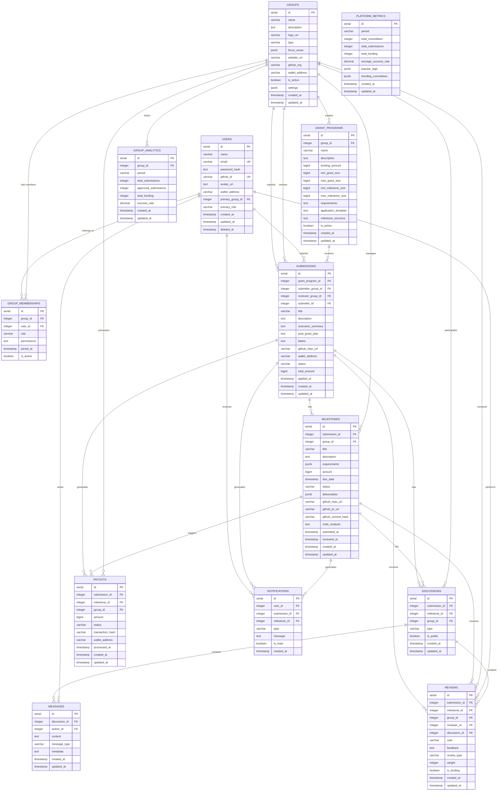

# Data Stores and Database Diagram

## Overview
GrantFlow.dev uses a PostgreSQL database with Drizzle ORM, following a TypeScript-first approach where the database schema serves as the source of truth for all data types and relationships.

## Database Schema Diagram

## Entity Descriptions

### **Core Entities**

#### **Users**
- **Purpose**: Stores user profiles and authentication data
- **Key Fields**: GitHub integration, wallet addresses, primary group association
- **Relationships**: Central entity connected to all user activities
- **Special Features**: Soft deletion support, role-based access control

#### **Groups**
- **Purpose**: Unified table for both committees and teams
- **Key Fields**: Type differentiation, focus areas, settings configuration
- **Relationships**: Can submit, review, and manage submissions
- **Special Features**: JSON settings for custom workflows, multisig wallet integration

#### **Submissions**
- **Purpose**: Grant applications and proposals
- **Key Fields**: Executive summary, GitHub repo links, funding amounts
- **Relationships**: Connected to grant programs, submitter/reviewer groups
- **Special Features**: Status tracking, wallet integration for payouts

### **Workflow Entities**

#### **Milestones**
- **Purpose**: Milestone tracking and progress management
- **Key Fields**: Requirements, deliverables, GitHub integration
- **Relationships**: Belongs to submissions, managed by groups
- **Special Features**: AI code analysis, commit tracking, deliverable verification

#### **Discussions**
- **Purpose**: Real-time communication threads
- **Key Fields**: Type differentiation (submission/milestone/group), public visibility
- **Relationships**: Can be attached to submissions or milestones
- **Special Features**: Public transparency, group-specific discussions

#### **Messages**
- **Purpose**: Individual messages within discussions
- **Key Fields**: Content, message type, metadata for structured data
- **Relationships**: Belongs to discussions, authored by users
- **Special Features**: Support for votes, status changes, group decisions

#### **Reviews**
- **Purpose**: Committee voting and decision-making
- **Key Fields**: Vote options, feedback, review types, voting weights
- **Relationships**: Connected to submissions/milestones, groups, and reviewers
- **Special Features**: Weighted voting, binding decisions, multiple review types

### **Financial Entities**

#### **Payouts**
- **Purpose**: Payment processing and transaction tracking
- **Key Fields**: Amounts, transaction hashes, wallet addresses
- **Relationships**: Generated by submissions/milestones, processed by groups
- **Special Features**: Blockchain transaction integration, multisig support

### **Analytics Entities**

#### **Group Analytics**
- **Purpose**: Committee performance metrics
- **Key Fields**: Success rates, funding amounts, submission statistics
- **Relationships**: Tracks group performance over time
- **Special Features**: Period-based tracking, success rate calculations

#### **Platform Metrics**
- **Purpose**: Platform-wide statistics and insights
- **Key Fields**: Total committees, submissions, funding, trending data
- **Relationships**: Aggregates data from all groups and submissions
- **Special Features**: Popular tags, trending committees, market insights

### **Notification Entity**

#### **Notifications**
- **Purpose**: Multi-channel notification system
- **Key Fields**: User targeting, message content, read status
- **Relationships**: Connected to users, submissions, and milestones
- **Special Features**: Multi-channel delivery (webapp, PWA, email, Telegram)

## Key Design Patterns

### **1. Unified Group Model**
- Single `groups` table handles both committees and teams
- Type field differentiates between committee and team roles
- Flexible membership system with role-based permissions

### **2. Status Tracking**
- Enum-based status fields for submissions and milestones
- Consistent status progression (pending → in-review → approved/rejected)
- Audit trail with timestamps for all status changes

### **3. JSON Configuration**
- Settings stored as JSON for flexible committee configurations
- Focus areas as JSON arrays for dynamic categorization
- Deliverables as structured JSON for milestone tracking

### **4. GitHub Integration**
- Repository URLs, PR links, and commit hashes stored
- AI code analysis results stored as text
- Commit tracking for milestone verification

### **5. Blockchain Integration**
- Wallet addresses for both users and groups
- Transaction hash storage for payout verification
- Multisig wallet support for committee operations

### **6. Real-time Communication**
- Discussion threads with message threading
- Public/private visibility controls
- Metadata support for structured communication (votes, decisions)

### **7. Analytics and Metrics**
- Separate analytics tables for performance tracking
- Platform-wide metrics for transparency
- Period-based aggregation for trend analysis

## Data Flow Patterns

### **Submission Lifecycle**
1. **Creation**: User creates submission → linked to grant program
2. **Review**: Committee reviews → discussions and reviews created
3. **Approval**: Status updates → milestones created
4. **Completion**: Milestones tracked → payouts processed

### **Committee Operations**
1. **Setup**: Group created → members added → grant programs configured
2. **Review**: Submissions assigned → discussions started → votes cast
3. **Management**: Analytics tracked → performance monitored

### **Notification Flow**
1. **Trigger**: Status changes → notifications generated
2. **Delivery**: Multi-channel distribution → read status tracked
3. **Engagement**: User interactions → notification updates

## Database Constraints and Indexes

### **Unique Constraints**
- User email addresses
- GitHub IDs
- Group names (within scope)

### **Foreign Key Relationships**
- All entities properly linked with referential integrity
- Cascade deletes for dependent records
- Soft deletes for user data preservation

### **Performance Considerations**
- Indexed fields for common queries (user_id, group_id, status)
- JSON field indexing for settings and analytics
- Timestamp indexing for time-based queries

## Migration and Schema Evolution

### **Drizzle ORM Benefits**
- TypeScript-first schema definition
- Automatic migration generation
- Type safety across the application
- Schema validation with Zod integration

### **Schema Versioning**
- Incremental migration files
- Backward compatibility considerations
- Data transformation support
- Rollback capabilities
