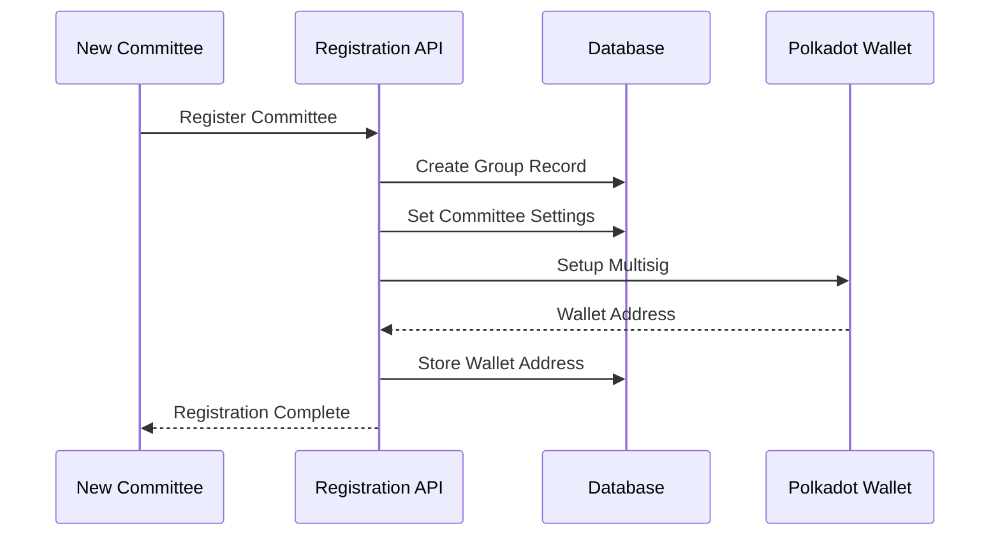
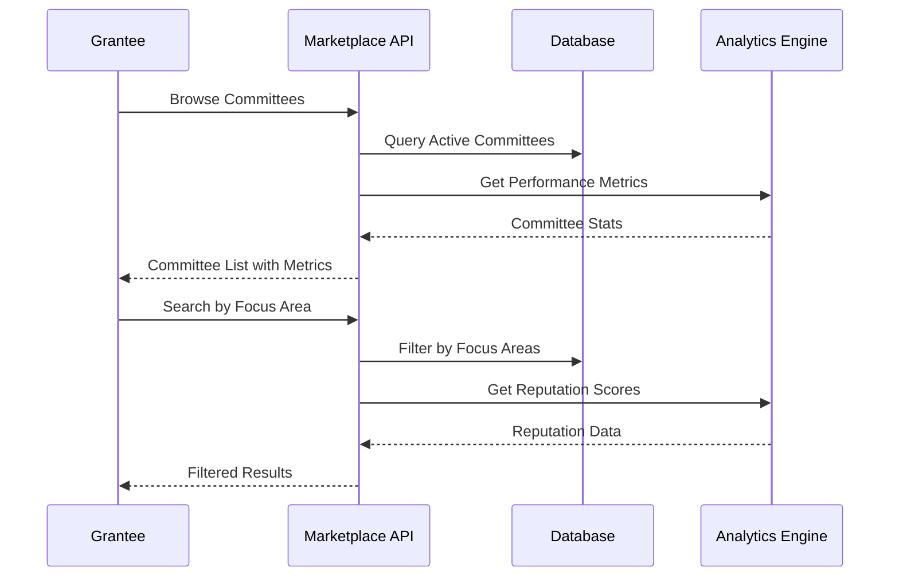
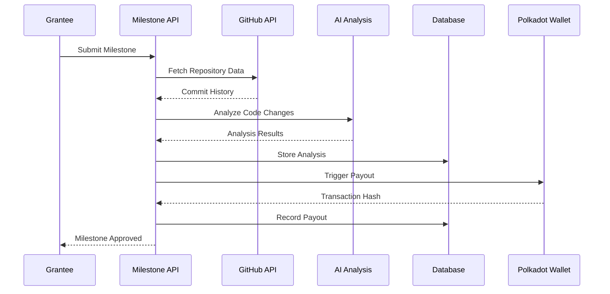
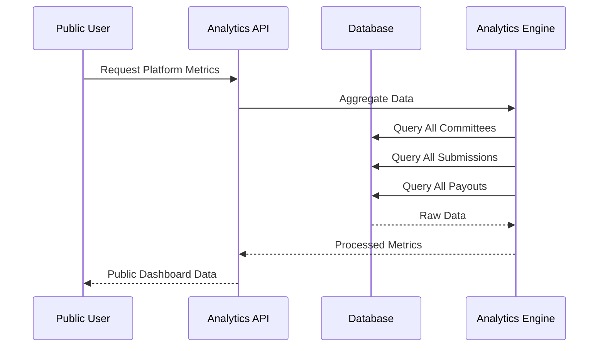
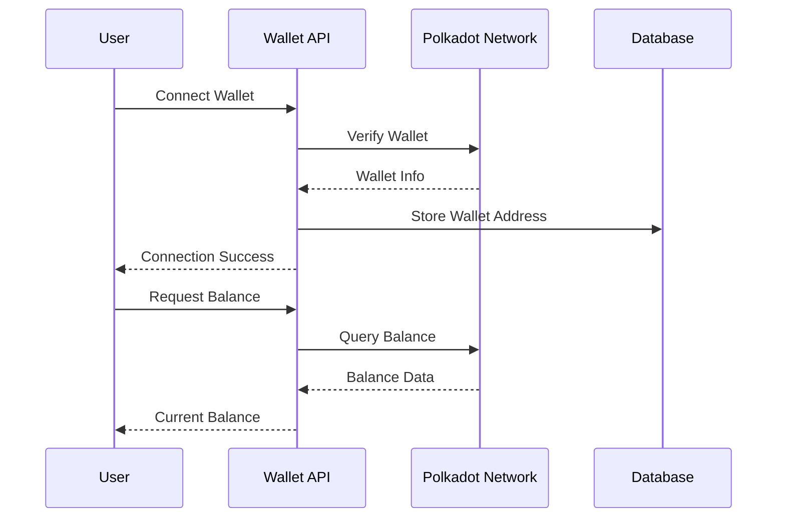

# Missing Data and Routes (Introspection on Planned Features)

## Overview
This document identifies routes, database operations, and data pathways that are defined or implied but not yet fully implemented in GrantFlow.dev. The analysis reveals a comprehensive roadmap of planned features and missing functionality.

## Missing Data Flows Diagram

```mermaid
graph TB
    subgraph "Planned Features - Not Yet Implemented"
        subgraph "Committee Onboarding & Management"
            CO1[Committee Registration]
            CO2[Profile Creation]
            CO3[Multi-sig Wallet Integration]
            CO4[Workflow Customization]
        end
        
        subgraph "Marketplace & Discovery"
            MD1[Committee Browsing]
            MD2[Advanced Search & Filtering]
            MD3[Committee Detail Pages]
            MD4[Public Reputation Scoring]
            MD5[Cross-committee Tracking]
        end
        
        subgraph "Enhanced Milestone Management"
            EM1[AI-assisted Code Analysis]
            EM2[Automated File Change Detection]
            EM3[Committee-specific Workflows]
            EM4[Multi-committee Comparison]
        end
        
        subgraph "Platform Analytics & Transparency"
            PA1[Cross-committee Metrics]
            PA2[Public Transparency Dashboard]
            PA3[Reputation Systems]
            PA4[Market Intelligence]
        end
        
        subgraph "Advanced Features"
            AF1[Wallet Connection]
            AF2[On-chain Integration]
            AF3[Automated Payouts]
            AF4[Public Status Pages]
        end
    end
    
    subgraph "Current Implementation"
        CI1[Basic Auth & User Management]
        CI2[Submission Forms & Workflow]
        CI3[Discussion & Communication]
        CI4[Review & Voting System]
        CI5[Committee Management Interface]
        CI6[Real-time Notifications]
    end
    
    subgraph "Missing API Endpoints"
        API1[/api/committees/register]
        API2[/api/committees/browse]
        API3[/api/analytics/platform]
        API4[/api/wallet/connect]
        API5[/api/payouts/process]
        API6[/api/public/submissions]
    end
    
    subgraph "Missing Database Operations"
        DB1[Committee Registration Flow]
        DB2[Marketplace Queries]
        DB3[Analytics Aggregation]
        DB4[Wallet Integration]
        DB5[Public Transparency]
    end
    
    %% Connections showing missing flows
    CO1 --> API1
    MD1 --> API2
    PA1 --> API3
    AF1 --> API4
    AF3 --> API5
    PA2 --> API6
    
    API1 --> DB1
    API2 --> DB2
    API3 --> DB3
    API4 --> DB4
    API6 --> DB5
```

## Detailed Missing Features Analysis

### **1. Committee Onboarding & Management**

#### **Missing Routes:**
- `POST /api/committees/register` - Committee registration endpoint
- `GET /api/committees/browse` - Public committee discovery
- `PUT /api/committees/{id}/settings` - Committee workflow customization
- `POST /api/committees/{id}/multisig` - Multisig wallet setup

#### **Missing Data Flows:**


#### **Missing Database Operations:**
- Committee registration workflow
- Multisig wallet configuration storage
- Committee settings and workflow customization
- Public committee profile management

### **2. Marketplace & Discovery Features**

#### **Missing Routes:**
- `GET /api/marketplace/committees` - Committee browsing with filters
- `GET /api/marketplace/search` - Advanced search functionality
- `GET /api/committees/{id}/public` - Public committee details
- `GET /api/analytics/committees/{id}` - Committee performance metrics

#### **Missing Data Flows:**


#### **Missing Database Operations:**
- Committee discovery queries with filtering
- Focus area-based search functionality
- Public committee profile aggregation
- Cross-committee application tracking

### **3. Enhanced Milestone & Payout Management**

#### **Missing Routes:**
- `POST /api/milestones/{id}/analyze` - AI code analysis
- `GET /api/milestones/{id}/changes` - File change detection
- `POST /api/payouts/process` - Automated payout processing
- `GET /api/milestones/compare` - Multi-committee comparison

#### **Missing Data Flows:**


#### **Missing Database Operations:**
- AI code analysis storage and retrieval
- Automated file change detection
- Committee-specific milestone workflows
- Multi-committee milestone comparison queries

### **4. Platform Analytics & Transparency**

#### **Missing Routes:**
- `GET /api/analytics/platform` - Platform-wide metrics
- `GET /api/analytics/committees` - Cross-committee comparison
- `GET /api/public/dashboard` - Public transparency dashboard
- `GET /api/reputation/scores` - Reputation system data

#### **Missing Data Flows:**


#### **Missing Database Operations:**
- Platform-wide analytics aggregation
- Cross-committee performance comparison
- Public transparency data queries
- Reputation scoring calculations

### **5. Advanced Features**

#### **Missing Routes:**
- `POST /api/wallet/connect` - Wallet connection
- `GET /api/wallet/balance` - Wallet balance checking
- `POST /api/onchain/verify` - On-chain verification
- `GET /api/public/submissions/{id}` - Public submission views

#### **Missing Data Flows:**


#### **Missing Database Operations:**
- Wallet connection and verification
- On-chain transaction tracking
- Public submission visibility
- Automated payout processing

## Implementation Priority Matrix

### **High Priority (Phase 4 - Current)**
1. **Committee Onboarding** - Essential for marketplace functionality
2. **Wallet Integration** - Required for automated payouts
3. **Public Transparency** - Core value proposition

### **Medium Priority (Phase 5)**
1. **AI Code Analysis** - Enhanced milestone verification
2. **Advanced Analytics** - Platform intelligence
3. **Marketplace Discovery** - User experience improvement

### **Low Priority (Future)**
1. **Reputation Systems** - Long-term platform value
2. **Market Intelligence** - Advanced analytics
3. **Cross-committee Features** - Platform maturity

## Missing Database Schema Extensions

### **Planned Tables:**
```sql
-- Committee onboarding and registration
CREATE TABLE committee_registrations (
  id SERIAL PRIMARY KEY,
  committee_id INTEGER REFERENCES groups(id),
  registration_data JSONB,
  verification_status VARCHAR(20),
  created_at TIMESTAMP DEFAULT NOW()
);

-- Wallet integration and multisig
CREATE TABLE wallet_connections (
  id SERIAL PRIMARY KEY,
  user_id INTEGER REFERENCES users(id),
  wallet_address VARCHAR(64),
  connection_type VARCHAR(20),
  verified_at TIMESTAMP,
  created_at TIMESTAMP DEFAULT NOW()
);

-- Public transparency data
CREATE TABLE public_submissions (
  id SERIAL PRIMARY KEY,
  submission_id INTEGER REFERENCES submissions(id),
  public_data JSONB,
  visibility_settings JSONB,
  created_at TIMESTAMP DEFAULT NOW()
);

-- Analytics and metrics
CREATE TABLE platform_analytics (
  id SERIAL PRIMARY KEY,
  metric_type VARCHAR(50),
  metric_data JSONB,
  period_start TIMESTAMP,
  period_end TIMESTAMP,
  created_at TIMESTAMP DEFAULT NOW()
);
```

## Missing API Endpoint Specifications

### **Committee Registration**
```typescript
POST /api/committees/register
{
  name: string;
  description: string;
  focusAreas: string[];
  websiteUrl?: string;
  githubOrg?: string;
  settings: {
    votingThreshold: number;
    approvalWorkflow: string;
    payoutTriggers: string[];
  };
}
```

### **Marketplace Discovery**
```typescript
GET /api/marketplace/committees?focusAreas=[]&active=true&sortBy=reputation
Response: {
  committees: Committee[];
  totalCount: number;
  filters: FilterOptions;
}
```

### **Analytics Platform**
```typescript
GET /api/analytics/platform
Response: {
  totalCommittees: number;
  totalSubmissions: number;
  totalFunding: number;
  averageSuccessRate: number;
  popularTags: string[];
  trendingCommittees: Committee[];
}
```

## Data Flow Gaps

### **1. Committee Onboarding Flow**
- **Missing**: Registration form validation
- **Missing**: Committee profile creation
- **Missing**: Multisig wallet setup
- **Missing**: Initial grant program configuration

### **2. Marketplace Discovery Flow**
- **Missing**: Committee browsing interface
- **Missing**: Advanced search functionality
- **Missing**: Committee comparison features
- **Missing**: Public committee profiles

### **3. Enhanced Milestone Flow**
- **Missing**: AI code analysis integration
- **Missing**: Automated file change detection
- **Missing**: Committee-specific workflows
- **Missing**: Multi-committee milestone tracking

### **4. Analytics and Transparency Flow**
- **Missing**: Platform-wide metrics aggregation
- **Missing**: Public transparency dashboard
- **Missing**: Reputation scoring system
- **Missing**: Market intelligence features

## Implementation Recommendations

### **Immediate Next Steps:**
1. **Committee Registration API** - Enable committee onboarding
2. **Wallet Connection System** - Foundation for automated payouts
3. **Public Submission Views** - Basic transparency features

### **Medium-term Goals:**
1. **Marketplace Interface** - Committee discovery and comparison
2. **AI Integration** - Code analysis and automated verification
3. **Advanced Analytics** - Platform intelligence and insights

### **Long-term Vision:**
1. **Reputation Systems** - Committee and grantee scoring
2. **Market Intelligence** - Funding trends and success patterns
3. **Cross-committee Features** - Advanced platform capabilities
