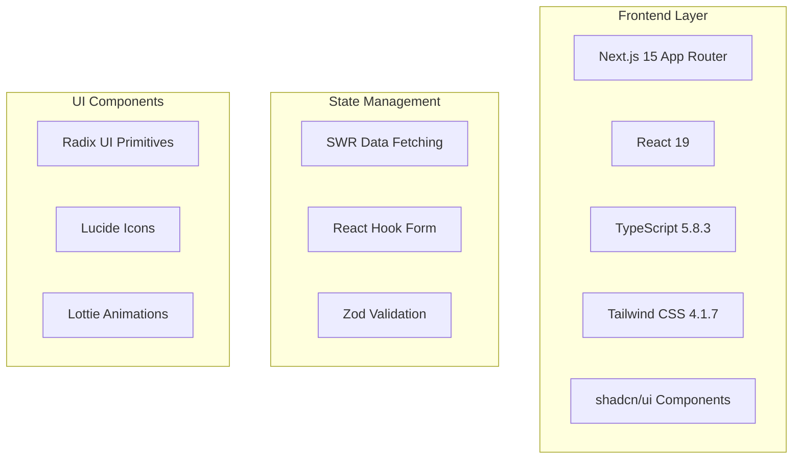
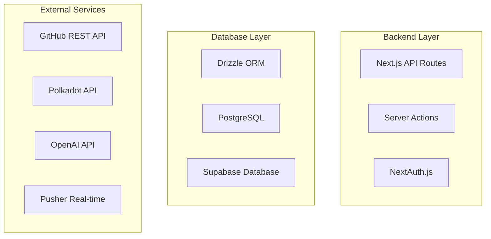

# Technologies and Dependencies Overview

## Overview
GrantFlow.dev is built on a modern TypeScript-first stack with Next.js 15, focusing on real-time collaboration, blockchain integration, and AI-powered code analysis for grant management.

## Dependencies by Category

### **Frontend Frameworks & UI**

#### **Core Framework**
- **Next.js 15.4.1** - React framework with App Router for modern web development
- **React 19.1.0** - UI library with latest concurrent features
- **React DOM 19.1.0** - React rendering for web applications

#### **UI Components & Styling**
- **Tailwind CSS 4.1.7** - Utility-first CSS framework for rapid UI development
- **shadcn/ui** - Pre-built accessible components with Radix UI primitives
- **Radix UI** - Unstyled, accessible UI primitives for complex components
- **Lucide React 0.511.0** - Beautiful, customizable SVG icons
- **Lottie React 2.4.1** - Animation library for loading states and micro-interactions

#### **Form Management**
- **React Hook Form 7.60.0** - Performant forms with easy validation
- **Hookform Resolvers 5.2.2** - Validation resolvers for React Hook Form

### **Backend & Database**

#### **Database & ORM**
- **Drizzle ORM 0.43.1** - TypeScript-first ORM with excellent type safety
- **Drizzle Kit 0.31.1** - Database toolkit for migrations and introspection
- **Drizzle Zod 0.8.3** - Zod integration for runtime type validation
- **PostgreSQL** - Primary database (via Supabase)
- **Postgres 3.4.5** - PostgreSQL client for Node.js

#### **Authentication & Security**
- **NextAuth.js 4.24.11** - Authentication library with GitHub OAuth provider
- **bcryptjs 3.0.2** - Password hashing for secure user authentication
- **Jose 6.0.11** - JWT token handling and verification

### **External Integrations**

#### **GitHub Integration**
- **Octokit Rest 22.0.0** - GitHub REST API client for repository analysis
- **Octokit App 16.0.1** - GitHub App authentication
- **Octokit Auth App 8.0.2** - GitHub App authentication helpers

#### **Blockchain & Web3**
- **Polkadot API 1.15.0** - Polkadot blockchain integration
- **Polkadot Util Crypto 13.5.7** - Cryptographic utilities for Polkadot
- **Polkadot API Descriptors** - TypeScript descriptors for Polkadot APIs

#### **AI & LLM Integration**
- **Vercel AI SDK 4.3.19** - AI SDK for LLM interactions
- **AI SDK OpenAI 1.3.23** - OpenAI integration for code analysis

#### **Real-time Communication**
- **Pusher 5.2.0** - Real-time messaging and notifications
- **Pusher JS 8.4.0** - Client-side real-time functionality

### **Development & Build Tools**

#### **TypeScript & Language**
- **TypeScript 5.8.3** - Type-safe JavaScript development
- **Node Types 22.15.18** - TypeScript definitions for Node.js
- **React Types 19.1.8** - TypeScript definitions for React
- **React DOM Types 19.1.6** - TypeScript definitions for React DOM

#### **Code Quality & Linting**
- **ESLint 9.36.0** - JavaScript/TypeScript linting
- **ESLint Config Next 15.5.4** - Next.js specific linting rules
- **ESLint Config Prettier 9.1.0** - Prettier integration for ESLint
- **ESLint Plugin React 7.37.5** - React-specific linting rules
- **ESLint Plugin React Hooks 5.2.0** - React Hooks linting rules
- **TypeScript ESLint 8.45.0** - TypeScript-specific linting

#### **Testing Framework**
- **Vitest 3.2.4** - Fast unit testing framework
- **Testing Library** - Component testing utilities

#### **Build & Deployment**
- **Autoprefixer 10.4.21** - CSS vendor prefixing
- **PostCSS 8.5.3** - CSS transformation tool
- **Tailwind Merge 3.3.0** - Tailwind CSS class merging utility

### **Utility Libraries**

#### **Data Fetching & State**
- **SWR 2.3.3** - Data fetching with caching and revalidation
- **Server Only 0.0.1** - Server-side only code protection

#### **Form Validation & Data**
- **Zod 3.25.76** - TypeScript-first schema validation
- **Class Variance Authority 0.7.1** - Component variant management
- **CLSX 2.1.1** - Conditional class name utility

#### **Animation & UI**
- **Tailwind Animate CSS 1.3.0** - Animation utilities for Tailwind
- **Radix UI 1.4.2** - Accessible UI component primitives

#### **Environment & Configuration**
- **Dotenv 16.5.0** - Environment variable loading

### **Development Dependencies**

#### **Code Quality**
- **Prettier 3.3.3** - Code formatting
- **Prettier Plugin Tailwind CSS 0.6.14** - Tailwind CSS class sorting
- **Husky 9.1.7** - Git hooks for code quality
- **Lint Staged 16.2.3** - Run linters on staged files

#### **Build Tools**
- **Globals 15.15.0** - Global variable definitions
- **ESLint RC 3.1.0** - ESLint configuration utilities

## Technology Stack Architecture

### **Frontend Architecture**

### **Backend Architecture**

## Key Dependencies Analysis

### **Critical Dependencies (Core Functionality)**

#### **Next.js 15.4.1**
- **Purpose**: Full-stack React framework with App Router
- **Significance**: Provides server-side rendering, API routes, and modern React patterns
- **Usage**: Main application framework, routing, and server-side functionality

#### **Drizzle ORM 0.43.1**
- **Purpose**: TypeScript-first database ORM
- **Significance**: Type-safe database operations with excellent developer experience
- **Usage**: Database schema definition, queries, and migrations

#### **NextAuth.js 4.24.11**
- **Purpose**: Authentication and session management
- **Significance**: Secure user authentication with GitHub OAuth integration
- **Usage**: User login, session management, and role-based access control

### **Integration Dependencies (External Services)**

#### **Octokit Rest 22.0.0**
- **Purpose**: GitHub API integration for repository analysis
- **Significance**: Enables code analysis and commit tracking for milestones
- **Usage**: Repository data fetching, commit analysis, and PR information

#### **Polkadot API 1.15.0**
- **Purpose**: Blockchain integration for multisig operations
- **Significance**: Enables automated payouts and on-chain verification
- **Usage**: Multisig wallet operations, transaction verification, and blockchain interactions

#### **Vercel AI SDK 4.3.19**
- **Purpose**: AI/LLM integration for code analysis
- **Significance**: Automated code analysis and review assistance
- **Usage**: GitHub repository analysis, code change detection, and AI-powered insights

### **Real-time Dependencies (Communication)**

#### **Pusher 5.2.0**
- **Purpose**: Real-time messaging and notifications
- **Significance**: Enables live discussion updates and instant notifications
- **Usage**: Discussion threads, voting updates, and milestone notifications

#### **Server-Sent Events (SSE)**
- **Purpose**: Real-time notification delivery
- **Significance**: Live updates without external dependencies
- **Usage**: Notification streams, discussion updates, and status changes

### **Development Dependencies (Code Quality)**

#### **TypeScript 5.8.3**
- **Purpose**: Type-safe JavaScript development
- **Significance**: Prevents runtime errors and improves developer experience
- **Usage**: Type definitions, interface declarations, and compile-time checking

#### **ESLint 9.36.0**
- **Purpose**: Code linting and quality enforcement
- **Significance**: Maintains code quality and consistency across the project
- **Usage**: Code style enforcement, error detection, and best practices

#### **Vitest 3.2.4**
- **Purpose**: Unit testing framework
- **Significance**: Ensures code reliability and prevents regressions
- **Usage**: Component testing, API testing, and integration testing

## Dependency Management

### **Package Manager**
- **pnpm 10.5.0** - Fast, disk space efficient package manager
- **Overrides**: React types pinned to specific versions for compatibility

### **Version Management**
- **TypeScript**: Latest stable version (5.8.3)
- **React**: Latest version (19.1.0) with concurrent features
- **Next.js**: Latest version (15.4.1) with App Router
- **Drizzle**: Latest version (0.43.1) with TypeScript-first approach

### **Security Considerations**
- **bcryptjs**: Password hashing for secure authentication
- **Jose**: JWT token handling with proper security
- **NextAuth.js**: Secure session management with HTTP-only cookies
- **Server-only**: Protection against client-side code execution

## Performance Optimizations

### **Frontend Performance**
- **SWR**: Intelligent data fetching with caching and revalidation
- **React Hook Form**: Uncontrolled components for better performance
- **Tailwind CSS**: Utility-first CSS for minimal bundle size
- **Lottie**: Optimized animations for loading states

### **Backend Performance**
- **Drizzle ORM**: Optimized database queries with type safety
- **Server Actions**: Efficient form handling without API routes
- **Server-Sent Events**: Lightweight real-time communication
- **PostgreSQL**: High-performance relational database

### **Build Optimizations**
- **Next.js**: Automatic code splitting and optimization
- **TypeScript**: Compile-time error checking
- **ESLint**: Code quality enforcement
- **Prettier**: Consistent code formatting

## External Service Dependencies

### **Required Services**
1. **GitHub API** - Repository analysis and code tracking
2. **Polkadot Network** - Blockchain operations and multisig
3. **OpenAI API** - AI-powered code analysis
4. **Supabase** - PostgreSQL database hosting
5. **Vercel** - Application hosting and deployment

### **Optional Services**
1. **Pusher** - Real-time messaging (can be replaced with SSE)
2. **Stripe** - Payment processing (currently disabled)
3. **Email Service** - Notification delivery (planned)
4. **Telegram Bot** - Alternative notification channel (planned)

## Migration and Upgrade Paths

### **Planned Upgrades**
- **Next.js**: Automatic updates to latest stable versions
- **React**: Gradual adoption of new concurrent features
- **Drizzle**: Regular updates for new ORM features
- **TypeScript**: Continuous updates for latest language features

### **Breaking Change Management**
- **TypeScript**: Strict type checking enabled
- **ESLint**: Comprehensive linting rules
- **Testing**: Automated test coverage for critical paths
- **Documentation**: Comprehensive API documentation

## Security Dependencies

### **Authentication Security**
- **NextAuth.js**: Secure OAuth implementation
- **bcryptjs**: Strong password hashing
- **Jose**: Secure JWT token handling
- **HTTP-only cookies**: XSS protection

### **Data Security**
- **Drizzle ORM**: SQL injection prevention
- **Zod validation**: Input sanitization and validation
- **Server-only**: Client-side code protection
- **Environment variables**: Secure configuration management

### **Network Security**
- **HTTPS**: Secure communication
- **CORS**: Cross-origin request protection
- **Rate limiting**: API abuse prevention
- **Input validation**: XSS and injection prevention
