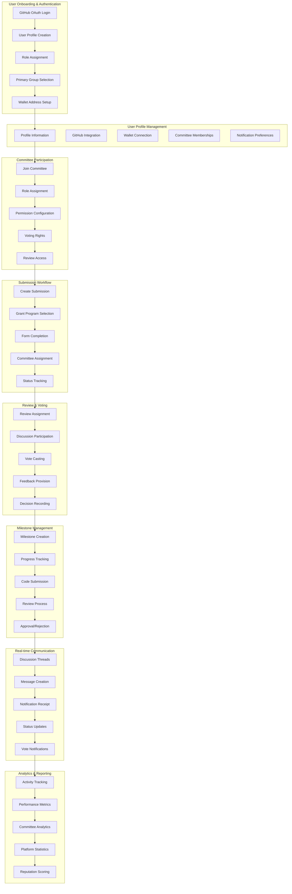
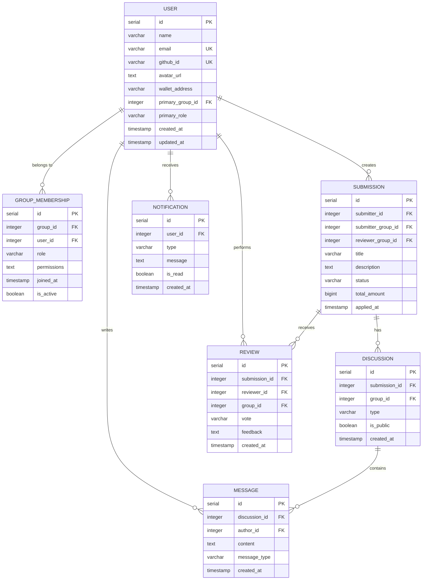
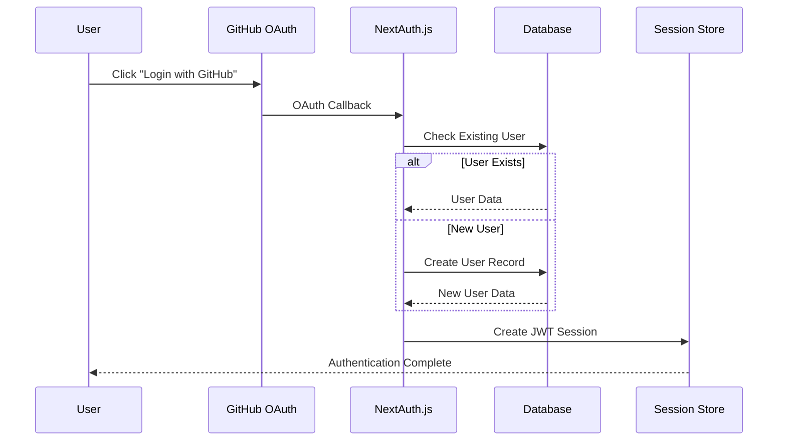
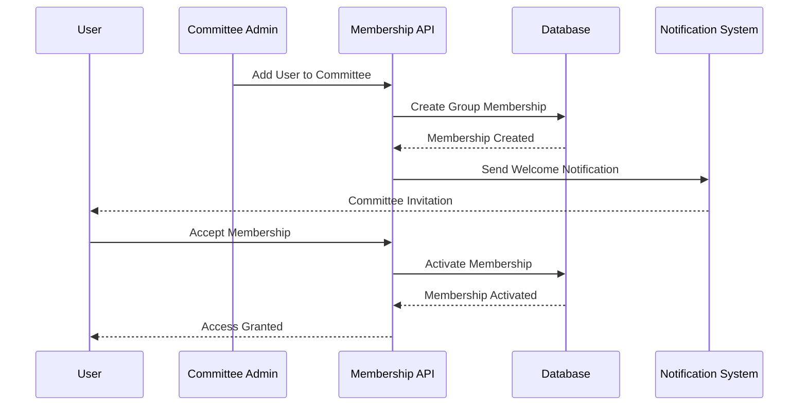
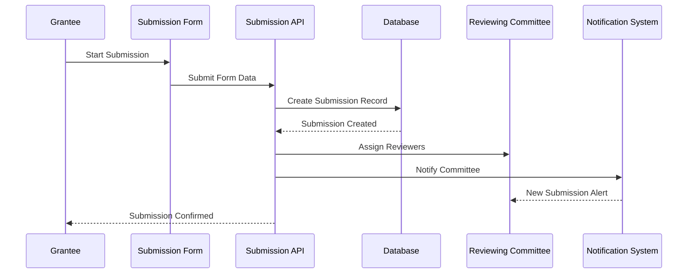
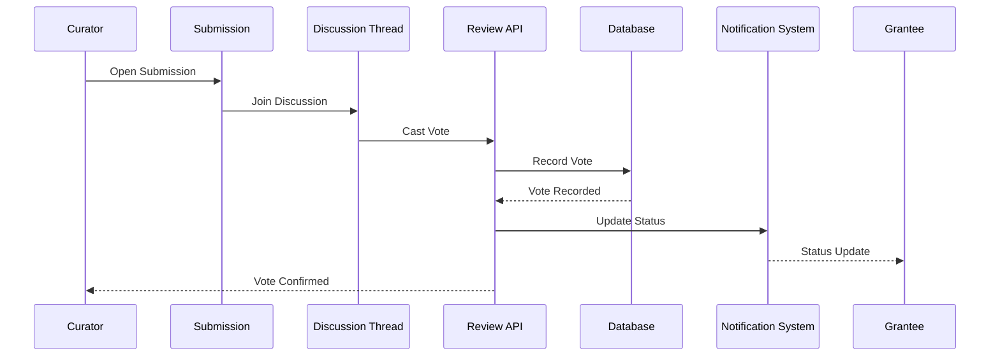
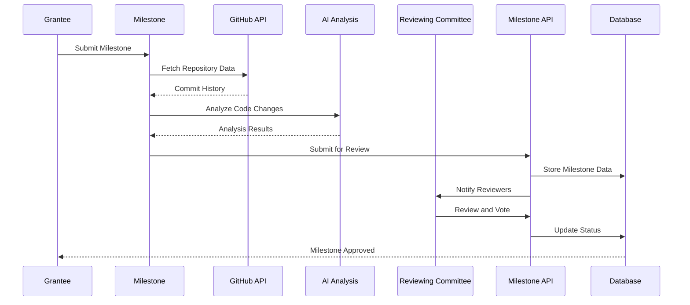
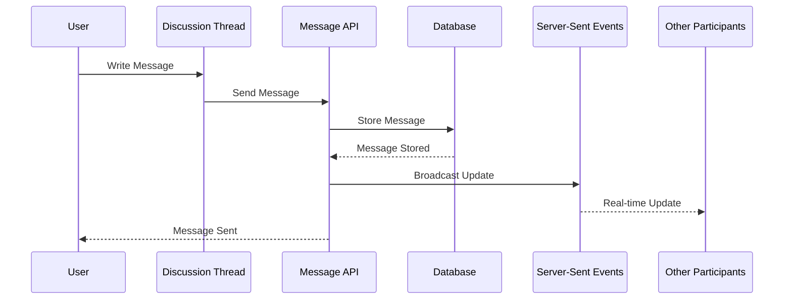
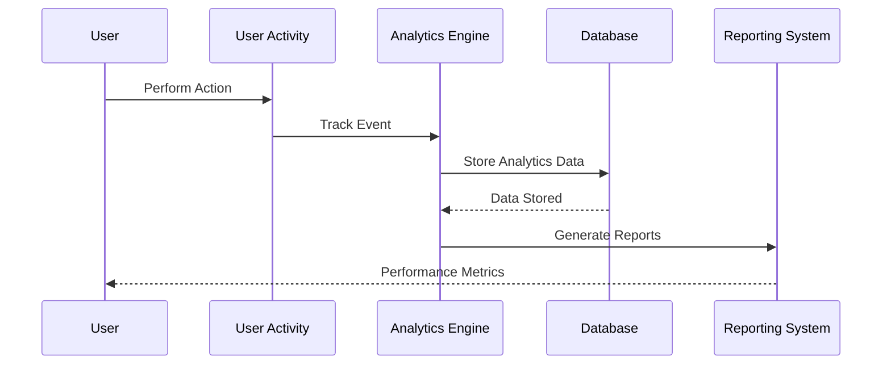

# User Data Model Diagram

## Overview
GrantFlow.dev implements a comprehensive user data lifecycle that spans authentication, role-based access, committee participation, submission management, and real-time collaboration. The system supports multiple user types with different permissions and workflows.

## User Data Lifecycle Diagram

## User Data Model Relationships

## User Role and Permission Matrix

### **User Types and Capabilities**

#### **Platform Admin**
- **Data Access**: Full platform access, all committees, all submissions
- **Actions**: User management, committee oversight, platform configuration
- **Restrictions**: Cannot vote on submissions, cannot create submissions
- **Analytics**: Platform-wide metrics and reporting

#### **Committee Curator**
- **Data Access**: Assigned committee submissions, committee discussions
- **Actions**: Review submissions, cast votes, participate in discussions
- **Restrictions**: Limited to assigned committee, cannot access other committees
- **Analytics**: Committee-specific metrics and performance data

#### **Grantee (Team Member)**
- **Data Access**: Own submissions, team submissions, public discussions
- **Actions**: Create submissions, participate in discussions, submit milestones
- **Restrictions**: Cannot review own submissions, limited to team submissions
- **Analytics**: Personal submission history and team performance

#### **Committee Admin**
- **Data Access**: Committee management, member management, settings
- **Actions**: Add/remove members, configure workflows, manage grant programs
- **Restrictions**: Cannot vote on submissions, cannot create submissions
- **Analytics**: Committee performance and member activity

## User Data Lifecycle Stages

### **1. Authentication & Onboarding**

#### **GitHub OAuth Integration**

#### **User Profile Creation**
- **GitHub Profile Sync**: Name, email, avatar, GitHub ID
- **Role Assignment**: Default role based on registration context
- **Primary Group**: Initial group association
- **Wallet Setup**: Optional wallet address configuration

### **2. Committee Participation**

#### **Membership Management**

#### **Role-Based Permissions**
- **Member**: Basic committee access, discussion participation
- **Curator**: Review access, voting rights, milestone management
- **Admin**: Committee management, member management, settings

### **3. Submission Workflow**

#### **Submission Creation Process**

#### **Submission Data Flow**
- **Form Data**: Title, description, executive summary, GitHub repo
- **Committee Assignment**: Automatic assignment based on focus areas
- **Status Tracking**: Pending → In Review → Approved/Rejected
- **Milestone Creation**: Automatic milestone generation based on grant program

### **4. Review and Voting Process**

#### **Review Assignment and Voting**

#### **Voting Data Management**
- **Vote Recording**: Approve, reject, abstain with feedback
- **Weighted Voting**: Different voting weights based on role
- **Binding Decisions**: Final decision recording and status updates
- **Discussion Integration**: Votes linked to discussion threads

### **5. Milestone Management**

#### **Milestone Lifecycle**

#### **Milestone Data Flow**
- **Progress Tracking**: Status updates, completion percentages
- **Code Analysis**: AI-powered code change detection
- **Deliverable Verification**: GitHub commit and PR tracking
- **Approval Process**: Committee review and voting

### **6. Real-time Communication**

#### **Discussion and Messaging**

#### **Notification System**
- **Real-time Updates**: Server-sent events for live notifications
- **Multi-channel Delivery**: Webapp, PWA, email, optional Telegram
- **Notification Types**: Discussion updates, vote notifications, status changes
- **Read Status Tracking**: Notification engagement and response tracking

### **7. Analytics and Reporting**

#### **User Analytics Data Flow**

#### **Analytics Data Collection**
- **User Activity**: Login frequency, submission creation, review participation
- **Committee Performance**: Review speed, approval rates, member engagement
- **Platform Metrics**: Total submissions, funding amounts, success rates
- **Reputation Scoring**: User and committee reputation based on performance

## Data Privacy and Security

### **User Data Protection**
- **Authentication**: Secure GitHub OAuth with JWT sessions
- **Data Encryption**: Sensitive data encrypted at rest and in transit
- **Access Control**: Role-based permissions and data access restrictions
- **Audit Logging**: User activity tracking for security and compliance

### **Data Retention**
- **User Profiles**: Retained for account lifetime
- **Submissions**: Retained for transparency and audit purposes
- **Discussions**: Retained for historical context and transparency
- **Analytics**: Aggregated data retained for platform insights

### **Data Export and Deletion**
- **User Data Export**: Complete user data export functionality
- **Account Deletion**: Soft deletion with data anonymization
- **Data Portability**: User data export in standard formats
- **Compliance**: GDPR and privacy regulation compliance

## User Experience Optimization

### **Performance Considerations**
- **Data Caching**: SWR for efficient data fetching and caching
- **Real-time Updates**: Server-sent events for live updates
- **Form Optimization**: React Hook Form for performant forms
- **Mobile Optimization**: PWA support for mobile users

### **Accessibility Features**
- **Screen Reader Support**: Accessible UI components with Radix UI
- **Keyboard Navigation**: Full keyboard accessibility
- **Color Contrast**: WCAG compliant color schemes
- **Responsive Design**: Mobile-first responsive design

### **User Onboarding**
- **Progressive Disclosure**: Gradual feature introduction
- **Contextual Help**: In-app guidance and tooltips
- **Role-based Tutorials**: Customized onboarding based on user role
- **Feedback Collection**: User feedback and improvement suggestions
