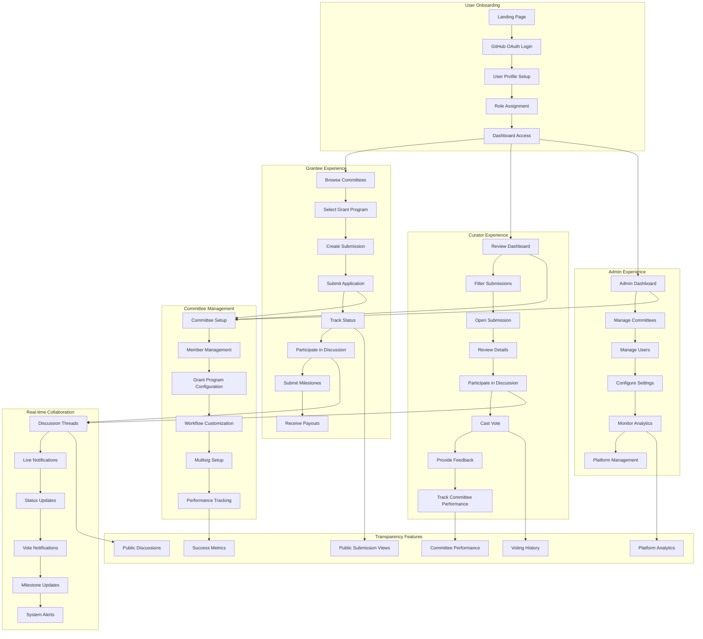
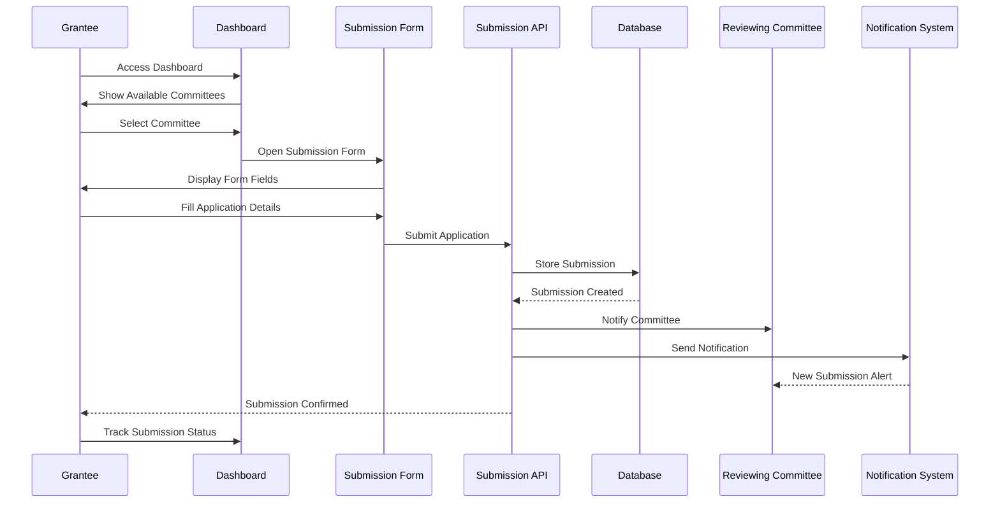
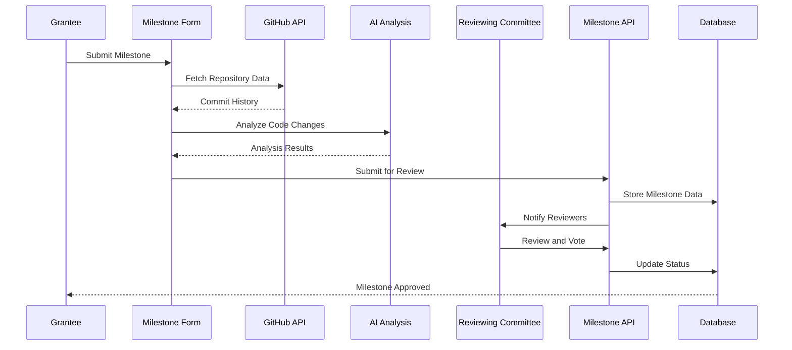
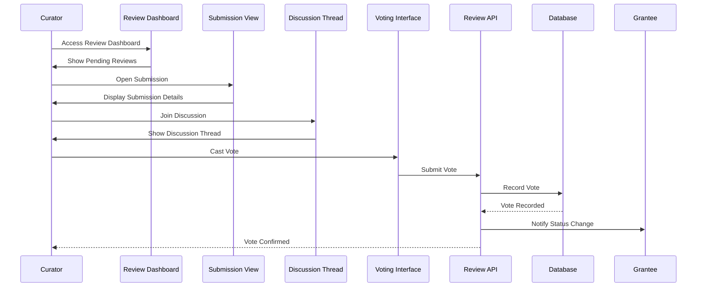
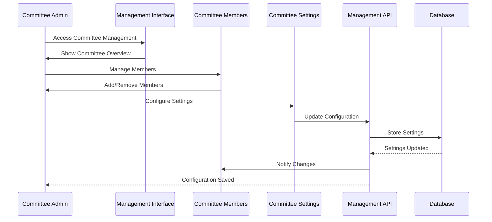
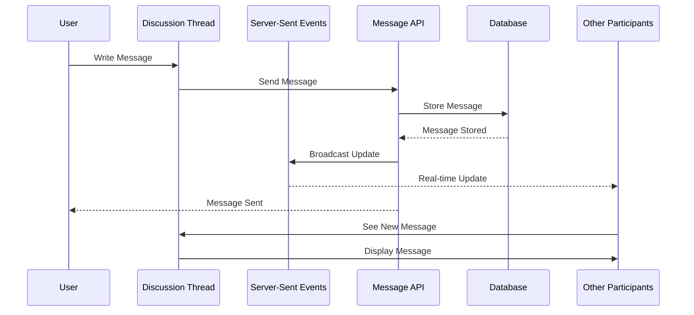
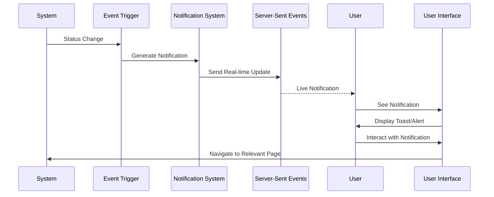

# User Experience (UX) Flow Diagram

## Overview
GrantFlow.dev provides a comprehensive user experience flow that supports multiple user types (grantees, curators, admins) through the complete grant lifecycle from application to payout. The UX is designed for transparency, collaboration, and efficient grant management.

## User Experience Flow Diagram

## Detailed User Experience Flows

### **1. Grantee User Journey**

#### **Application Submission Flow**

#### **Milestone Submission Flow**

### **2. Curator User Journey**

#### **Review and Voting Flow**

#### **Committee Management Flow**

### **3. Real-time Collaboration Experience**

#### **Discussion and Communication Flow**

#### **Notification Experience**

## User Interface Components

### **1. Dashboard Components**

#### **Grantee Dashboard**
- **Submission Overview**: List of user's submissions with status
- **Committee Browser**: Available committees and grant programs
- **Milestone Tracker**: Progress tracking for active grants
- **Notification Center**: Real-time updates and alerts
- **Profile Management**: User profile and settings

#### **Curator Dashboard**
- **Review Queue**: Pending submissions for review
- **Committee Overview**: Committee performance and metrics
- **Discussion Threads**: Active discussions and conversations
- **Voting Interface**: Voting tools and decision tracking
- **Analytics**: Committee performance and success metrics

#### **Admin Dashboard**
- **Platform Overview**: System-wide statistics and metrics
- **User Management**: User management and role assignment
- **Committee Management**: Committee creation and configuration
- **System Settings**: Platform configuration and maintenance
- **Analytics**: Comprehensive platform analytics

### **2. Form and Input Components**

#### **Submission Form**
- **Multi-step Form**: Progressive form completion
- **Draft Saving**: Auto-save and draft recovery
- **Validation**: Real-time form validation
- **File Upload**: Document and code repository links
- **Preview**: Submission preview before submission

#### **Review Interface**
- **Submission Details**: Comprehensive submission information
- **Discussion Panel**: Real-time discussion interface
- **Voting Tools**: Vote casting and decision recording
- **Feedback Form**: Review feedback and comments
- **Status Tracking**: Submission status and progress

### **3. Real-time Components**

#### **Discussion Threads**
- **Live Chat**: Real-time messaging interface
- **Message Threading**: Organized conversation threads
- **User Presence**: Online status and activity indicators
- **File Sharing**: Document and code sharing
- **Notification Badges**: Unread message indicators

#### **Notification System**
- **Toast Notifications**: In-app notification toasts
- **Status Updates**: Real-time status change notifications
- **Vote Alerts**: Voting and decision notifications
- **System Alerts**: Platform and system notifications
- **Email Notifications**: Email notification delivery (planned)

## User Experience Principles

### **1. Transparency and Openness**

#### **Public Visibility**
- **Submission Status**: Public submission status and progress
- **Committee Decisions**: Transparent voting and decision process
- **Discussion History**: Public discussion threads and conversations
- **Performance Metrics**: Committee and platform performance data
- **Success Stories**: Public success stories and achievements

#### **Accountability**
- **Decision Tracking**: Complete audit trail of decisions
- **Vote History**: Public voting history and rationale
- **Performance Metrics**: Committee and individual performance
- **Timeline Tracking**: Complete timeline of submission progress
- **Outcome Reporting**: Final outcomes and results

### **2. Collaboration and Communication**

#### **Real-time Collaboration**
- **Live Discussions**: Real-time discussion and collaboration
- **Instant Notifications**: Immediate notification delivery
- **Status Synchronization**: Real-time status updates
- **Multi-user Interface**: Support for multiple concurrent users
- **Conflict Resolution**: Handling of simultaneous edits and updates

#### **Communication Tools**
- **Discussion Threads**: Organized conversation management
- **Message Types**: Different message types (comments, votes, decisions)
- **User Mentions**: User mention and notification system
- **File Sharing**: Document and code sharing capabilities
- **Search and Filter**: Message search and filtering

### **3. Efficiency and Productivity**

#### **Workflow Optimization**
- **Automated Processes**: Automated workflow and status updates
- **Bulk Operations**: Bulk actions for efficiency
- **Keyboard Shortcuts**: Keyboard shortcuts for power users
- **Quick Actions**: Quick action buttons and shortcuts
- **Template System**: Reusable templates and configurations

#### **Performance Features**
- **Fast Loading**: Optimized loading and rendering
- **Offline Support**: Offline functionality and sync
- **Mobile Optimization**: Mobile-first responsive design
- **Progressive Web App**: PWA capabilities for mobile experience
- **Caching**: Intelligent caching and data management

### **4. Accessibility and Usability**

#### **Accessibility Features**
- **Screen Reader Support**: Full screen reader compatibility
- **Keyboard Navigation**: Complete keyboard navigation support
- **Color Contrast**: WCAG compliant color schemes
- **Text Scaling**: Support for text scaling and zoom
- **Alternative Text**: Comprehensive alt text for images

#### **Usability Design**
- **Intuitive Navigation**: Clear and logical navigation structure
- **Consistent Design**: Consistent design language and patterns
- **Error Handling**: Clear error messages and recovery
- **Help System**: Contextual help and documentation
- **User Onboarding**: Guided user onboarding and tutorials

## Mobile and Responsive Experience

### **1. Mobile-First Design**

#### **Responsive Layout**
- **Adaptive Design**: Responsive design for all screen sizes
- **Touch Optimization**: Touch-friendly interface elements
- **Mobile Navigation**: Mobile-optimized navigation patterns
- **Gesture Support**: Touch gestures and interactions
- **Performance**: Optimized performance for mobile devices

#### **Progressive Web App**
- **App-like Experience**: Native app-like user experience
- **Offline Functionality**: Offline access and synchronization
- **Push Notifications**: Mobile push notification support
- **Installation**: App installation and home screen support
- **Background Sync**: Background synchronization and updates

### **2. Cross-Platform Consistency**

#### **Unified Experience**
- **Consistent Interface**: Consistent interface across platforms
- **Synchronized Data**: Real-time data synchronization
- **Cross-Platform Notifications**: Unified notification system
- **Shared State**: Shared application state
- **Seamless Transitions**: Smooth transitions between platforms

## User Feedback and Iteration

### **1. User Feedback Collection**

#### **Feedback Mechanisms**
- **In-app Feedback**: Built-in feedback collection
- **User Surveys**: Regular user satisfaction surveys
- **Usage Analytics**: User behavior and usage analytics
- **Performance Metrics**: User experience performance metrics
- **Error Reporting**: User error reporting and tracking

#### **Continuous Improvement**
- **A/B Testing**: A/B testing for interface improvements
- **User Research**: Regular user research and interviews
- **Usability Testing**: Usability testing and optimization
- **Performance Monitoring**: Continuous performance monitoring
- **Feature Iteration**: Iterative feature development and improvement

### **2. User Experience Metrics**

#### **Key Performance Indicators**
- **User Engagement**: User engagement and activity metrics
- **Task Completion**: Task completion rates and success
- **User Satisfaction**: User satisfaction and feedback scores
- **Performance Metrics**: Page load times and responsiveness
- **Error Rates**: Error rates and user experience issues

#### **Success Metrics**
- **Submission Success**: Successful submission completion rates
- **Review Efficiency**: Review process efficiency and speed
- **User Retention**: User retention and engagement
- **Platform Adoption**: Platform adoption and growth
- **Committee Performance**: Committee performance and success
