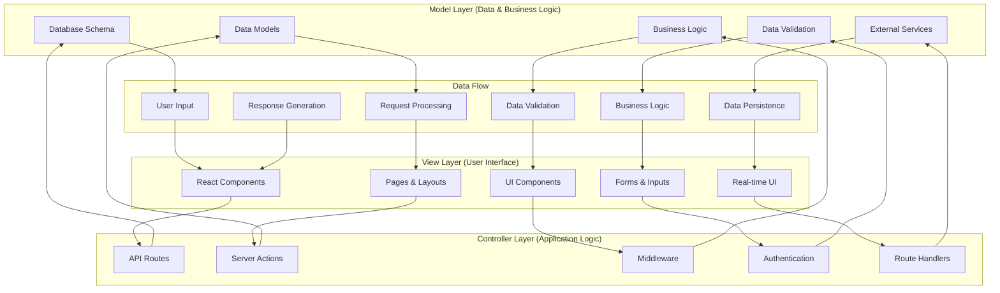
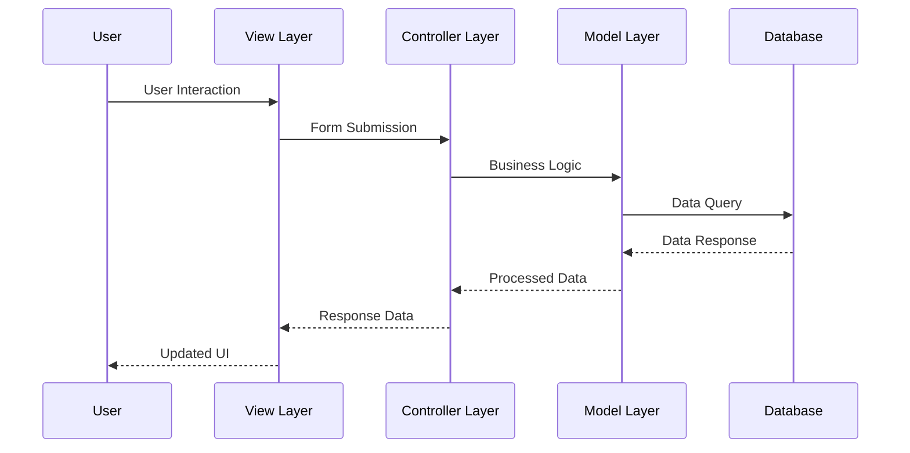
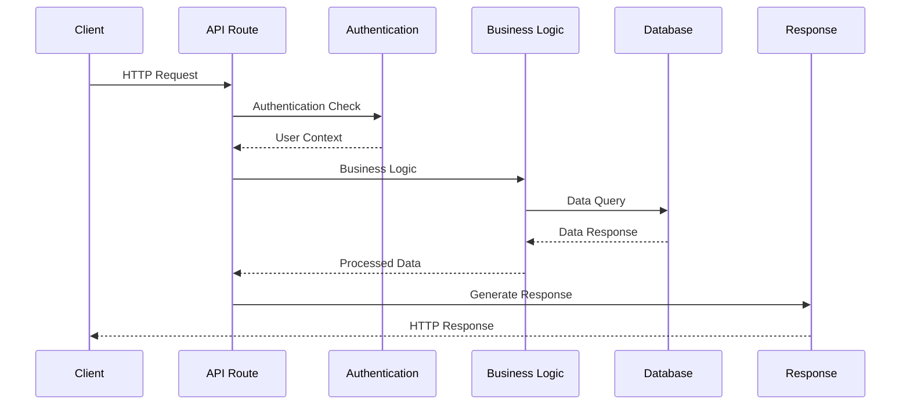
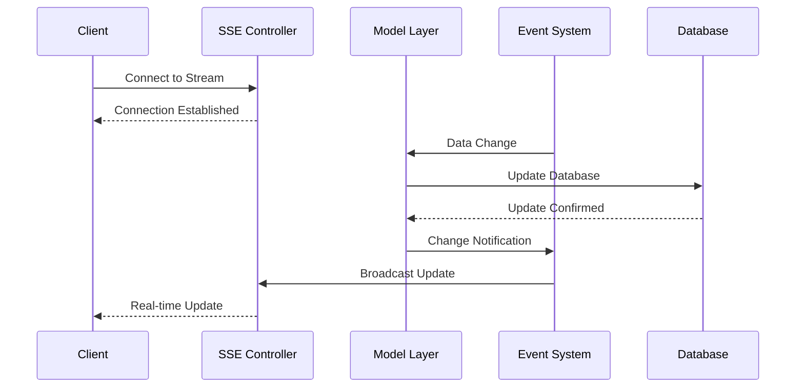
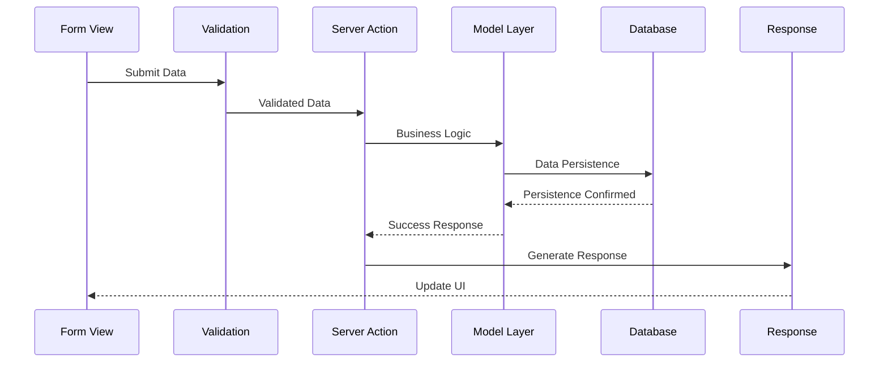

# MVC Representational Diagram

## Overview
GrantFlow.dev follows a modern Next.js architecture that can be interpreted through an MVC (Model-View-Controller) lens, with clear separation between data models, user interfaces, and business logic controllers. The application uses Next.js App Router with server components, API routes, and client components.

## MVC Architecture Diagram



## Detailed MVC Analysis

### **1. Model Layer (Data & Business Logic)**

#### **Database Models**
```typescript
// src/lib/db/schema/ - Model Layer
export const users = pgTable('users', {
  id: serial('id').primaryKey(),
  name: varchar('name', { length: 100 }),
  email: varchar('email', { length: 255 }).unique(),
  githubId: varchar('github_id', { length: 64 }),
  walletAddress: varchar('wallet_address', { length: 64 }),
  primaryRole: varchar('primary_role', { length: 20 }).default('team'),
  createdAt: timestamp('created_at').notNull().defaultNow(),
})

export const submissions = pgTable('submissions', {
  id: serial('id').primaryKey(),
  grantProgramId: integer('grant_program_id').references(() => grantPrograms.id),
  submitterId: integer('submitter_id').references(() => users.id),
  title: varchar('title', { length: 255 }).notNull(),
  description: text('description'),
  status: submissionStatusEnum('status').default('pending'),
  totalAmount: bigint('total_amount', { mode: 'number' }),
  createdAt: timestamp('created_at').notNull().defaultNow(),
})
```

#### **Business Logic Models**
```typescript
// src/lib/db/queries/ - Business Logic Layer
export async function getDashboardStats() {
  // Business logic for dashboard statistics
  const stats = await db
    .select({
      totalSubmissions: count(submissions.id),
      pendingReviews: count(submissions.id).where(eq(submissions.status, 'pending')),
      completedMilestones: count(milestones.id).where(eq(milestones.status, 'completed')),
    })
    .from(submissions)
    .leftJoin(milestones, eq(submissions.id, milestones.submissionId))
  
  return stats
}

export async function createSubmission(data: NewSubmission, userId: number) {
  // Business logic for submission creation
  const submission = await db.insert(submissions).values({
    ...data,
    submitterId: userId,
    appliedAt: new Date(),
  }).returning()
  
  // Trigger business logic for committee notification
  await notifyCommittee(submission[0].reviewerGroupId, submission[0].id)
  
  return submission[0]
}
```

#### **External Service Models**
```typescript
// src/lib/github/simple-client.ts - External Service Model
export class GitHubClient {
  async getRepositoryData(repoUrl: string) {
    // Business logic for GitHub repository analysis
    const repo = await this.octokit.rest.repos.get({
      owner: this.extractOwner(repoUrl),
      repo: this.extractRepo(repoUrl),
    })
    
    return {
      name: repo.data.name,
      description: repo.data.description,
      language: repo.data.language,
      stars: repo.data.stargazers_count,
      forks: repo.data.forks_count,
    }
  }
  
  async getCommitHistory(repoUrl: string, since?: string) {
    // Business logic for commit analysis
    const commits = await this.octokit.rest.repos.listCommits({
      owner: this.extractOwner(repoUrl),
      repo: this.extractRepo(repoUrl),
      since: since,
    })
    
    return commits.data.map(commit => ({
      sha: commit.sha,
      message: commit.commit.message,
      author: commit.commit.author?.name,
      date: commit.commit.author?.date,
    }))
  }
}
```

### **2. View Layer (User Interface)**

#### **Page Components (Views)**
```typescript
// src/app/dashboard/page.tsx - View Layer
export default async function DashboardPage() {
  const user = await getUser()
  const stats = await getDashboardStats()
  const submissions = await getUserSubmissions(user.id)
  
  return (
    <div className="container mx-auto p-6">
      <h1 className="text-2xl font-bold mb-6">Dashboard</h1>
      
      <div className="grid grid-cols-1 md:grid-cols-3 gap-6 mb-8">
        <StatsCard title="Total Submissions" value={stats.totalSubmissions} />
        <StatsCard title="Pending Reviews" value={stats.pendingReviews} />
        <StatsCard title="Completed Milestones" value={stats.completedMilestones} />
      </div>
      
      <SubmissionsList submissions={submissions} />
    </div>
  )
}
```

#### **Component Views**
```typescript
// src/components/submissions/submission-card.tsx - View Component
interface SubmissionCardProps {
  submission: SubmissionWithMilestones
  userContext: UserContext
}

export function SubmissionCard({ submission, userContext }: SubmissionCardProps) {
  return (
    <Card className="p-6">
      <div className="flex justify-between items-start mb-4">
        <h3 className="text-lg font-semibold">{submission.title}</h3>
        <StatusBadge status={submission.status} />
      </div>
      
      <p className="text-gray-600 mb-4">{submission.description}</p>
      
      <div className="flex justify-between items-center">
        <div className="flex space-x-2">
          <Button variant="outline" size="sm">
            View Details
          </Button>
          {userContext.canEditSubmission && (
            <Button variant="outline" size="sm">
              Edit
            </Button>
          )}
        </div>
        
        <div className="text-sm text-gray-500">
          {formatDate(submission.createdAt)}
        </div>
      </div>
    </Card>
  )
}
```

#### **Form Views**
```typescript
// src/components/forms/submission-form.tsx - Form View
export function SubmissionForm({ grantProgram, onSubmit }: SubmissionFormProps) {
  const form = useForm<SubmissionFormData>({
    resolver: zodResolver(submissionSchema),
    defaultValues: {
      title: '',
      description: '',
      executiveSummary: '',
      githubRepoUrl: '',
      totalAmount: 0,
    },
  })
  
  return (
    <Form {...form}>
      <form onSubmit={form.handleSubmit(onSubmit)} className="space-y-6">
        <FormField
          control={form.control}
          name="title"
          render={({ field }) => (
            <FormItem>
              <FormLabel>Project Title</FormLabel>
              <FormControl>
                <Input {...field} placeholder="Enter project title" />
              </FormControl>
              <FormMessage />
            </FormItem>
          )}
        />
        
        <FormField
          control={form.control}
          name="description"
          render={({ field }) => (
            <FormItem>
              <FormLabel>Project Description</FormLabel>
              <FormControl>
                <Textarea {...field} placeholder="Describe your project" />
              </FormControl>
              <FormMessage />
            </FormItem>
          )}
        />
        
        <Button type="submit" className="w-full">
          Submit Application
        </Button>
      </form>
    </Form>
  )
}
```

### **3. Controller Layer (Application Logic)**

#### **API Route Controllers**
```typescript
// src/app/api/dashboard/stats/route.ts - Controller
export async function GET() {
  try {
    // Authentication check
    const user = await getUser()
    if (!user) {
      return NextResponse.json({ error: 'Unauthorized' }, { status: 401 })
    }
    
    // Business logic execution
    const [stats, deadlines] = await Promise.all([
      getDashboardStats(),
      getUpcomingDeadlines(user.id),
    ])
    
    // Response generation
    return NextResponse.json({ ...stats, upcomingDeadlines: deadlines })
  } catch (error) {
    console.error('Error fetching dashboard stats:', error)
    return NextResponse.json(
      { error: 'Failed to fetch dashboard stats' },
      { status: 500 }
    )
  }
}
```

#### **Server Action Controllers**
```typescript
// src/lib/actions/submission-actions.ts - Controller
export const createSubmissionAction = validatedActionWithUser(
  submissionSchema,
  async (data: SubmissionFormData, user: User) => {
    try {
      // Business logic validation
      const grantProgram = await getGrantProgram(data.grantProgramId)
      if (!grantProgram) {
        return { error: 'Grant program not found' }
      }
      
      // Data processing
      const submission = await createSubmission({
        ...data,
        submitterId: user.id,
        submitterGroupId: user.primaryGroupId,
        reviewerGroupId: grantProgram.groupId,
      })
      
      // Side effects
      await notifyCommittee(grantProgram.groupId, submission.id)
      await logActivity('CREATE_SUBMISSION', user.id, { submissionId: submission.id })
      
      return { success: true, submission }
    } catch (error) {
      console.error('Error creating submission:', error)
      return { error: 'Failed to create submission' }
    }
  }
)
```

#### **Middleware Controllers**
```typescript
// middleware.ts - Controller
export async function middleware(request: NextRequest) {
  const token = await getToken({ req: request })
  const { pathname } = request.nextUrl
  
  // Authentication logic
  if (pathname.startsWith('/dashboard')) {
    if (!token) {
      return NextResponse.redirect(new URL('/login', request.url))
    }
    
    // Authorization logic
    if (pathname.startsWith('/dashboard/admin') && token.role !== 'admin') {
      return NextResponse.redirect(new URL('/dashboard', request.url))
    }
  }
  
  // API protection logic
  if (pathname.startsWith('/api/')) {
    if (!token) {
      return NextResponse.json({ error: 'Unauthorized' }, { status: 401 })
    }
  }
  
  return NextResponse.next()
}
```

## MVC Data Flow Patterns

### **1. Request-Response Flow**

#### **User Request Flow**


#### **API Request Flow**


### **2. Real-time Data Flow**

#### **Server-Sent Events Flow**


### **3. Form Submission Flow**

#### **Form Processing Flow**


## MVC Component Mapping

### **1. Model Layer Components**

#### **Database Models**
- **Location**: `src/lib/db/schema/`
- **Components**: All table definitions and relationships
- **Purpose**: Data structure and business rules
- **Examples**: `users.ts`, `submissions.ts`, `milestones.ts`

#### **Business Logic**
- **Location**: `src/lib/db/queries/`
- **Components**: Query functions and business logic
- **Purpose**: Data access and business rules
- **Examples**: `dashboard.ts`, `submissions.ts`, `committees.ts`

#### **External Services**
- **Location**: `src/lib/github/`, `src/lib/polkadot/`
- **Components**: External service clients
- **Purpose**: External data integration
- **Examples**: `simple-client.ts`, `client.ts`

### **2. View Layer Components**

#### **Page Components**
- **Location**: `src/app/`
- **Components**: Page components and layouts
- **Purpose**: User interface pages
- **Examples**: `dashboard/page.tsx`, `submissions/page.tsx`

#### **UI Components**
- **Location**: `src/components/`
- **Components**: Reusable UI components
- **Purpose**: User interface elements
- **Examples**: `ui/button.tsx`, `submissions/submission-card.tsx`

#### **Form Components**
- **Location**: `src/components/forms/`
- **Components**: Form components and validation
- **Purpose**: User input and data collection
- **Examples**: `submission-form.tsx`, `milestone-form.tsx`

### **3. Controller Layer Components**

#### **API Routes**
- **Location**: `src/app/api/`
- **Components**: API route handlers
- **Purpose**: HTTP request handling
- **Examples**: `dashboard/stats/route.ts`, `user/route.ts`

#### **Server Actions**
- **Location**: `src/lib/actions/`
- **Components**: Server action functions
- **Purpose**: Form handling and business logic
- **Examples**: `submission-actions.ts`, `user-actions.ts`

#### **Middleware**
- **Location**: `middleware.ts`
- **Components**: Request middleware
- **Purpose**: Authentication and authorization
- **Examples**: Route protection, authentication checks

## MVC Best Practices Implementation

### **1. Separation of Concerns**

#### **Model Layer**
- **Data Access**: Centralized database access
- **Business Logic**: Encapsulated business rules
- **Validation**: Data validation and constraints
- **External Services**: External service integration

#### **View Layer**
- **Presentation**: User interface presentation
- **User Interaction**: User input and interaction
- **State Management**: Component state management
- **Responsive Design**: Mobile and desktop optimization

#### **Controller Layer**
- **Request Handling**: HTTP request processing
- **Authentication**: User authentication and authorization
- **Business Logic**: Application logic coordination
- **Response Generation**: Response formatting and delivery

### **2. Data Flow Management**

#### **Unidirectional Data Flow**
- **Top-down**: Data flows from parent to child components
- **Event Handling**: User interactions bubble up through components
- **State Management**: Centralized state management with React hooks
- **Server State**: Server state management with SWR

#### **Real-time Updates**
- **Server-Sent Events**: Real-time data updates
- **State Synchronization**: Client-server state synchronization
- **Optimistic Updates**: Immediate UI updates with server confirmation
- **Error Handling**: Graceful error handling and recovery

### **3. Component Architecture**

#### **Component Hierarchy**
- **Page Components**: Top-level page components
- **Layout Components**: Layout and structure components
- **Feature Components**: Feature-specific components
- **UI Components**: Reusable UI components

#### **Component Communication**
- **Props**: Parent-child communication
- **Context**: Cross-component communication
- **Events**: Event-driven communication
- **State**: Shared state management

## MVC Testing Strategy

### **1. Model Testing**
- **Unit Tests**: Individual model function testing
- **Integration Tests**: Database integration testing
- **Business Logic Tests**: Business rule validation
- **External Service Tests**: External service mocking

### **2. View Testing**
- **Component Tests**: React component testing
- **User Interaction Tests**: User interaction testing
- **Accessibility Tests**: Accessibility compliance testing
- **Visual Tests**: Visual regression testing

### **3. Controller Testing**
- **API Tests**: API endpoint testing
- **Authentication Tests**: Authentication flow testing
- **Authorization Tests**: Permission and access control testing
- **Integration Tests**: End-to-end workflow testing

## MVC Performance Optimization

### **1. Model Layer Optimization**
- **Database Optimization**: Query optimization and indexing
- **Caching**: Data caching and memoization
- **Connection Pooling**: Database connection management
- **Lazy Loading**: On-demand data loading

### **2. View Layer Optimization**
- **Component Optimization**: React component optimization
- **Bundle Optimization**: Code splitting and lazy loading
- **Rendering Optimization**: Efficient rendering and updates
- **Memory Management**: Memory leak prevention

### **3. Controller Layer Optimization**
- **Request Optimization**: Request processing optimization
- **Caching**: Response caching and optimization
- **Rate Limiting**: API rate limiting and throttling
- **Error Handling**: Efficient error handling and recovery
