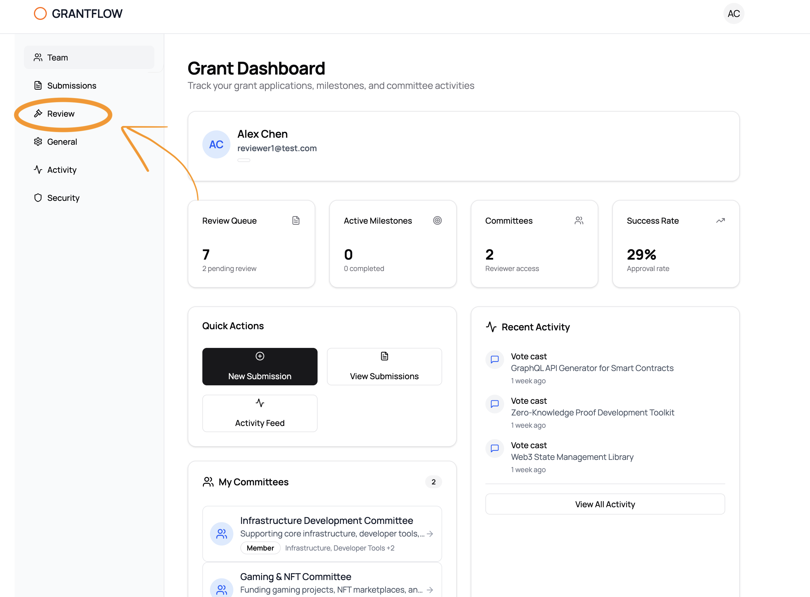
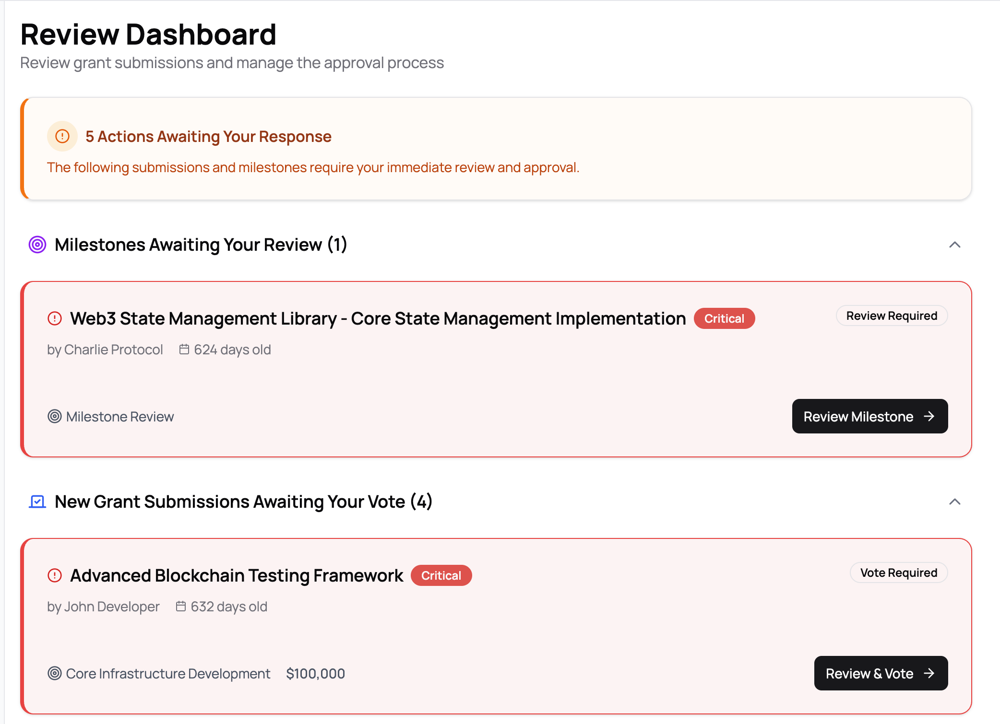
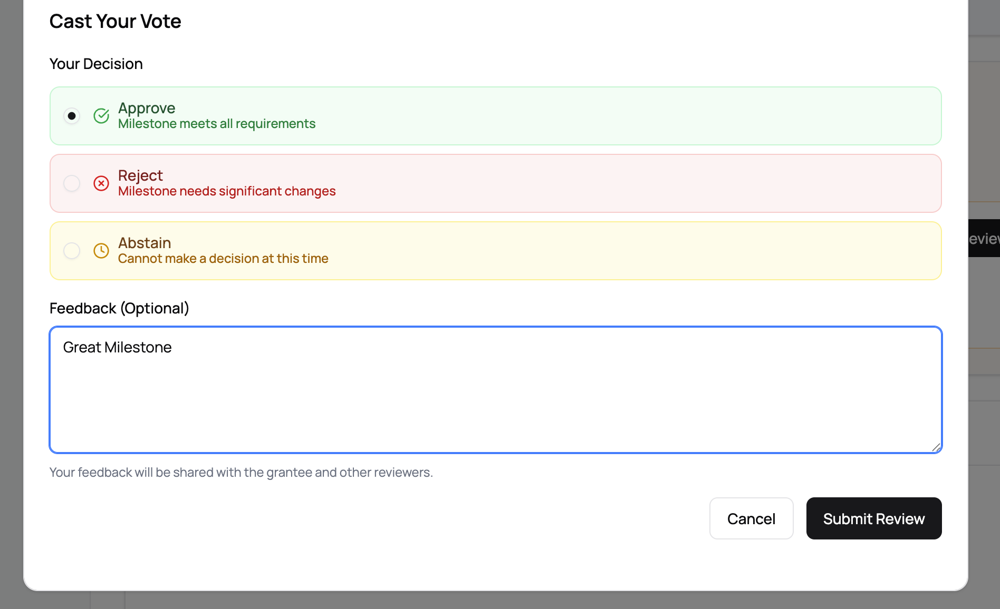
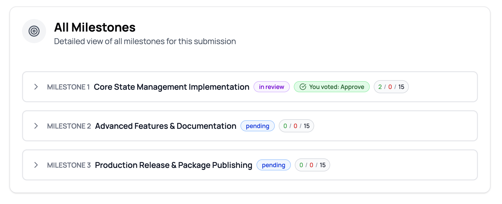
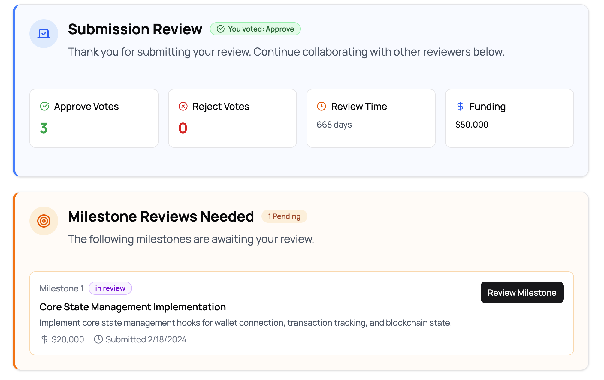
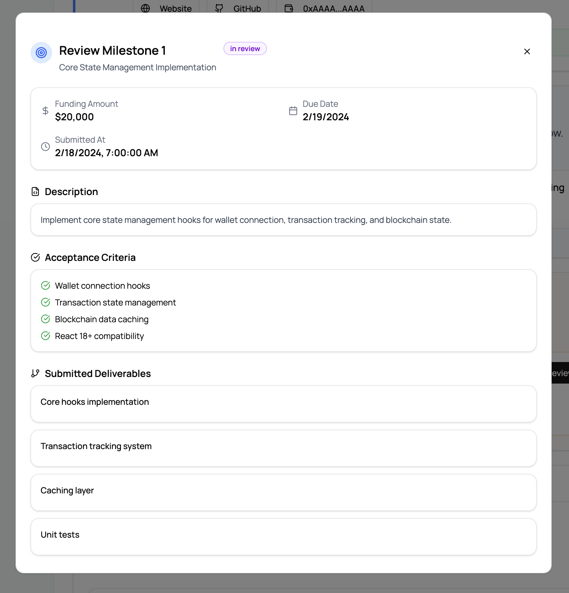

# Review Walkthrough

This document provides a step-by-step guide for reviewers to navigate the GrantFlow review process, from accessing the review dashboard to completing milestone reviews.

## Overview

The review process in GrantFlow consists of two main types of reviews:
1. **Submission Reviews**: Initial grant proposal reviews where reviewers vote to approve or reject submissions
2. **Milestone Reviews**: Reviews of specific milestones submitted as part of funded grants

## Step 1: Accessing the Review Dashboard

Start by navigating to the **Review** section from the main dashboard navigation.

The Grant Dashboard provides an overview of your review queue, active milestones, committees, and success rate. To access the review functionality, click on **Review** in the left sidebar.

## Step 2: Review Dashboard Overview

Once in the Review Dashboard, you'll see a comprehensive view of all pending actions requiring your attention.

The dashboard displays:
- **Summary Alert**: Shows the total number of actions awaiting your response
- **Milestones Awaiting Your Review**: Lists milestones that need your review
- **New Grant Submissions Awaiting Your Vote**: Lists new submissions that require your vote

Each item is color-coded to indicate urgency:
- **Red (Critical)**: Items older than 14 days
- **Orange (Urgent)**: Items older than 7 days
- **Blue (Normal)**: Items less than 7 days old

## Step 3: Reviewing a Submission

Click on any submission card to review it. You'll see detailed information including the submission title, submitter information, committee details, grant program information, and funding amount.

### Casting Your Vote

When reviewing a submission, you'll need to cast your vote using the review dialog.

**Your Decision Options:**
1. **Approve**: Milestone meets all requirements (green checkmark)
2. **Reject**: Milestone needs significant changes (red X)
3. **Abstain**: Cannot make a decision at this time (yellow clock)

**Feedback (Optional)**: You can provide feedback that will be shared with the grantee and other reviewers.

Click **Submit Review** to submit your vote, or **Cancel** to return without voting.

### Viewing Submission Review Status

After submitting your review, you'll see the submission review status page.

This page displays:
- **Your Vote Status**: Confirmation that you voted (e.g., "You voted: Approve")
- **Voting Statistics**:
  - Approve Votes count
  - Reject Votes count
  - Review Time (days since submission)
  - Funding Amount
- **Milestone Reviews Needed**: List of milestones that still require your review

## Step 4: Viewing All Milestones

For submissions with multiple milestones, you can view an overview of all milestones.

The milestones view shows:
- **Milestone Name and Number**: e.g., "MILESTONE 1 Core State Management Implementation"
- **Status Badge**: Current status (e.g., "in review", "pending")
- **Your Vote Status**: If you've already voted (e.g., "You voted: Approve")
- **Voting Progress**: Shows approve/reject/total votes (e.g., "2 / 0 / 15")

Click on any milestone to view its details and cast your review.

## Step 5: Reviewing a Milestone

Click **Review Milestone** on any pending milestone to open the milestone review dialog.

The milestone review dialog displays:

### Key Information
- **Milestone Title**: e.g., "Core State Management Implementation"
- **Status Badge**: Current review status (e.g., "in review")
- **Funding Amount**: The allocated funding for this milestone
- **Submitted At**: Date and time when the milestone was submitted
- **Due Date**: Deadline for completing the review

### Milestone Details
- **Description**: Detailed description of what the milestone entails
- **Acceptance Criteria**: List of requirements that must be met (displayed with checkmarks)
- **Submitted Deliverables**: Files, links, or other deliverables provided by the grantee

### Reviewing the Milestone
1. Review the description and acceptance criteria
2. Check the submitted deliverables
3. Cast your vote (Approve/Reject/Abstain)
4. Add optional feedback
5. Submit your review

## Best Practices

1. **Timely Reviews**: Aim to complete reviews within 7 days to avoid urgent status
2. **Thorough Review**: Check all acceptance criteria and deliverables before voting
3. **Constructive Feedback**: Provide helpful feedback when rejecting or requesting changes
4. **Follow Up**: Monitor submission and milestone progress after your review
5. **Collaboration**: Review discussions and feedback from other reviewers to ensure consistency

## Navigation Tips

- Use the **Review Dashboard** as your central hub for all pending actions
- Sections can be collapsed/expanded using the chevron icons
- The urgency color coding helps prioritize which items need immediate attention
- The "All Caught Up!" message appears when you have no pending actions

## Troubleshooting

**Q: I don't see any pending actions, but I know there should be some.**
A: Ensure you're a member of the relevant committee and have reviewer permissions.

**Q: Can I change my vote after submitting?**
A: Contact the committee administrator if you need to change a submitted vote.

**Q: What's the difference between a submission review and a milestone review?**
A: Submission reviews are for initial grant proposals. Milestone reviews are for specific deliverables within approved grants.

---

For technical support or questions about the review process, contact your committee administrator.
