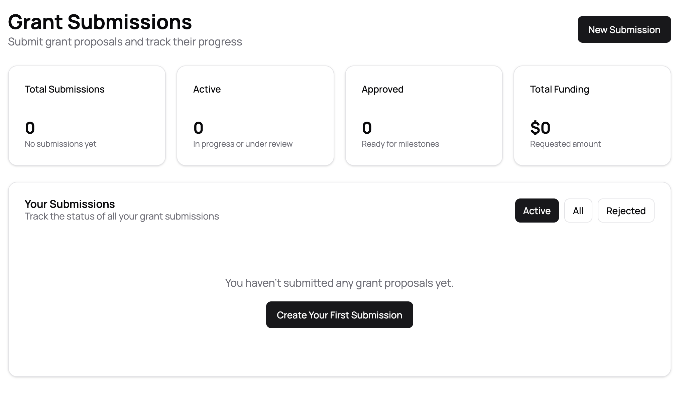
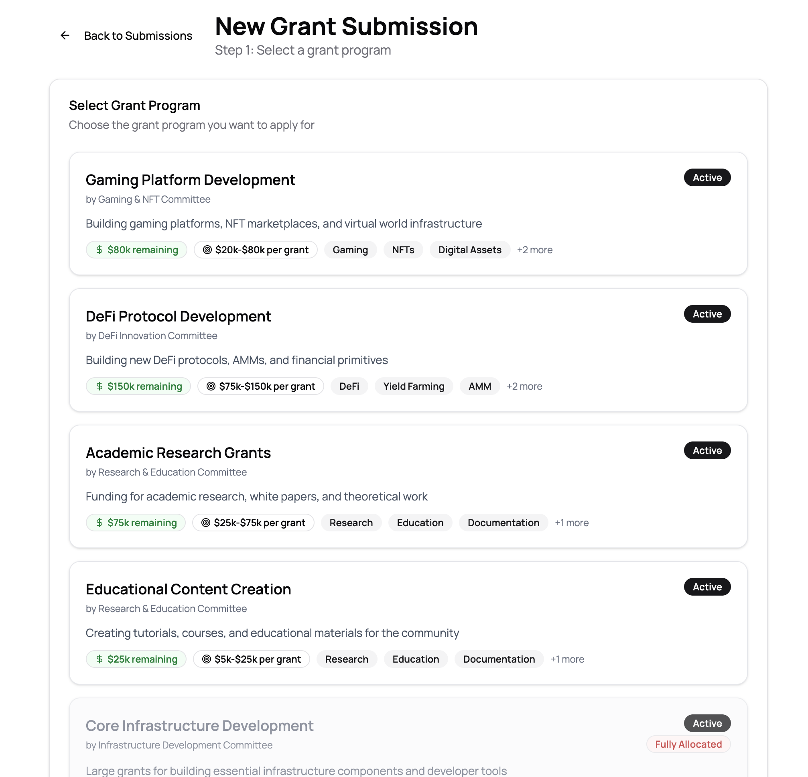
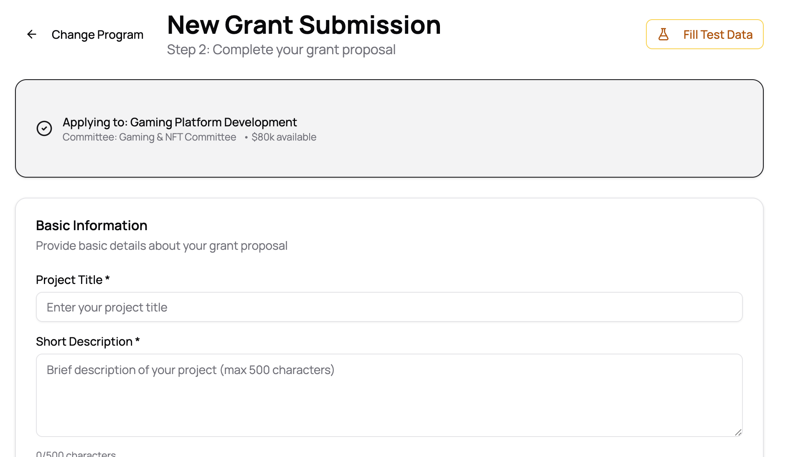
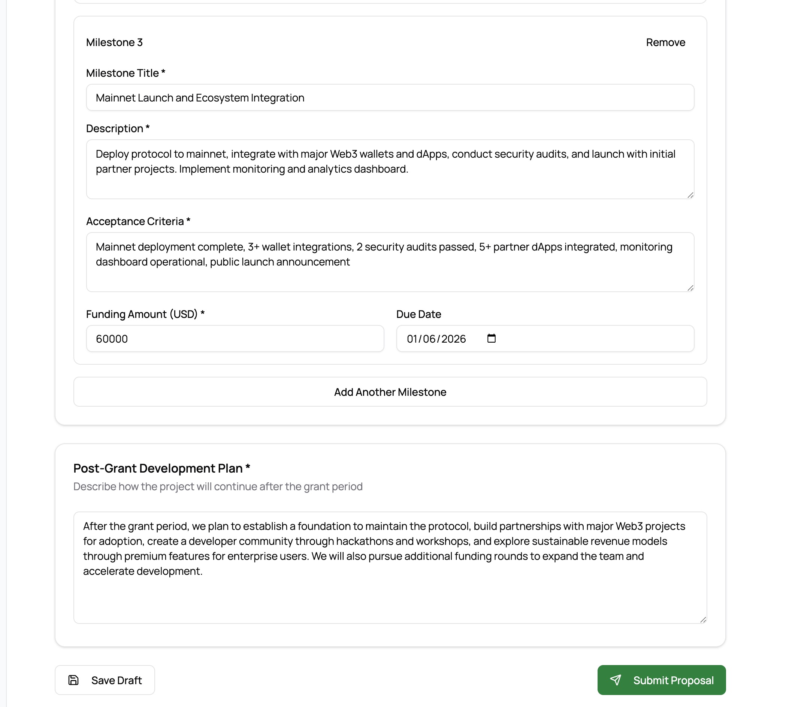
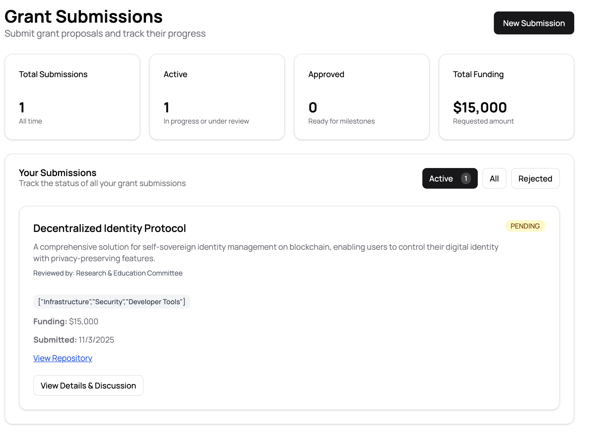
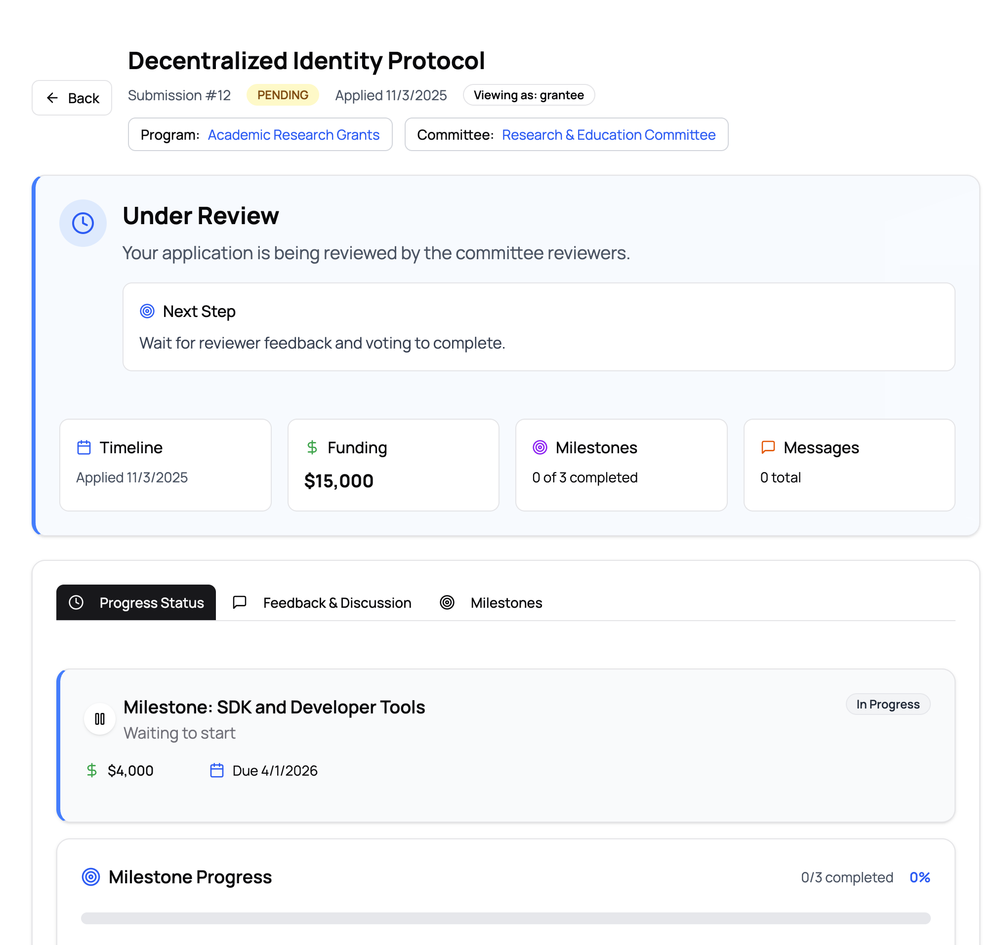

# Submitter Walkthrough

This document provides a step-by-step guide for grant applicants to submit proposals, track their status, and manage milestones through GrantFlow.

## Overview

The grant submission process consists of several key steps:
1. **Accessing the Submissions Dashboard**: View your submissions and start new applications
2. **Selecting a Grant Program**: Choose the appropriate grant program and committee
3. **Completing the Application Form**: Fill in project details, milestones, and post-grant plans
4. **Submitting Your Proposal**: Review and submit for committee review
5. **Tracking Your Submission**: Monitor the review status and respond to feedback

## Step 1: Accessing the Submissions Dashboard

Start by navigating to the **Submissions** section from the main dashboard. Here you'll see an overview of all your grant submissions.

The dashboard displays:
- **Summary Cards**: Total submissions, active submissions, approved submissions, and total funding requested
- **Filter Options**: View Active, All, or Rejected submissions
- **Your Submissions**: List of all your grant applications with their current status

If you haven't submitted any proposals yet, you'll see a message prompting you to create your first submission.

## Step 2: Starting a New Submission

Click the **New Submission** button in the top right corner to begin creating a grant proposal.

### Selecting a Grant Program

The first step is to select the grant program you want to apply for.

**Grant Program Information:**
- **Program Title**: Name and focus area of the grant program
- **Committee**: The committee responsible for reviewing applications
- **Description**: Details about what the program funds
- **Status**: Active programs are available for applications
- **Funding Details**: 
  - Remaining funding available
  - Typical grant size range (e.g., $20k-$80k per grant)
- **Tags**: Relevant keywords and focus areas

**Important Considerations:**
- Some programs may show "Fully Allocated" if all funding has been committed
- Review the grant size range to ensure it matches your funding needs
- Check the tags to ensure your project aligns with the program's focus

Click on a program card to proceed to the application form.

## Step 3: Completing the Application Form

After selecting a grant program, you'll move to Step 2: Complete your grant proposal.

### Application Header

At the top, you'll see:
- **Selected Program**: Confirmation of which program you're applying to, including committee name and available funding
- **Change Program**: Option to go back and select a different program
- **Fill Test Data**: Helper button to populate the form with sample data (for testing)

### Basic Information Section

**Required Fields:**
- **Project Title***: A clear, concise title for your project
- **Short Description***: Brief description (max 500 characters) summarizing your project

### Milestones Section

Each grant application requires you to define one or more milestones that break your project into manageable phases.

**For Each Milestone, Provide:**
- **Milestone Title***: A descriptive name for the milestone
- **Description***: Detailed explanation of the work to be completed
- **Acceptance Criteria***: Specific, measurable conditions that must be met for completion
- **Funding Amount (USD)***: The amount requested for this milestone
- **Due Date**: Target completion date

**Tips for Defining Milestones:**
- Break your project into logical phases with clear deliverables
- Ensure acceptance criteria are specific and measurable
- Align funding amounts with the work scope
- Set realistic due dates based on your team's capacity

You can add multiple milestones by clicking **Add Another Milestone**. Each milestone will be reviewed separately once your proposal is approved.

### Post-Grant Development Plan

Beyond the grant period, describe your long-term vision for project sustainability.

**Include Information About:**
- **Sustainability**: How the project will be maintained and funded long-term
- **Community Building**: Plans for engaging users and developers
- **Future Development**: Next steps and growth strategies
- **Revenue Models**: If applicable, how the project will generate revenue
- **Additional Funding**: Plans for future fundraising rounds

This section helps reviewers understand your commitment to the project beyond the grant period.

## Step 4: Saving and Submitting

Throughout the application process, you can save your progress as a draft to complete later.

**Before Submitting:**
1. Review all milestones for accuracy and completeness
2. Ensure acceptance criteria are clear and achievable
3. Verify funding amounts total appropriately
4. Check that all required fields are filled
5. Review your post-grant development plan

**When Ready:**
- Click **Save Draft** to save your progress without submitting
- Click **Submit Proposal** to submit your application for committee review

Once submitted, your proposal enters the review queue and cannot be edited (though you can provide updates through discussions).

## Step 5: Tracking Your Submission

After submitting, return to the Submissions Dashboard to view your proposal's status.

The dashboard now shows:
- **Updated Statistics**: Your submission counts and total funding requested
- **Your Submission Card**: Displays:
  - Project title and description
  - Reviewing committee
  - Funding amount requested
  - Submission date
  - Current status badge (e.g., "PENDING", "APPROVED", "REJECTED")
  - Tags/categories
  - Action buttons: "View Repository" and "View Details & Discussion"

Click **View Details & Discussion** to see the detailed submission page.

## Step 6: Submission Status and Review Process

The detailed submission page provides comprehensive information about your application's status.

### Status Overview

**Main Status Section:**
- **Current Status**: Shows where your application is in the review process
  - "Under Review": Your application is being reviewed by committee reviewers
  - Next step guidance (e.g., "Wait for reviewer feedback and voting to complete")

### Key Information Cards

- **Timeline**: Date you applied
- **Funding**: Total funding amount requested
- **Milestones**: Progress (e.g., "0 of 3 completed")
- **Messages**: Discussion thread activity

### Navigation Tabs

- **Progress Status**: Overview of milestone progress and status
- **Feedback & Discussion**: Conversations with reviewers
- **Milestones**: Detailed view of all milestones and their requirements

### Milestone Details

Each milestone card shows:
- **Milestone Name**: Title and description
- **Status**: Current state (e.g., "Waiting to start", "In Progress", "In Review")
- **Funding Amount**: Allocated funding for this milestone
- **Due Date**: Target completion date
- **Progress**: Visual progress indicator showing completed vs. total milestones

## Best Practices

1. **Choose the Right Program**: Select a grant program that aligns with your project's focus and funding needs
2. **Clear Milestones**: Break your project into logical phases with clear, measurable acceptance criteria
3. **Realistic Funding**: Request funding amounts that accurately reflect the work required
4. **Thorough Planning**: Provide detailed post-grant plans to demonstrate long-term commitment
5. **Monitor Status**: Regularly check your submission status and respond to reviewer feedback promptly
6. **Engage in Discussion**: Use the feedback & discussion section to answer questions and provide clarifications

## Understanding Status Badges

- **PENDING**: Your application is awaiting committee review
- **UNDER REVIEW**: Reviewers are actively evaluating your proposal
- **APPROVED**: Your proposal has been accepted and you can begin working on milestones
- **REJECTED**: Your proposal was not accepted (you can view feedback for reasons)
- **IN PROGRESS**: Work on milestones has begun
- **IN REVIEW**: A milestone has been submitted and is being reviewed

## Tips for Success

1. **Start Early**: Begin your application well before any deadlines
2. **Be Specific**: Provide detailed descriptions and measurable acceptance criteria
3. **Align Funding**: Ensure milestone funding matches the work scope
4. **Demonstrate Sustainability**: Show how your project will continue after the grant
5. **Engage Proactively**: Respond to reviewer questions and participate in discussions
6. **Track Progress**: Regularly update your submission page to monitor review status

## Troubleshooting

**Q: Can I edit my submission after submitting it?**
A: Once submitted, you cannot directly edit the proposal. However, you can provide updates and clarifications through the discussion section.

**Q: What happens if my proposal is rejected?**
A: You'll receive feedback from reviewers explaining the decision. You can use this feedback to improve future applications or address concerns if you believe there was an error.

**Q: How do I know when reviewers need more information?**
A: Check the "Feedback & Discussion" tab regularly. Reviewers may ask questions or request clarifications there.

**Q: Can I submit multiple applications?**
A: Yes, you can submit multiple grant applications, but ensure each is for a distinct project or clearly different work.

**Q: What if I need to change a milestone after approval?**
A: Contact the committee through the discussion section to discuss milestone modifications.

---

For additional support or questions about the submission process, contact your committee or the GrantFlow support team.
