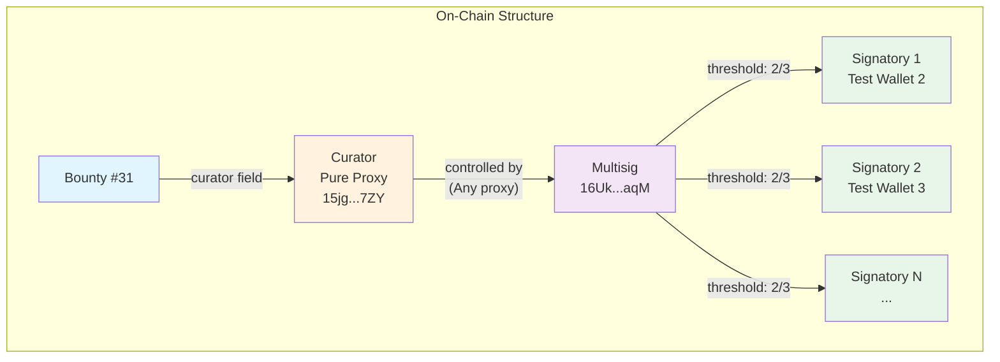
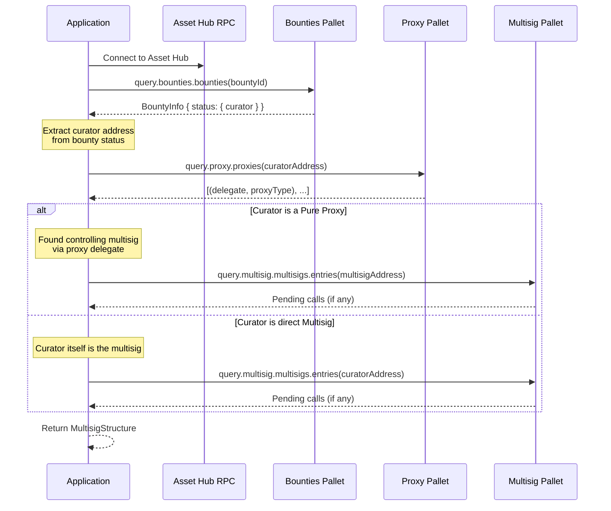

# Multisig Discovery Process

This document explains how the multisig structure discovery works for Polkadot bounties managed by committee multisigs.

## Overview

Treasury bounties on Polkadot Asset Hub are managed by curators. These curators are typically not simple accounts but rather **Pure Proxies** controlled by **Multisig accounts**, which in turn are controlled by multiple **Signatories**.

This layered structure provides:
- **Security**: Multiple parties must approve actions
- **Flexibility**: The proxy can be re-assigned without changing the bounty
- **Accountability**: All actions are traceable on-chain

## Structure Diagram



## Discovery Process

The discovery process queries on-chain storage to trace from a bounty ID back to its controlling multisig.



## Step-by-Step Process

### Step 1: Query Bounty Information

```typescript
const bounty = await client.query.bounties.bounties(bountyId)
```

The bounty status contains the curator address. Valid statuses with curators:
- `ApprovedWithCurator` - Curator assigned, awaiting acceptance
- `CuratorProposed` - Curator proposed, pending approval
- `Active` - Bounty is active with curator
- `PendingPayout` - Awaiting payout

### Step 2: Check if Curator is a Proxy

```typescript
const proxiesResult = await client.query.proxy.proxies(curatorAddress)
```

If the curator has proxy delegates, it's a **Pure Proxy** controlled by another account (typically a multisig).

The proxy query returns:
- `delegate`: The controlling account (multisig address)
- `proxyType`: Type of proxy permission (e.g., "Any", "Governance")

### Step 3: Identify the Effective Multisig

Two possible structures:

**Structure A: Proxy-based (most common)**
```
Signatories → Multisig → Pure Proxy (Curator) → Bounty
```

**Structure B: Direct Multisig**
```
Signatories → Multisig (Curator) → Bounty
```

### Step 4: Check for Pending Calls (Optional)

```typescript
const entries = await client.query.multisig.multisigs.entries(multisigAddress)
```

Pending multisig calls reveal:
- `callHash`: The hash of the pending call
- `approvals`: Addresses that have approved (partial signatory discovery!)
- `depositor`: Who initiated the call
- `when`: Block height and index when created

## Data Types

### MultisigStructure

```typescript
interface MultisigStructure {
  bountyId: number
  bountyStatus: string
  curator: {
    address: string  // SS58 encoded (Polkadot format)
    raw: string      // Hex-encoded public key
  }
  controllingMultisig?: {
    address: string
    raw: string
    proxyType: string  // "Any", "Governance", etc.
  }
  curatorIsMultisig: boolean
  effectiveMultisig: string  // The address to use for multisig operations
}
```

## Limitations

### What CAN be discovered on-chain:
- ✅ Bounty curator address
- ✅ Whether curator is a proxy or direct multisig
- ✅ Controlling multisig address (if proxy)
- ✅ Proxy type permissions
- ✅ Pending multisig calls and their approvers

### What CANNOT be discovered on-chain:
- ❌ **Signatory addresses** - Not stored in multisig account state
- ❌ **Threshold** - Only derivable from multisig address computation
- ❌ **Historical signatories** - Would require indexing past transactions

### Why Signatories Can't Be Discovered

Multisig addresses in Substrate are **deterministically derived** from:
1. The sorted list of signatory addresses
2. The threshold value

The multisig address is computed as:
```
multisig_address = blake2_256(
  b"modlpy/teleaccounts" +
  sorted_signatories +
  threshold
)
```

This is a **one-way hash** - you cannot reverse it to find the signatories.

**Workarounds:**
1. Check pending multisig calls for partial signatory lists
2. Index historical `Multisig.NewMultisig` events
3. Require manual signatory input (current approach)

## Address Encoding

All addresses are converted to **Polkadot format** (SS58 prefix 0) for consistency:

```typescript
import { encodeAddress, decodeAddress } from 'dedot/utils'

// Convert any address to Polkadot format
const polkadotAddress = encodeAddress(decodeAddress(anyAddress), 0)
```

| Network | SS58 Prefix | Address Prefix |
|---------|-------------|----------------|
| Polkadot | 0 | 1... |
| Kusama | 2 | C..., D..., etc. |
| Generic | 42 | 5... |

## Example Output

```json
{
  "bountyId": 31,
  "bountyStatus": "ApprovedWithCurator",
  "curator": {
    "address": "15jgfpfSvcEF7FXd77LZ8eBh4MVeSfK5DbWJ6mQsonwvi7ZY",
    "raw": "0xd17ec79a72f81a5acc9872ad2c3f5b2d443a018d33976b1a3b1b60809ea10646"
  },
  "controllingMultisig": {
    "address": "16UkJk6ZuA6CdmT9YiyjnpNpgRUVh9fMGtkfmi8HCFSe6aqM",
    "raw": "0xf25692ea292a711c0c324522c9677d87e18b41408679064cbb48c10312650b6f",
    "proxyType": "Any"
  },
  "curatorIsMultisig": false,
  "effectiveMultisig": "16UkJk6ZuA6CdmT9YiyjnpNpgRUVh9fMGtkfmi8HCFSe6aqM"
}
```

## Usage

### In Code

```typescript
import {
  discoverMultisigStructure,
  getPendingMultisigCalls
} from '@/lib/polkadot/multisig-discovery'

// Discover structure from bounty ID
const structure = await discoverMultisigStructure(client, 31)

if (structure) {
  console.log('Curator:', structure.curator.address)
  console.log('Multisig:', structure.effectiveMultisig)

  // Check for pending calls
  const pending = await getPendingMultisigCalls(
    client,
    structure.effectiveMultisig
  )
}
```

### UI Component

Use the `MultisigDiscoveryModal` component for interactive discovery:

```tsx
import { MultisigDiscoveryModal } from '@/components/committee/multisig-discovery-modal'

<MultisigDiscoveryModal
  network="paseo"
  initialBountyId={31}
/>
```

## Related Files

- `src/lib/polkadot/multisig-discovery.ts` - Core discovery functions
- `src/components/committee/multisig-discovery-modal.tsx` - UI component
- `scripts/test-multisig-structure.ts` - Test script for exploration
